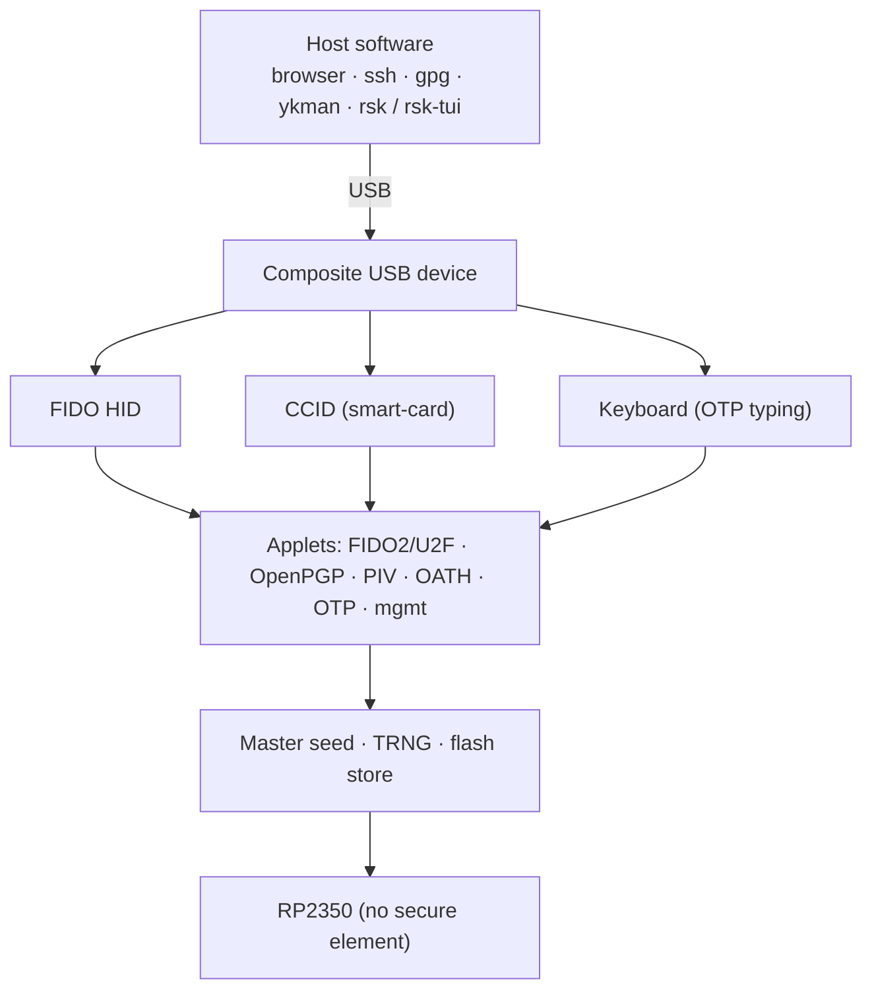
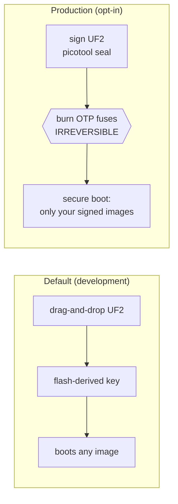

# RS-Key

[](https://github.com/TheMaxMur/RS-Key/actions/workflows/ci.yml)
[](https://github.com/TheMaxMur/RS-Key/actions/workflows/deep-checks.yml)
[](https://themaxmur.github.io/RS-Key/)

RS-Key (RSK, *Raspberry Security Key* — also a nod to its being written in Rust)
is open-source security-key firmware for the Raspberry Pi **RP2350**. It makes an
RP2350 board behave like a USB authenticator and ships the host tooling to drive
it. It is written in Rust (`no_std`, [embassy](https://embassy.dev)) and is meant
for development, research, and controlled experiments — **not** as a drop-in
replacement for an audited commercial key.

> **This project is experimental.** It has had no external security audit, the
> RP2350 is not a secure element, and a stolen board is only as strong as the
> optional OTP / secure-boot hardening you have applied to it. Don't use it to
> guard credentials you can't afford to lose or have stolen. Read the
> [threat model](docs/threat-model.md) and [limitations](docs/limitations.md)
> before trusting it with anything real.

## Project status

A working, single-maintainer hobby project under active development. The latest
tagged release is **v0.2.7**; day to day the supported version is the tip of
`main`, and every behavior change bumps the USB `bcdDevice` build counter so a
build can be named precisely. Most of the protocol surface works against real host software; what
has actually been checked on hardware (with dates) is in
[docs/interop.md](docs/interop.md). Treat anything not in that matrix as
unverified.

## Documentation

The docs live in [docs/](docs/) and are published as a site:
**<https://themaxmur.github.io/RS-Key/>**.

| | |
|---|---|
| [Quick start](docs/quickstart.md) | flash, enroll, first login |
| [Hardware](docs/hardware.md) | supported boards and build knobs |
| [Build options](docs/build.md) | every flag: VID/PID presets, version, touch, PQC, FIPS profile |
| [Production setup](docs/production.md) | OTP fuses + secure boot, step by step (**irreversible**) |
| [Feature guides](docs/guides/) | FIDO2, SSH, OpenPGP, PIV, OATH, OTP, backup, soft-lock, LED, audit, … |
| [Threat model](docs/threat-model.md) · [Limitations](docs/limitations.md) | what it protects against, and what it does not |
| [Architecture](docs/architecture.md) · [`unsafe` audit](docs/unsafe.md) | how it's built; every `unsafe` site |
| [Testing](docs/testing.md) · [Interop](docs/interop.md) | host tests, fuzzing; real-tool results |
| [Linux setup](docs/linux.md) · [Motivation](docs/motivation.md) | pcscd/udev/polkit; why this exists |

## What it supports

- **FIDO2 / WebAuthn / U2F** — passkeys, two-factor logins, `ssh ed25519-sk`
- **OpenPGP card 3.4** — `gpg` signing, decryption, authentication (EC + RSA)
- **PIV** — X.509 smart-card via PKCS#11 (or `ykman piv`, which needs the opt-in `VIDPID=Yubikey5` build)
- **OATH** — TOTP / HOTP codes (`ykman oath`, Yubico Authenticator — both need the opt-in `VIDPID=Yubikey5` build)
- **Yubico-style OTP** — four slots, plus a USB-keyboard interface that types the code
- **Seed backup** — export the FIDO master seed as BIP-39 / SLIP-39 words
- **At-rest soft-lock** — keep the FIDO seed in flash encrypted to a key only you hold
- **On-device audit journal** and **enterprise (org-provisioned) attestation**
- **Post-quantum FIDO2 (experimental)** — implements the ML-DSA-44 scheme
  (COSE −48); advertising it in getInfo is off by default because some shipped
  browsers reject an unknown algorithm id. This is not a FIPS-validated module.

Capacities are flash-bound and generous (e.g. up to 256 resident passkeys,
255 OATH accounts, 24 PIV slots, 4 OTP slots); details are in the
[feature guides](docs/guides/) and [build options](docs/build.md).



## What it does not protect against

- **Physical / lab attacks** — decapping, microprobing, fault injection beyond
  the on-chip glitch detectors, power/EM side channels, and flash-emulation
  TOCTOU. The RP2350 is not a secure element; if your threat model includes a
  funded lab, buy a certified key.
- **A compromised host with the device unlocked** — like any security key, it
  will perform operations you have authorized while plugged in and unlocked.
- **Loss of secrets without the optional hardening** — at-rest protection only
  becomes meaningful after you fuse the OTP master key (see Production, below).

Full reasoning: [docs/threat-model.md](docs/threat-model.md).

## Hardware

Any RP2350 board with USB. Developed and tested on the **Waveshare RP2350-One**
(WS2812 status LED on GPIO16; boards without an LED run fine). A different flash
size or LED pin is a one-line build knob. Details:
[docs/hardware.md](docs/hardware.md).

## Quick start

```sh
git clone https://github.com/TheMaxMur/RS-Key && cd RS-Key
nix develop                       # toolchain, picotool, host tools — everything

cargo build --release -p firmware
picotool uf2 convert target/thumbv8m.main-none-eabihf/release/firmware -t elf firmware.uf2

# hold BOOTSEL, plug the board in, then copy the image to the RP2350 drive:
cp firmware.uf2 /Volumes/RP2350/  # macOS; on Linux, the mounted RP2350 mass-storage volume
```

Re-plug the board and it enumerates as a composite USB authenticator. The default
build requires a **physical touch** (the BOOTSEL button) for FIDO operations;
build with `--features no-touch` for a no-touch build (the automated test
suites need it). Full walkthrough: [docs/quickstart.md](docs/quickstart.md).
On Linux, the CCID half needs a little host setup: [docs/linux.md](docs/linux.md).

## Development setup

`nix develop` is the whole setup — Rust with the `thumbv8m.main-none-eabihf`
target, `picotool`, the Python host stack, and the security tooling. One command
is the merge gate, and CI runs exactly the same script:

```sh
nix develop -c ./scripts/check.sh   # fmt, clippy, host tests, firmware builds, audit, deny, gitleaks
```

See [CONTRIBUTING.md](CONTRIBUTING.md) and [docs/testing.md](docs/testing.md).

## Production / secure boot (irreversible — read first)

By default the firmware flashes by drag-and-drop and roots its at-rest
encryption in a key derived on the device. An optional, opt-in path hardens
that: it fuses a random master key into RP2350 OTP and enables secure boot so
the board runs only images you sign.



These steps **burn one-time-programmable fuses**: they cannot be undone, they
change your reflash workflow forever (signed images only), and a mistake can
brick the board. They are also what makes a stolen board's flash dump useless.
Read [docs/production.md](docs/production.md) end to end before running anything.

## Host tools

Inside the dev shell two commands are on `PATH`:

- **`rsk`** — the device CLI (Python): `rsk status`, `rsk backup`, `rsk lock`,
  `rsk secure-boot`, `rsk otp`, `rsk fido`, `rsk led`, `rsk reboot`, … (`rsk --help`)
- **`rsk-tui`** — a terminal dashboard for day-to-day reads and a few in-band
  actions ([guide](docs/guides/tui.md); `rsk-tui --demo` needs no hardware)

Without the dev shell, `rsk` also runs on a plain Python ≥ 3.9 toolchain via
[uv](https://docs.astral.sh/uv/) or pip — `uvx --from ./tools rsk status`,
`uv tool install ./tools`, or `pipx install ./tools`. Details and the native-lib
notes are in [tools/README.md](tools/README.md).

Separately, **`rsk-wipe`** is a RAM-only flash-erase *image* you flash
deliberately to wipe a board for clean-slate testing — it is built and flashed
like firmware, not run from `PATH` ([rsk-wipe/README.md](rsk-wipe/README.md)).

## Limitations (short list)

- **No secure element.** OTP + secure boot is real hardening, but physical
  attacks are out of scope.
- **Seed backup covers the deterministic identity only** — resident passkeys,
  OpenPGP and PIV keys do not survive a board swap.
- **No Brainpool / X448 / Ed448** OpenPGP curves (no mature `no_std` Rust
  implementations).
- The default USB identity is **RS-Key's own** pid.codes id `0x1209:0x0001`;
  the YubiKey USB identity that `ykman` / Yubico Authenticator auto-recognize is
  the opt-in `VIDPID=Yubikey5` build, not for distribution.

Details and reasoning: [docs/limitations.md](docs/limitations.md).

## License

**AGPL-3.0-only** — see [LICENSE](LICENSE), [NOTICE](NOTICE), and
[COMPLIANCE.md](COMPLIANCE.md). RS-Key is a from-scratch Rust reimplementation of
the AGPL-3.0-**only** [pico-keys](https://github.com/polhenarejos) firmware
family (pico-fido / pico-openpgp / pico-keys-sdk) by Pol Henarejos; the upstream
grant is version-3-only, so RS-Key inherits it and so must forks. Not affiliated
with or endorsed by Yubico, Nitrokey, or Raspberry Pi. See [motivation](docs/motivation.md).
