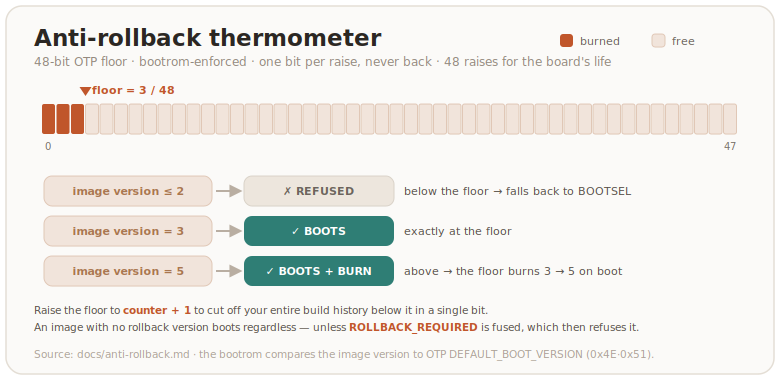

<!-- SPDX-License-Identifier: AGPL-3.0-only -->
<!-- Copyright (C) 2026 RS-Key contributors -->

# Anti-rollback

Secure boot ([production.md](production.md)) refuses *foreign* images — but
every image **you** signed stays valid forever. The first time a release fixes
an exploitable bug, your *previous* signed image becomes a hole: an attacker
with the device drags your old, signed UF2 over BOOTSEL and attacks the bug you
already fixed. Anti-rollback closes that downgrade path.

This page is the model and every case. The operational steps to turn it on are
in [production.md, stage 3](production.md#stage-3--anti-rollback-optional); the
fuses it touches are in [otp-fuses.md](otp-fuses.md). It is **optional** — until
you enable it, nothing here applies.

> **Read this whole page before enabling it.** Anti-rollback burns one-time
> fuses and, once enforced, changes which images your board will boot. None of
> it is reversible.

## Two independent axes

The single most important idea: an old, vulnerable image can be refused by
**two different mechanisms**, and they do not depend on each other.

| Axis | What it refuses on | Budget per chip |
|---|---|---|
| **Version** | a rollback counter in OTP ("don't boot below my floor") | 48 steps |
| **Key** | the signature ("don't boot if signed by a key I don't trust") | 4 key slots |

While you have version budget, the first axis does the work. When it runs out,
the second takes over. A fresh chip with a fresh key resets both. The rest of
this page is those two axes and what happens at their limits.

---

## Axis 1 — version (the rollback floor)

### Two different numbers

- **Firmware version** (`v0.3.1`, semver) — "which build is this", changes every
  release.
- **Rollback floor** — a number **on your board**: it refuses to boot anything
  below it. You move it, rarely, by hand.

RS-Key does **not** assign project-wide "epoch" numbers. There is only your own
floor, on each board, and you manage it.

### How it works in hardware

The floor lives in RP2350 OTP as a **48-bit thermometer** (its value is the
number of burned bits). At boot the **bootrom** (not our firmware) compares the
image's rollback version against your board's floor:

- image version **below** the floor → **refused**, fall back to BOOTSEL;
- **equal** → boots;
- **above** → boots **and immediately burns** the thermometer up to the image's
  version.



The whole mechanism has an on/off fuse, `ROLLBACK_REQUIRED`. Until it is burned,
images carrying **no** rollback version boot regardless (anti-rollback has no
teeth). You burn it from firmware:

```sh
rsk secure-boot status      # shows ROLLBACK_REQUIRED and the boot version N/48
rsk otp rollback-require     # fuse ROLLBACK_REQUIRED (requires secure boot enabled)
```

> ⚠️ **Burning the thermometer is irreversible.** OTP is one-time-programmable:
> a bit goes 0→1 and never back. See [otp-fuses.md](otp-fuses.md).

### Budget: 48 steps per chip, for the board's whole life

The thermometer is 48 bits, so the floor can advance **48 times over the entire
life of that board** — and never again. That is not "48 releases", it is 48
*burns*. Treat each advance as spending an irreversible, finite resource.

### The project flags downgrade-fixes; you decide

Because secure boot is rooted in **your own** signing key, there are no
project-signed images — every owner signs and chooses their own floor. So the
project's only job is to mark, in the changelog, which releases fix a
downgrade-exploitable bug:

| Release | downgrade-fix? |
|---|---|
| `v0.2.0` (OATH features) | no |
| `v0.3.0` (PIN-bypass fix) | **yes** |
| `v0.4.0` (PIV slots) | no |
| `v0.5.0` (signature-check fix) | **yes** |

When you build firmware, you check: were there downgrade-fix releases since my
last build? If so, it is your call:

- **Raise the floor** (close those bugs): seal with `--rollback <your counter +
  1>`. The board burns up to it; your older images below it stop booting.
- **Leave it** (you accept the risk): seal with `--rollback <your current
  counter>`. Everything still boots, nothing burns.

**The default is not to burn.** Raising the floor is a deliberate act tied to a
specific security release, not routine.

> Stated plainly: **if you don't burn, the downgrade attack stays possible** —
> your old signed image will still boot. That is a fine, conscious trade-off
> (you keep your 48-budget and don't orphan working images), but it is *your*
> choice of risk, not a default-protected state.

### Why `+1` is enough

The floor only needs to sit **above your own vulnerable builds.** Every build
you made was sealed at a version ≤ your current counter. So raising the floor to
**`counter + 1` cuts off your entire build history below it in a single bit** —
there is no absolute number to "catch up" to.

A bonus falls out of this: "decline, decline, then raise once when you decide to
care" spends *fewer* bits than raising the floor on every release, for the same
protection — because all your older builds sit below the one bump.

Concretely:

```sh
rsk secure-boot status         # read your floor, say "boot version 2/48"
# build the fixed firmware, then seal it one step higher:
picotool seal --sign --hash firmware.uf2 firmware-signed.uf2 \
    ~/.rs-key-secrets/secure_boot_key.pem ~/.rs-key-secrets/otp_secureboot.json \
    --major 1 --minor 0 --rollback 3        # 3 = counter (2) + 1
# flash it; on boot the floor burns 2 → 3, and every image sealed ≤ 2 is now refused
```

> One caveat for correctness: you must seal the **fixed** firmware **strictly
> above** the version you used for the vulnerable build. In practice that is
> `counter + 1`. If you accidentally seal the fixed image at the *same* version
> as a vulnerable one, the floor didn't rise and you are not protected.

### Your floor is per-board

The floor is **private to each board** — it equals the highest version that
*that* board has booted. It depends only on your burns, not on how many releases
exist. Different boards carry different floors; this is normal and needs no
coordination. The one rule: a board **will not boot an image below its own
floor** — you cannot go back down past a floor you've burned.

### At the ceiling (floor = 48)

The thermometer is full — but **you can still update forever.** You seal every
future image at version 48 and it boots. You lose only the *growth* of
version-based downgrade protection: a new release can no longer out-version a
previous one (there is no 49th step). The device works, secure boot still holds.
From here, downgrade protection moves to **axis 2**.

---

## Axis 2 — key (the signature)

### How the bootrom checks a signature

- OTP holds not the key but a **fingerprint** — `SHA-256(public key)` — in a
  boot-key slot.
- A signed image carries, inside it, the **full public key** plus an **ECDSA
  signature** (secp256k1 + SHA-256) over the image hash.
- At boot the bootrom hashes the public key **from the image** and compares it
  to the fused fingerprints. **No match → refused**, before it even checks the
  signature. Match → it verifies the ECDSA signature with that key → boots.

This can't be forged: an attacker can't sign for a key they don't hold, and they
can't make a different public key hash to a fused fingerprint (SHA-256).

### Key revocation = downgrade defense without the thermometer

When the version budget is spent, you switch axes. For each new downgrade-fix:

1. sign the fixed firmware with a **new key** K2;
2. confirm it boots;
3. **revoke the old key** K1 (`KEY_INVALID`).

The old vulnerable image, signed by K1, now fails secure boot **by signature** —
the version counter is not involved. RP2350 has **4 key slots**, so this buys
roughly **3 more rounds** on top of the 48.

### A decision you must make *before* the ceiling

Key revocation needs a **free key slot** reserved at provisioning time. Today
`rsk secure-boot lock` (stage D) revokes all three unused slots — after that
there is nowhere to rotate to. So this is a genuine trade-off, made up front:

| | Full `lock` (current default) | Reserve a slot for rotation |
|---|---|---|
| Hardening against attacker key injection | maximum | the free slot is reachable by an attacker with physical access who can burn fuses |
| Escape valve at the 48 ceiling | none (new chip only) | ~3 key rotations |

> Detail: after `lock`, the key pages stay *secure*-writable (the firmware must
> still write `ROLLBACK_REQUIRED` and the page-58 lock), so a future firmware
> command could in principle provision a key into a *free, un-revoked* slot even
> after lock. That command does not exist yet.

---

## When the 48 budget is exhausted — the ladder

1. **Rotate the key on the same board** (~3 rounds, if you reserved a slot) —
   old images die by signature.
2. **New board + new key** (next section) — a fresh 48, and the whole old
   history is dead by signature.
3. **Accept the residual** — secure boot still holds; a downgrade is then only
   possible to an attacker with **physical access *and* one of your old signed
   artifacts.** Document it; for most threat models this is acceptable.

> **This is the RP2350's hard limit, not an RS-Key flaw.** Any firmware on this
> chip has the same ceiling (48 versions + 4 keys). There is no software trick
> around it: a software rollback counter in the firmware would be weaker — it
> runs *after* the bootrom already booted the (possibly vulnerable) image, and
> its store would live in flash, which the same attacker can rewrite.

**Prevention beats cure.** 48 *genuine* downgrade-exploitable fixes on a single
chip is beyond even commercial keys over a decade. If you are approaching the
limit, you are almost certainly flagging as "downgrade-fix" releases where
booting the old image gains the attacker nothing. The real discipline is: floor
`+1` only when the old image is a working exploit.

---

## Moving to a new board

A fresh chip gives a fresh 48 and fresh 4 slots. You provision a **new signing
key** (yours, backed up) and trust **only it** on the new board.

### Why the new board's floor is 1, not a repeat of every old risk

This is the subtle part. Starting a new board at floor 1 can *look* like you are
re-accepting every downgrade risk you defended against on the old board. **You
are not.** The protection didn't disappear — it moved from the version axis to
the key axis:

- the old vulnerable images are signed with the **old** key;
- the new board trusts **only the new** key, so those images are refused **by
  signature**;
- and there are **no** vulnerable images signed with the **new** key — you
  signed only the current, fixed firmware with it.

So there is nothing below floor 1 (on the new key) to block. Floor 1 is safe
precisely because no image exists that is both (a) vulnerable and (b) signed by a
trusted key.

> The rule that makes this work: an image is dangerous only if it is **both**
> signed by a trusted key **and** exists as a file. On the new board, old
> vulnerable images are signed by an untrusted key, and the new key has signed
> only the fixed firmware.

> ⚠️ **Required condition: the new board trusts only the new key.** If you also
> provision the old key on the new board, the old vulnerable images pass the
> signature check again and floor 1 will not stop them. New board ⇒ fresh key,
> old key not carried over.

### What migrates, what doesn't

- **Migrates:** your FIDO identity, via [seed backup](guides/seed-backup.md)
  (`ssh ed25519-sk`, 2FA registrations) — `rsk backup restore`.
- **Does not migrate:** resident passkeys, OpenPGP and PIV keys — sealed to the
  old chip, not derivable from the seed. Re-enroll those.

---

## How to verify all of this

```sh
rsk secure-boot status              # fused boot-key fingerprint, ROLLBACK_REQUIRED, boot version N/48
picotool info firmware-signed.uf2   # the image's key fingerprint — compare to the fused one
```

Negative tests are the real proof:

- an **unsigned** UF2 → bootrom refuses it, falls back to BOOTSEL;
- an image **below your floor** → refused (the version axis works);
- an image signed by the **old / a foreign key** → refused by signature (the key
  axis works).

## Cheat sheet

- Firmware version ≠ rollback floor. The project assigns no epochs — the floor
  is on your board and you control it.
- The project only flags a release as a downgrade-fix; you decide and you burn.
- **Raise = your board's current counter + 1.** Default: don't burn.
- Don't burn ⇒ downgrade is possible (your conscious risk).
- Budget is 48 **per chip**; burning is irreversible.
- At the ceiling, updates still work; protection moves to key revocation.
- A new chip + new key is a clean restart at floor 1; the old history is dead
  by signature, not by version.
