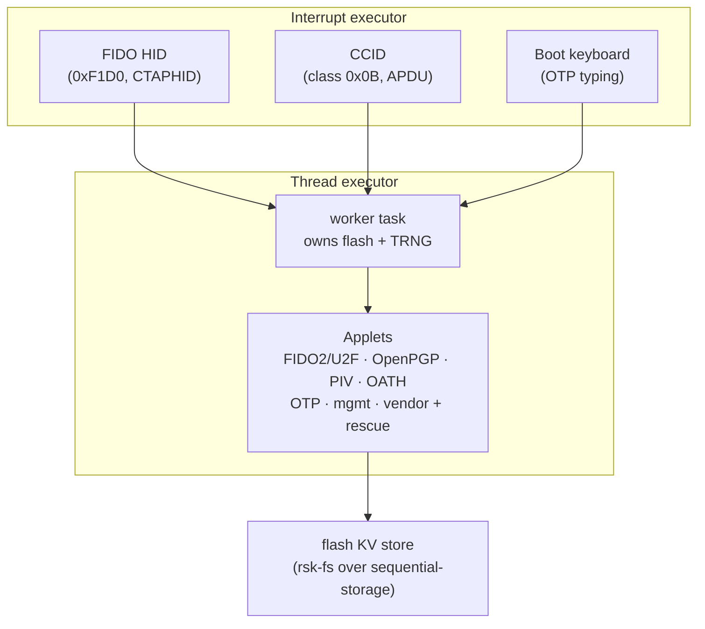
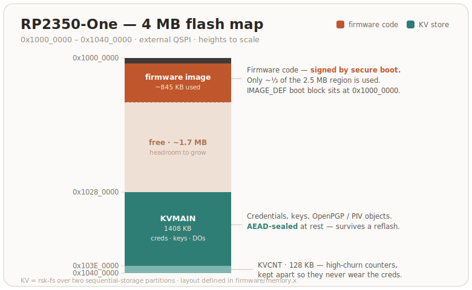

# Architecture

How the firmware is put together — for contributors and the curious. For what
the design does and does not defend against, see the
[threat model](threat-model.md).

## The big picture

A composite USB device with three interfaces, seven smart-card applets and
one storage layer. Day to day everything runs on one RP2350 core — the
second wakes only to parallelize RSA keygen (below):

**Two executors.** USB and the transports live on a high-priority
`InterruptExecutor`; the applet dispatch lives on the low-priority thread
executor in a single *worker* task that owns the flash and the TRNG outright.
Long synchronous work — on-card RSA generation, flash compaction, a touch
wait — blocks only the worker, while the interrupt executor keeps the bus
enumerated, streams CCID/CTAPHID keepalives, and animates the LED. No
mutexes: ownership does the synchronization.

**Why (mostly) one core.** The async executor provides the *concurrency* that
the upstream design used a second core and hand-rolled queues for. Core 1 is
kept out of the transport path and has exactly one job: during on-card RSA
generation both cores race the prime search — independent random candidates,
each core with its own DRBG stream, feeding one shared two-prime pool
(`firmware/src/core1.rs`). Measured, RSA-2048 generation drops from ~8.9 s to
~4.3 s mean (2.07×).

Three details make that work:

- The Fermat-filter modexp (C + asm) executes from SRAM. Two cores running it
  from XIP throttle each other on the shared flash cache (~40% per core,
  measured).
- The key returns the moment the pool completes; core1's last candidate
  finishes in the background.
- A core1 that ever stops answering latches the engine into single-core mode
  rather than stalling the worker (`INS 0x12` on the vendor applet reads the
  engine's counters and flags).

Outside keygen, core1 parks in WFE, and embassy-rp pauses it around every flash
erase/program, so its XIP fetches never collide with flash writes.

## Crates

| Crate | Contents |
|---|---|
| `firmware` | the only crate that touches the HAL: board bring-up, USB descriptors, executors, the worker, OTP fuse access, LED, BOOTSEL touch |
| `rsk-sdk` | APDU parsing (cases 1–4, short + extended), BER-TLV, status words, the `Applet` trait + dispatcher |
| `rsk-fs` | the flash filesystem: 16-bit file ids over two `sequential-storage` KV partitions (main + high-churn counters), ACLs, metadata records |
| `rsk-crypto` | one wrapper over RustCrypto: hashes, HMAC/HKDF, AES-CBC/CFB/GCM, ChaCha20-Poly1305, PIN KDFs, HMAC-DRBG, ML-DSA-44/ML-KEM, base64url, CRC |
| `rsk-usb` | the CTAPHID reassembler/framer and the CCID state machine, transport-agnostic and fully host-testable |
| `rsk-fido` | FIDO2 (CTAP 2.1) + U2F: credentials, clientPIN (protocols 1+2), credManagement, extensions (hmac-secret, credProtect, credBlob, largeBlobs, minPinLength), enterprise attestation, seed backup + soft-lock vendor commands |
| `rsk-openpgp` | OpenPGP card 3.4: DO model, PW1/RC/PW3, import/generate, PSO, AES PSO, certs — EC + RSA-2048/3072/4096 |
| `rsk-piv` | PIV: 24 key slots + F9 attestation, management-key auth, generate/import/sign/ECDH, on-card X.509 via a hand-rolled backward DER writer |
| `rsk-oath` | YKOATH protocol: TOTP/HOTP, touch-required accounts, access codes |
| `rsk-otp` | Yubico OTP slots ×4: CCID command surface + the keyboard frame protocol and typed-ticket generation |
| `rsk-mgmt` | the YubiKey management applet (DeviceInfo, interface toggles) served over both CCID and CTAPHID |
| `rsk-rescue` | recovery/provisioning applet: identity, phy config record, flash info, secure-boot status, attestation key, reboot, the one OTP-lock write |
| `rsk-rsa-asm` | vendored C/ARM-asm modular exponentiation behind one FFI fn (host build uses a pure-Rust fallback) |
| `rsk-led` | the `EF_LED_CONF` codec for the status-LED config block, shared by the firmware and the `rsk led` host tool |
| `rsk-ui` | the trusted-display UI model (operation prompts, untrusted relying-party-string sanitizing, Allow/Deny button geometry); compiled only into the `display` build |

Everything except `firmware` is hardware-agnostic and runs the full test
suite on the host ([testing.md](testing.md)).

## Flash layout

Two KV partitions at fixed offsets (`firmware/memory.x`): the main store, and
a small separate partition for the per-operation counters so their churn
never forces compaction of long-lived records. Files are 16-bit ids; each
applet owns disjoint ranges (FIDO `0x10xx/0xCxxx/0xCFxx/0xD0xx`, OpenPGP DO
mirrors, PIV `0xD1xx/0xD2xx`, OTP slots `0xBBxx`, phy/rescue `0xE0xx`) and a
reset wipes exactly its own predicate — never a range shared with another
applet.

Key sealing at rest: `kbase = HKDF(serial_hash, otp_master_key)` keys
AES-CBC for the FIDO seed (tagged formats: plain vs OTP-rooted generation)
and AES-GCM for PIV keys; OpenPGP keys sit under the PIN-wrapped DEK chain.
When the OTP master key gets provisioned later in a device's life, a boot
pass and lazy PIN-verify hooks migrate every sealed object to the new root
without losing data. Until that burn the root derives from on-chip state
alone, which an attacker with full flash and chip access could reconstruct —
[threat-model.md](threat-model.md) covers what at-rest sealing does and does
not buy before provisioning.

## Capacity — why the flash is mostly empty

The KV store is a fixed 1.5 MB whatever the `FLASH_SIZE` ([build.md](build.md));
a larger flash only grows the code region, most of which no firmware writes. That
is deliberate. A security key's maximum *logical* state is small and hard-capped:
`MAX_RESIDENT_CREDENTIALS` (256 passkeys), `MAX_DYNAMIC_FILES` (256 files across
all applets), `MAX_OATH_CRED` (255), plus a handful of OpenPGP/PIV slots — so a
fully provisioned device fills only a few hundred KB, well under the 1408 KB main
partition. Growing the store to "fill" a 16 MB board would buy nothing usable: it
lengthens the `sequential-storage` scan behind every cold boot and absent-key
probe (the present cache exists to dodge exactly that full-partition ~0.2 s cost),
and forces the logical caps — and the RAM/stack buffers sized to them — up for
capacity no one reaches. Empty flash here is headroom, not waste.

## Device identity

USB VID/PID, product strings and the reported firmware version are
compile-time knobs ([build.md](build.md)). The default is RS-Key's own
identity — VID:PID `0x1209:0x0001` (pid.codes), manufacturer "RS-Key",
product "RS-Key Security Key" (the `RSKey` preset). An opt-in `VIDPID=Yubikey5`
preset builds the Yubico interop flavor (`0x1050:0x0407`, reader name "Yubico
YubiKey") for the tools that auto-recognize the device purely by that reader
name. A flash-resident *phy* record can override VID/PID and the product
string at boot (the store mounts before the USB builder runs for exactly this
reason). FIDO tools find the device by HID usage page, CCID tools by the
reader name.

## User presence

One presence button (BOOTSEL by default, or `PRESENCE_PIN`), shared by all 
applets through a `UserPresence` trait the firmware implements once: FIDO 
operations, OpenPGP UIF, PIV touch policies, OATH touch accounts, and OTP slot 
typing (1–4 presses select the slot) all gate on it. The no-touch build 
(`--features no-touch`) auto-confirms — for test rigs, not for daily use.

## Provenance

RS-Key reimplements the applet behaviour, file layouts and protocol surface
of [pico-keys](https://github.com/polhenarejos) (AGPL, see
[NOTICE](https://github.com/TheMaxMur/RS-Key/blob/main/NOTICE)) in Rust,
replacing the C HAL/runtime/transport stack with embassy and RustCrypto:

| was (C) | is (Rust) |
|---|---|
| pico-sdk runtime + TinyUSB | `embassy-rp` + `embassy-usb` |
| mbedTLS | RustCrypto (`p256/p384/p521/k256`, `rsa`, `ed25519-dalek`, …) |
| TinyCBOR | `minicbor` |
| bespoke wear-leveled flash writer | `sequential-storage` |
| core0/core1 + queues | one async executor pair; core1 = a keygen math engine only |

Where the two implementations deliberately differ (at-rest sealing, seed
PIN-wrapping, OTP provisioning policy, several upstream bugs not carried
over), the divergence is a documented design decision — see
[threat-model.md](threat-model.md) and the crate docs.
