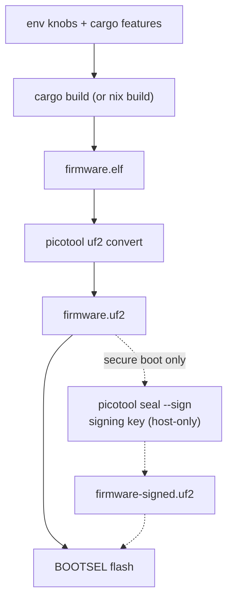
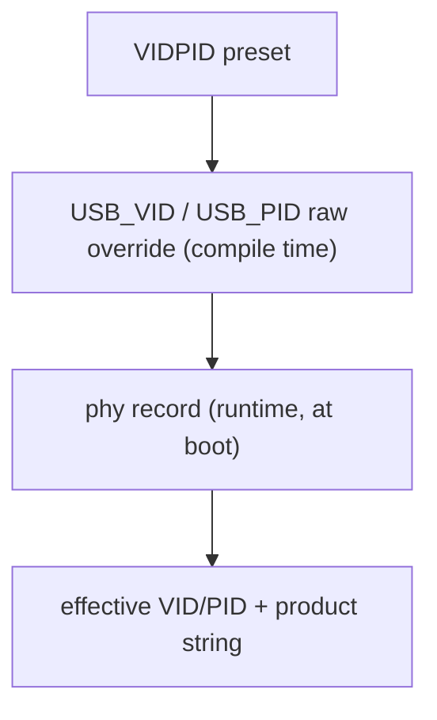

# Build options

Every knob is compile-time: set environment variables and cargo features at
`cargo build` and they are baked into the image. Nothing here can be changed
at runtime (except where noted for the phy record).

```sh
# the general shape
nix develop -c env KNOB=value cargo build --release -p firmware [--features ...] [--no-default-features]
picotool uf2 convert target/thumbv8m.main-none-eabihf/release/firmware -t elf firmware.uf2
```



## Cargo features

| Feature | Default | Effect |
|---|---|---|
| `up-button` | **on** | FIDO operations (makeCredential, getAssertion, U2F, reset, selection) and OpenPGP UIF data objects require a press of the BOOTSEL button. Build with `--no-default-features` to get the **no-touch test build** — the automated suites (`tests/`, python-fido2, OpenPGP card tests) cannot press a button and will hang on a touch build. |
| `advertise-pqc` | off | Prepends ML-DSA-44 (COSE −48) to the getInfo `algorithms` list. Off by default because released Firefox versions abort the *entire* getInfo parse on an unknown COSE id and report the authenticator broken. **PQC capability is on regardless of this flag** — makeCredential negotiates −48 from the request's `pubKeyCredParams`; the flag only controls advertising. |
| `fips-profile` | off | Bakes a locked FIPS-style policy into the image: ES256K (secp256k1) leaves the FIDO menu, the minimum PIN rises to 6, the vendor seed *export* is refused, and PIV refuses new 3DES management keys and RSA-1024. The default build is unchanged; with secure boot the policy is sealed by your signature. A profile, **not** a FIPS validation — details and rationale: [guides/fips.md](guides/fips.md). |

## Environment variables

| Variable | Default | Values | Effect |
|---|---|---|---|
| `VIDPID` | `Yubikey5` | `Yubikey5`, `YubikeyNeo`, `YubiHSM`, `NitroHSM`, `NitroFIDO2`, `NitroStart`, `NitroPro`, `Nitro3`, `Gnuk`, `GnuPG`, `Pico`, `Dev` | USB VID/PID preset. The default `Yubikey5` (`0x1050:0x0407`) is what makes `ykman`, Yubico Authenticator and the stock udev rules work. `Pico` = the Raspberry Pi generic id (`0x2E8A:0x10FD`); `Dev` = a placeholder (`0xFEFF:0xFCFD`). An unknown preset fails the build. **These vendor-mimicking ids are for local interop only — never distribute hardware carrying them.** |
| `USB_VID` / `USB_PID` | from preset | `0xHHHH` | Raw override, applied on top of the preset (you can override either half alone). |
| `FW_VERSION` | `5.7.4` | `X.Y.Z` or `X.Y` | The firmware version reported everywhere a tool looks: management DeviceInfo (`ykman info`), FIDO getInfo, CTAPHID INIT, OATH/OTP/PIV version fields. Yubico tools gate features on it; 5.7.4 mimics a current YubiKey 5. Does **not** change the OpenPGP card version (3.4) or the USB `bcdDevice` (an internal build counter). |
| `XOSC_DELAY_MULT` | `128` | `1..=1024` | Crystal-oscillator startup-delay multiplier ("delayed boot"). A longer settle wait is intended to harden the early-boot clock-switch window against glitch/fault injection. 128 is the embassy default. |
| `FLASH_SIZE` | `4M` | bytes, `0xHEX`, or `<n>K`/`<n>M` | External QSPI flash size. build.rs regenerates `memory.x` from it — the KV store stays a fixed 1.5 MB at the top, the code region is the rest. `4M` reproduces the checked-in layout byte-for-byte. Use this for boards with a different flash chip (e.g. `8M`); must be ≥ ~2 MB and ≤ 16 MB. |
| `LED_PIN` | `16` | `0..=29` | The WS2812 status-LED data GPIO (RP2350A). Default GPIO16 is the Waveshare RP2350-One. Point it at a free GPIO on boards that use 16 for something else; the indicator simply drives whatever pin you pick. |
| `FAKE_MKEK` / `FAKE_DEVK` | unset | 64 hex chars | **Test builds only.** Bakes a fake OTP master key / device key into the image instead of reading the OTP fuses, so the whole OTP migration path can be exercised with zero fuse writes. The build prints a loud warning and the key is greppable in the binary. Flashing a FAKE build onto a provisioned device migrates its data under the fake key — going back orphans that data (recovery = per-applet resets). Never flash one on a device you care about. |

Verify what got baked without flashing:

```sh
rg PK_USB_VID  target/thumbv8m.main-none-eabihf/release/build/firmware-*/output   # decimal: 4176 = 0x1050
rg PK_FW_VERSION target/thumbv8m.main-none-eabihf/release/build/rsk-sdk-*/output
rg PK_XOSC_DELAY_MULT target/thumbv8m.main-none-eabihf/release/build/firmware-*/output
```

## Examples

```sh
# default: touch build, YubiKey-5 identity, fw 5.7.4
cargo build --release -p firmware

# no-touch test build (for the automated suites)
cargo build --release -p firmware --no-default-features

# Nitrokey FIDO2 identity with its own version number
env VIDPID=NitroFIDO2 FW_VERSION=1.4.0 cargo build --release -p firmware

# advertise PQC in getInfo (breaks released Firefox — see above)
cargo build --release -p firmware --features advertise-pqc
```

## `nix build` (hermetic, no dev shell)

The flake exposes the firmware as a package, so you can build a UF2 without
entering the dev shell or having a Rust toolchain installed — Nix pins the
toolchain, the cross target, and every dependency:

```sh
nix build .#firmware                 # default touch image
ls result/                           # firmware.elf  firmware.uf2
```

`result/firmware.uf2` is functionally the image the dev-shell `cargo build`
produces — and, unlike the dev-shell build, it is **bit-for-bit
reproducible**: the derivation remaps the two absolute build inputs out of
the binary (the per-build sandbox dir and the toolchain store path — both
land in panic-location strings in `.rodata`, plus DWARF in the `.elf`) with
stable `--remap-path-prefix`, so one `flake.lock` yields one `firmware.uf2`
on every machine of a platform. The weekly `repro` job in
[deep-checks](https://github.com/TheMaxMur/RS-Key/blob/main/.github/workflows/deep-checks.yml)
proves it — `nix build` twice, the second with `--rebuild` so nix compares
every output byte — and publishes the canonical sha256 in its run summary.

To verify a published image: `nix build .#firmware` at the release commit
and compare hashes. A *sealed* image can't be reproduced by a third party
(the signature is the signer's); verify the unsigned payload instead, then
check the seal with `picotool`. The flavors mirror the
[CI matrix](https://github.com/TheMaxMur/RS-Key/blob/main/.github/workflows/ci.yml):

| Attribute | Image |
|---|---|
| `.#firmware` (default) | touch build, YubiKey-5 identity, fw 5.7.4 |
| `.#firmware-no-touch` | `--no-default-features` (the test build) |
| `.#firmware-fips` | `--features fips-profile` |
| `.#firmware-pqc` | `--features advertise-pqc` |

Two caveats:

- **The output is UNSIGNED.** On a secure-boot device you still seal it with
  your key — the signing key deliberately never enters the build sandbox:
  ```sh
  picotool seal --sign --hash result/firmware.uf2 firmware-signed.uf2 \
      ~/.rs-key-secrets/secure_boot_key.pem ~/.rs-key-secrets/otp_secureboot.json \
      --major 1 --minor 0
  ```
  The `.pem` is your signing key, the `.json` is where `seal` writes the
  boot-key fingerprint, and `--major`/`--minor` stamp an **image version** into
  the boot metadata — a plain `major.minor` label, separate from both the
  firmware version RS-Key reports (`5.7.x`) and the rollback version. The full
  meaning of each flag is in [production.md](production.md#2b-sign-and-prove-a-signed-image-boots-before-any-fuse).

  If you have enabled **anti-rollback**, the seal additionally needs
  `--rollback <your board's floor>` — a separate, deliberate step with its own
  rules and a finite OTP budget. Don't add it blindly; the full
  flashing-with-rollback workflow is in [anti-rollback.md](anti-rollback.md).
- **The env knobs above are declarative Nix args**, not ambient env. A plain
  `nix build` bakes the defaults; to customize, pass them to the builder. For a
  config you reuse, add a one-line preset package (the flake ships
  `firmware-pico = mkFirmware { name = "firmware-pico"; vidpid = "Pico"; }` as a
  copy-me example) and build it:
  ```sh
  nix build .#firmware-pico
  ```
  For a one-off without committing a package, call the exposed builder. (The
  `--impure` here only lets `getFlake` read the working tree; the knobs
  themselves are pure — a committed/pushed flakeref needs no flag.)
  ```sh
  nix build --impure --expr \
    '(builtins.getFlake (toString ./.)).lib.${builtins.currentSystem}.mkFirmware
       { name = "fw"; vidpid = "Nitro3"; fwVersion = "2.0.0"; }'
  ```
  Knobs: `vidpid`, `usbVid`, `usbPid`, `fwVersion`, `xoscDelayMult`, `flashSize`,
  `ledPin`, `fakeMkek`, `fakeDevk` (mirroring the env vars above). As a convenience each also falls
  back to the like-named env var, so `VIDPID=Pico nix build --impure .#firmware`
  works for a quick throwaway — but the declarative arg is the reproducible path
  and needs no `--impure`.

## Runtime overrides (phy record)

The rescue applet can store a small config record in flash (`rsk` /
`rsk-tui` expose the safe fields). At boot, a stored **VID/PID** and **product
string** override the compile-time defaults — useful to re-identify a device
without rebuilding. A bad value can make the device enumerate strangely;
recovery is a BOOTSEL reflash (which never reads the record) or rewriting the
record over CCID.

The effective identity is resolved in this order:



## Notes

- The PC/SC **reader name** comes from the USB strings
  (`Yubico YubiKey RSK OTP+FIDO+CCID`). `ykman` derives the device's PID from
  that name — it needs the `Yubico YubiKey` words and the `OTP`/`FIDO`/`CCID`
  tokens. If you change the product string, YubiKey tools stop recognizing the
  CCID half; the project's own tools match the `RSK` token.
- `bcdDevice` (USB device release) is an internal build counter, not the
  firmware version.
- The two UF2 flavors on a release build of this repo:
  `firmware.uf2` (touch) and `firmware-test.uf2` (no-touch) — `scripts/check.sh`
  builds both.
