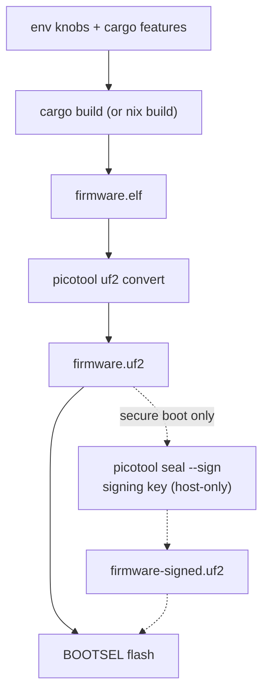
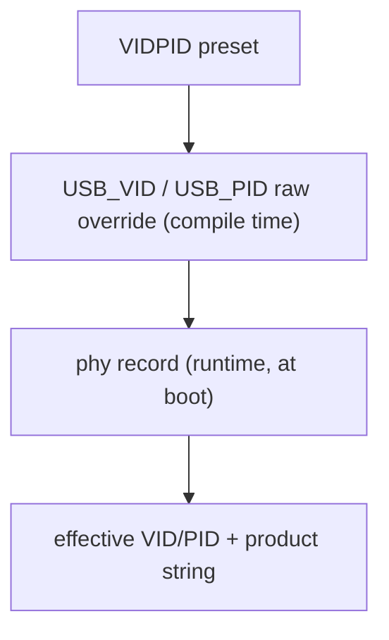

# Build options

Every knob is compile-time: set environment variables and cargo features at
`cargo build` and they are baked into the image. Nothing here can be changed
at runtime (except where noted for the phy record).

```sh
# the general shape
nix develop -c env KNOB=value cargo build --release -p firmware [--features ...]
picotool uf2 convert target/thumbv8m.main-none-eabihf/release/firmware -t elf firmware.uf2
```



## Cargo features

| Feature | Default | Effect |
|---|---|---|
| `no-touch` | off | Auto-confirm user presence — FIDO operations (makeCredential, getAssertion, U2F, reset, selection) and OpenPGP UIF data objects no longer require a press of the presence button (BOOTSEL by default, or `PRESENCE_PIN` when set). **Requiring a touch is the default and is not a feature**; `--features no-touch` is the explicit escape hatch for the automated suites (`tests/`, python-fido2, OpenPGP card tests), which cannot press a button and would hang on the (default) touch build. **Never ship a no-touch build.** |
| `advertise-pqc` | off | Prepends ML-DSA-44 (COSE −48) to the getInfo `algorithms` list. Off by default because released Firefox versions abort the *entire* getInfo parse on an unknown COSE id and report the authenticator broken. **PQC capability is on regardless of this flag** — makeCredential negotiates −48 from the request's `pubKeyCredParams`; the flag only controls advertising. |
| `fips-profile` | off | Bakes a locked FIPS-style policy into the image: ES256K (secp256k1) leaves the FIDO menu, the minimum PIN rises to 6, the vendor seed *export* is refused, and PIV refuses new 3DES management keys and RSA-1024. The default build is unchanged; with secure boot the policy is sealed by your signature. A profile, **not** a FIPS validation — details and rationale: [guides/fips.md](guides/fips.md). |
| `strict-up` | off | Require a touch on **every** `getAssertion`. By default RS-Key honors the platform's silent pre-flight probe (`up:false`): it returns the discovery assertion with no touch and the UP flag clear, so a WebAuthn login with an `allowCredentials` (non-resident) credential is a **single** touch — matching the CTAP2 spec and YubiKey. With `strict-up` the button is polled even for that probe, so such a login asks for **two** touches (one for the probe, one for the real assertion). A deliberately stricter "every assertion needs an explicit gesture" stance for those who want it; it is **not** spec-conformant for `up:false`. Resident-credential / passkey logins are a single touch either way. `fido-conformance` enables this implicitly (the conformance pass was validated with it). |
| `display` | off | **Experimental** trusted-display build for a screen + touch board (Waveshare RP2350-Touch-LCD-2.8): on-screen Approve/Deny showing the relying party, built-in user verification (an on-device PIN pad), an on-device settings menu with a factory reset, and a Passkeys browser that can delete a passkey on-device, with lock to follow. Entirely `dep:`-gated — a standard key without a screen compiles **none** of it, so its image is unaffected (the gate asserts the `rsk-ui` UI crate is absent from the default dependency tree). Build the display flavor with `LED_KIND=none FLASH_SIZE=16M … --features display` (the panel replaces the addressable LED, freeing GPIO16 for the backlight; a compile-time guard enforces `LED_KIND=none`). Wired today: the ST7789 shows a splash then mirrors the device status, and the panel gates user presence — a touch request paints a trusted Approve/Deny prompt naming the operation and the real relying party (Allow confirms, Deny refuses with `OPERATION_DENIED`), so a signature can't be obtained without a physical tap on a screen showing the true rp. Built-in user verification, too: getInfo advertises `options.uv` and a PIN typed on the on-screen numeric pad (masked, never sent to the host) mints a `pinUvAuthToken` via clientPIN `getPinUvAuthTokenUsingUvWithPermissions` (0x06) / `getUVRetries` (0x07), checked against the same `EF_PIN` — the PIN never leaves the device. The idle screen carries a bottom **navigation bar** (Home / Passkeys / Settings). **Settings** adjusts backlight brightness (PWM) and the touch timeout live, shows a read-only device-info page (firmware `bcdDevice` + chip serial), and offers a **Factory reset** that erases every applet's data — FIDO passkeys and PIN, PIV, OpenPGP, OATH — scrubs the flash, and reboots to a blank device (PIN-gated when a clientPIN is set, then a deliberate hold-to-confirm; only the org attestation and the fused OTP/secure-boot state survive); the brightness/timeout settings are runtime-only today, and persisting them across reboots is a later flash-format change. **Passkeys** lists the resident credentials stored on the device — one row per relying party (the real rpId + account count), drilling into a per-account detail where a passkey can be **deleted** on-device (gated by the on-screen PIN when a clientPIN is set, then a deliberate hold on the delete button) — all decrypted on the device, never on the host. Rename and lock land in a later phase. |

## Environment variables

| Variable | Default | Values | Effect |
|---|---|---|---|
| `VIDPID` | `RSKey` | `RSKey`, `Yubikey5`, `YubikeyNeo`, `YubiHSM`, `NitroHSM`, `NitroFIDO2`, `NitroStart`, `NitroPro`, `Nitro3`, `Gnuk`, `GnuPG`, `Pico`, `Dev` | USB VID/PID preset. The default `RSKey` (`0x1209:0x0001`) is this project's own [pid.codes](https://pid.codes/) identity — not a masquerade. The opt-in `Yubikey5` (`0x1050:0x0407`) instead presents Yubico's VID/PID **and** swaps the descriptor strings to `Yubico` / `YubiKey RSK …` — that is what makes `ykman`, Yubico Authenticator and the stock Yubico udev rules recognize the device; build it only for local interop / the interop suite. `Pico` = the Raspberry Pi generic id (`0x2E8A:0x10FD`); `Dev` = a non-colliding placeholder (`0xFEFF:0xFCFD`). An unknown preset fails the build. **The vendor-mimicking presets are for local interop only — never distribute hardware carrying them.** |
| `USB_VID` / `USB_PID` | from preset | `0xHHHH` | Raw override, applied on top of the preset (you can override either half alone). |
| `USB_MANUFACTURER` / `USB_PRODUCT` | from preset | string | Raw override of the USB descriptor strings. The default is `RS-Key` / `RS-Key Security Key`; the Yubico VID instead bakes `Yubico` / `YubiKey RSK OTP+FIDO+CCID`. The project's own tools (`rsk`, `rsk-tui`) match the reader by the `RS-Key` (or `RSK`) token in the product string. |
| `FW_VERSION` | `5.7.4` | `X.Y.Z` or `X.Y` | The firmware version reported everywhere a tool looks: management DeviceInfo (`ykman info`), FIDO getInfo, CTAPHID INIT, OATH/OTP/PIV version fields. Yubico tools gate features on it; 5.7.4 mimics a current YubiKey 5. Does **not** change the OpenPGP card version (3.4) or the USB `bcdDevice` (an internal build counter). |
| `XOSC_DELAY_MULT` | `128` | `1..=1024` | Crystal-oscillator startup-delay multiplier ("delayed boot"). A longer settle wait is intended to harden the early-boot clock-switch window against glitch/fault injection. 128 is the embassy default. |
| `FLASH_SIZE` | `4M` | bytes, `0xHEX`, or `<n>K`/`<n>M` | External QSPI flash size. build.rs regenerates `memory.x` from it — the KV store stays a fixed 1.5 MB at the top, the code region is the rest. `4M` reproduces the checked-in layout byte-for-byte. Use this for boards with a different flash chip (e.g. `8M`); must be ≥ ~2 MB and ≤ 16 MB. |
| `LED_PIN` | `16` | `0..=29` | The status-LED GPIO for the `ws2812` and `gpio` backends (RP2350A). Default GPIO16 is the Waveshare RP2350-One. Point it at a free GPIO on boards that use 16 for something else; the indicator simply drives whatever pin you pick. (Unused by `pimoroni`, which has fixed PWM pins, and by `none`.) |
| `PRESENCE_PIN` | `bootsel` | `bootsel` or `0..=29` | User-presence input source. Default `bootsel` keeps the BOOTSEL hardware-button path. Set a GPIO number for a dedicated button (active-low with an internal pull-up by default — flip with `PRESENCE_ACTIVE_HIGH`). Example: `PRESENCE_PIN=0` for a button to ground on GPIO0. |
| `PRESENCE_ACTIVE_HIGH` | `0` | `0` / `1` | GPIO presence-button polarity — only meaningful with a GPIO `PRESENCE_PIN`. `0` (default) = active-low: button to ground, internal pull-up, a press reads **low**. `1` = active-high: internal pull-down, a press reads **high** — for a capacitive touch sensor or a button to VCC. Ignored for the BOOTSEL default. |
| `WAKE_PIN` | `25` | `none` or `0..=29` | **`display` builds only.** The button that wakes the panel from display sleep. Default `25` is the Waveshare RP2350-Touch-LCD-2.8's **BAT_PWR** button. `none` makes wake touch-only (no button); any other GPIO selects a different button. A value in the LCD/touch range (`10..=18`) is rejected at compile time. The display-sleep timeout itself is set on-device (Settings → Display sleep). |
| `WAKE_ACTIVE_HIGH` | `0` | `0` / `1` | Wake-button polarity (`display` builds, with a GPIO `WAKE_PIN`). `0` (default) = active-low (internal pull-up, press reads **low**, e.g. BAT_PWR to ground); `1` = active-high (internal pull-down). |
| `LED_KIND` | `ws2812` | `ws2812` / `gpio` / `pimoroni` / `none` | The LED driver backend, and the **boot default** — a non-`none` build compiles all three so the driver/pin/order are runtime-switchable via `rsk hw` / PicoForge (see below). `ws2812` = a single addressable RGB on `LED_PIN` (the Waveshare default). `gpio` = a plain on/off LED on `LED_PIN` — hue/brightness collapse to lit/unlit, but the blink *pattern* still distinguishes statuses. `pimoroni` = a 3-pin PWM RGB (Pimoroni Tiny 2350: R=GPIO18, G=GPIO19, B=GPIO20, common-anode). `none` = no indicator (the status engine still runs; nothing renders it, and the phy LED fields are ignored). |
| `LED_ORDER` | `rgb` | `rgb` / `grb` | WS2812 wire byte order (`ws2812` backend only). The Waveshare RP2350-One is unusually `rgb` (the default); standard WS2812B parts (e.g. the TenStar RP2350-USB) are `grb`. If a `ws2812` board comes up with red and green swapped (blue fine), flip this to `grb`. |
| `MAX_LEDS` | `1` | `1`–`64` | PIO state-machine and frame-buffer ceiling for addressable LEDs. The **actual** connected count is set at runtime via `rsk hw --led-num` and must be ≤ `MAX_LEDS`. Default 1 is a single onboard LED; a board with a chain of N builds with `MAX_LEDS=N` (up to 64).|
| `FAKE_MKEK` / `FAKE_DEVK` | unset | 64 hex chars | **Test builds only.** Bakes a fake OTP master key / device key into the image instead of reading the OTP fuses, so the whole OTP migration path can be exercised with zero fuse writes. The build prints a loud warning and the key is greppable in the binary. Flashing a FAKE build onto a provisioned device migrates its data under the fake key — going back orphans that data (recovery = per-applet resets). Never flash one on a device you care about. |

The `LED_PIN` / `LED_KIND` / `LED_ORDER` / `MAX_LEDS` values are **boot defaults**
only. A
non-`none` build compiles all three backends, so the LED pin, driver, and wire
order are runtime-configurable — no reflash — with `rsk hw` (or PicoForge),
which write them to the device's `phy` record. The build knobs decide the
out-of-the-box behaviour and let you drop to a lean `none` build; everything
else is a `rsk hw` call away ([guides/led.md](guides/led.md)).

Verify what got baked without flashing:

```sh
rg PK_USB_VID  target/thumbv8m.main-none-eabihf/release/build/firmware-*/output   # decimal: 4617 = 0x1209
rg PK_FW_VERSION target/thumbv8m.main-none-eabihf/release/build/rsk-sdk-*/output
rg PK_XOSC_DELAY_MULT target/thumbv8m.main-none-eabihf/release/build/firmware-*/output
```

The `firmware-*` glob matches one build dir per feature combination you have
built, so a stale entry can show an old value. Read the freshest one (or
`cargo clean -p firmware` first) if the output looks doubled.

## Examples

```sh
# default: touch build, RS-Key identity (0x1209:0x0001), fw 5.7.4
cargo build --release -p firmware

# opt-in Yubico interop flavor (so ykman / Yubico Authenticator see the device)
env VIDPID=Yubikey5 cargo build --release -p firmware

# no-touch test build (for the automated suites)
cargo build --release -p firmware --features no-touch

# Nitrokey FIDO2 identity with its own version number
env VIDPID=NitroFIDO2 FW_VERSION=1.4.0 cargo build --release -p firmware

# advertise PQC in getInfo (breaks released Firefox — see above)
cargo build --release -p firmware --features advertise-pqc
```

## `nix build` (hermetic, no dev shell)

The flake exposes the firmware as a package, so you can build a UF2 without
entering the dev shell or having a Rust toolchain installed — Nix pins the
toolchain, the cross target, and every dependency:

```sh
nix build .#firmware                 # default touch image
ls result/                           # firmware.elf  firmware.uf2
```

`result/firmware.uf2` is functionally the image the dev-shell `cargo build`
produces — and, unlike the dev-shell build, it is **bit-for-bit
reproducible**: the derivation remaps the two absolute build inputs out of
the binary (the per-build sandbox dir and the toolchain store path — both
land in panic-location strings in `.rodata`, plus DWARF in the `.elf`) with
stable `--remap-path-prefix`, so one `flake.lock` yields one `firmware.uf2`
on every machine of a platform. The weekly `repro` job in
[deep-checks](https://github.com/TheMaxMur/RS-Key/blob/main/.github/workflows/deep-checks.yml)
proves it — `nix build` twice, the second with `--rebuild` so nix compares
every output byte — and publishes the canonical sha256 in its run summary.

To verify a published image: `nix build .#firmware` at the release commit
and compare hashes. A *sealed* image can't be reproduced by a third party
(the signature is the signer's); verify the unsigned payload instead, then
check the seal with `picotool`. The flavors mirror the
[CI matrix](https://github.com/TheMaxMur/RS-Key/blob/main/.github/workflows/ci.yml):

| Attribute | Image |
|---|---|
| `.#firmware` (default) | touch build, RS-Key identity (`0x1209:0x0001`), fw 5.7.4 |
| `.#firmware-no-touch` | `--features no-touch` (the test build) |
| `.#firmware-fips` | `--features fips-profile` |
| `.#firmware-pqc` | `--features advertise-pqc` |
| `.#firmware-display` | `--features display`, `FLASH_SIZE=16M`, `LED_KIND=none` (experimental, Waveshare RP2350-Touch-LCD-2.8) |

Two caveats:

- **The output is UNSIGNED.** On a secure-boot device you still seal it with
  your key — the signing key deliberately never enters the build sandbox:
  ```sh
  picotool seal --sign --hash result/firmware.uf2 firmware-signed.uf2 \
      ~/.rs-key-secrets/secure_boot_key.pem ~/.rs-key-secrets/otp_secureboot.json \
      --major 1 --minor 0
  ```
  The `.pem` is your signing key, the `.json` is where `seal` writes the
  boot-key fingerprint, and `--major`/`--minor` stamp an **image version** into
  the boot metadata — a plain `major.minor` label, separate from both the
  firmware version RS-Key reports (`5.7.x`) and the rollback version. The full
  meaning of each flag is in [production.md](production.md#2b-sign-and-prove-a-signed-image-boots-before-any-fuse).

  If you have enabled **anti-rollback**, the seal additionally needs
  `--rollback <your board's floor>` — a separate, deliberate step with its own
  rules and a finite OTP budget. Don't add it blindly; the full
  flashing-with-rollback workflow is in [anti-rollback.md](anti-rollback.md).
- **The env knobs above are declarative Nix args**, not ambient env. A plain
  `nix build` bakes the defaults; to customize, pass them to the builder. For a
  config you reuse, add a one-line preset package (the flake ships
  `firmware-pico = mkFirmware { name = "firmware-pico"; vidpid = "Pico"; }` as a
  copy-me example) and build it:
  ```sh
  nix build .#firmware-pico
  ```
  For a one-off without committing a package, call the exposed builder. (The
  `--impure` here only lets `getFlake` read the working tree; the knobs
  themselves are pure — a committed/pushed flakeref needs no flag.)
  ```sh
  nix build --impure --expr \
    '(builtins.getFlake (toString ./.)).lib.${builtins.currentSystem}.mkFirmware
       { name = "fw"; vidpid = "Nitro3"; fwVersion = "2.0.0"; }'
  ```
  Knobs: `vidpid`, `usbVid`, `usbPid`, `fwVersion`, `xoscDelayMult`, `flashSize`,
  `ledPin`, `presencePin`, `fakeMkek`, `fakeDevk` (mirroring the env vars above). As a convenience each also falls
  back to the like-named env var, so `VIDPID=Pico nix build --impure .#firmware`
  works for a quick throwaway — but the declarative arg is the reproducible path
  and needs no `--impure`.

## `nix run` — host tools without the dev shell

The host tooling is also exposed as flake apps, so it runs straight from the
flake without `nix develop` (Nix pins every dependency):

```sh
nix run .#rsk -- status          # the Python device CLI (rsk --help for groups)
nix run .#rsk-tui                # the live ratatui dashboard (prebuilt binary)
nix run .#flash -- --help        # build + sign + flash, one command (secure boot)
```

`#rsk` wraps the bundled `tools/rsk` package on the pinned interpreter; `#rsk-tui`
is a prebuilt host binary (no compile-on-run). Both are also buildable as
packages (`nix build .#rsk-tui`).

**`nix run .#flash`** wraps the secure-boot flash ritual end to end: it seals
(signs) an unsigned image, reboots the device into BOOTSEL, loads it, then
reboots. With no argument it seals the reproducible default firmware
(`.#firmware`); pass a path to seal a flavor you built yourself
(`nix run .#flash -- firmware-no-touch.uf2`). It reads the signing key from the
host — `~/.rs-key-secrets/{secure_boot_key.pem,otp_secureboot.json}` by default,
override the directory with `RS_KEY_SECRETS` — and stamps `--rollback 1` into the
seal (set `RSK_ROLLBACK` to change). It prompts before flashing (`-y` skips). The
device must already run secure boot with the matching boot key provisioned; the
full ritual, the anti-rollback rules, and recovery are in
[production.md](production.md) and [anti-rollback.md](anti-rollback.md).

## Runtime overrides (phy record)

The rescue applet can store a small config record in flash (`rsk` /
`rsk-tui` expose the safe fields). At boot, a stored **VID/PID** and **product
string** override the compile-time defaults — useful to re-identify a device
without rebuilding. A bad value can make the device enumerate strangely;
recovery is a BOOTSEL reflash (which never reads the record) or rewriting the
record over CCID.

The effective identity is resolved in this order:



## Notes

- The PC/SC **reader name** comes from the USB strings. The default build reads
  `RS-Key RS-Key Security Key …`, and the project's own tools (`rsk`, `rsk-tui`)
  match the `RS-Key` token. `ykman` and Yubico Authenticator derive the device's
  PID *purely from that name* — they need the `Yubico YubiKey` words and the
  `OTP`/`FIDO`/`CCID` tokens, which only the opt-in `VIDPID=Yubikey5` flavor
  supplies (`Yubico YubiKey RSK OTP+FIDO+CCID`); on the default build those tools
  do not see the device. `gpg`, `ssh -sk`, browsers, libfido2 and OpenSC are
  identity-independent and work on either build.
- `bcdDevice` (USB device release) is an internal build counter, not the
  firmware version.
- The two UF2 flavors on a release build of this repo:
  `firmware.uf2` (touch) and `firmware-test.uf2` (no-touch) — `scripts/check.sh`
  builds both.
