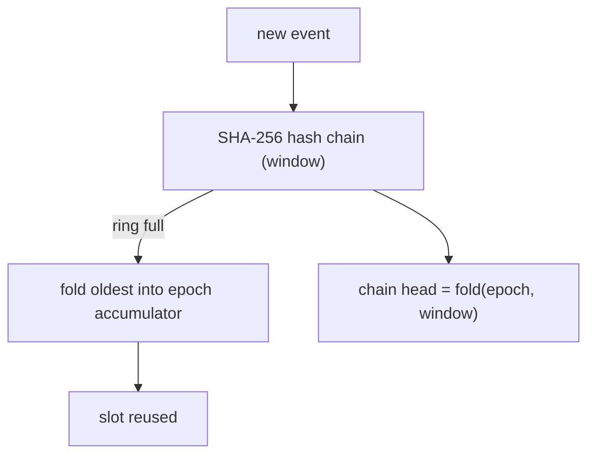

# Audit journal

A tamper-evident, on-device log of security events: boots, FIDO registrations
and logins, factory resets, PIN set/change/lockouts, policy changes, seed
backup and soft-lock activity.

```sh
rsk audit log              # export + print (add --pin if a PIN is set)
rsk audit verify           # log + DEVK-signed checkpoint (touch)
rsk audit verify --expect-key <hex>   # also pin the enrolled attestation key
```

`log` is a plain read — it pretty-prints the live window and the recomputed
chain head, no signature. It takes `--pin` on a device with a PIN, and a touch
on one with none (the read is never fully open). `verify` does the same read
*and* asks the device to sign the head, so it is the command that actually
proves the log is real. Use `log` for a quick glance, `verify` when the answer
matters.

## What it records

| event | detail |
|---|---|
| `BOOT` | first journal touch of each power cycle |
| `MAKE_CREDENTIAL` / `GET_ASSERTION` / `U2F_REGISTER` / `U2F_AUTH` | first 8 bytes of the rpIdHash (only *weakly* pseudonymous — see [Gating](#gating)) |
| `RESET` | factory reset (survives it — see below) |
| `PIN_SET` / `PIN_CHANGE` / `PIN_LOCKOUT` | lockout aux: 0 = retries exhausted, 1 = per-boot block |
| `CFG_MIN_PIN` | aux = new minimum; detail[0] = forceChangePin |
| `CFG_ENTERPRISE_ATT` | no aux/detail (flag-only) |
| `LOCK_ENGAGE` / `LOCK_RELEASE` | [soft-lock](soft-lock.md) engage/release |
| `BACKUP_EXPORT` / `BACKUP_LOAD` / `BACKUP_FINALIZE` | [seed-backup](seed-backup.md) lifecycle |
| `ATT_IMPORT` / `ATT_CLEAR` | [org attestation](attestation.md) provisioning |
| `CHECKPOINT` | every signed checkpoint is itself logged |

Each entry is a fixed 20 bytes:
`seq(4) ‖ uptime_ms(4) ‖ event(1) ‖ aux(1) ‖ detail(8) ‖ rsvd(2)`. There is
**no wall clock** on the device — entries carry the boot-relative uptime, every
power cycle opens with a `BOOT` entry, and the sequence number gives total
order. Wall-clock attribution is the host's job (e.g. record when you ran
`rsk audit verify`).

The `detail` field only ever carries the **first 8 bytes of the rpIdHash**, not
RP names, user handles, or credential IDs. That is deliberate: the log answers
"how was this key used and how often" without revealing *which sites* — see
[gating](#gating) below.

A `log` run prints a header, the chain state, then the window:

```text
window [72, 200)  —  128 entries, 72 folded into the epoch
epoch : 4f1c…           (the accumulator for evicted history)
head  : a93b…  (chain over the window — OK)

   seq      uptime  event              aux  detail
    72       3.4s  GET_ASSERTION        0  1a2b3c4d5e6f7081
    73     120.9s  MAKE_CREDENTIAL      0  9f8e7d6c5b4a3928
   …
```

## How the tamper evidence works

The journal is a 128-entry flash ring. Each entry extends a SHA-256 hash
chain; when the ring is full, the oldest entry is folded into an **epoch**
accumulator (`epoch' = SHA-256(epoch ‖ entry)`) before its slot is reused — so
evicted history stays attested in aggregate even though its per-event details
are gone. The chain head is `fold(epoch, window)`: the epoch run forward
through every entry still in the ring.

The chain is anchored, on an empty journal, at
`SHA-256("RSK-AUDIT-GENESIS-v1" ‖ serial_hash)` — bound to the device so two
boards' empty journals never share a head.



`rsk audit verify` sends a fresh 16-byte random challenge; the device signs
`"RSK-AUDIT-CKPT-v1" ‖ head ‖ seq_next ‖ challenge` with an ECDSA P-256 key
derived (HKDF) from the **OTP DEVK** ([production.md](../production.md) stage 1)
and returns the signature plus its 65-byte SEC1 public key. The host refolds
the exported window, verifies the signature over the message *it* reconstructs,
and checks that the signed head matches the refold. The challenge is what makes
the verdict fresh — a replayed old checkpoint signs a stale challenge and fails.

A successful `verify` prints the window, the head, and the attestation key with
a short fingerprint:

```text
chain   : OK — head a93b…
sig     : OK — checkpoint over seq_next=201, fresh challenge
att key : 04a1b2…   (65-byte SEC1)
          fingerprint 9c4e7f12ab… — record this; pin later runs with --expect-key
verdict : journal authentic ✓
```

Meta updates are ordered so that a power cut at any point loses at most the
newest event and never produces a false tamper verdict: when the ring is full
the fold-and-advance meta is committed *before* the slot is reused.

## Pinning the attestation key — `--expect-key`

The checkpoint key is deterministic and reset-stable (HKDF of the DEVK), so a
given device always signs with the same public key. Record it once at
provisioning, then pass it back on every later run:

```sh
rsk audit verify                         # first run: copy the printed "att key" hex
rsk audit verify --expect-key 04a1b2…    # afterwards: fail loudly on any mismatch
```

A mismatch means the public key changed, which can only happen if the DEVK
changed — i.e. you are talking to a **different device**, or a clone that was
flashed without burning the same OTP. The hex is the full 65-byte SEC1 point
(`04 ‖ x ‖ y`), lower-case; the comparison is exact. Stash it in your
provisioning record alongside the device serial.

`--expect-key` is your defence against a swapped device. The signature check
already proves the log was signed by *some* DEVK-bound key; pinning proves it
was *your* DEVK-bound key.

## Reset semantics (privacy by design)

`authenticatorReset` does **not** erase the journal — it *folds* the whole
window into the epoch and deletes the per-event details, then logs the
`RESET`. A handed-over device therefore proves "N events happened, then a
reset" without revealing where it had been used. The chain (and the
checkpoint key, which is DEVK-derived) continue uninterrupted across resets, so
`verify` keeps working and the head still validates against the same
`--expect-key`.

## Gating

| command | open device | PIN set |
|---|---|---|
| `audit log` / `AUDIT_READ` | touch | pinUvAuthToken with the `acfg` permission |
| `audit verify` / `AUDIT_CHECKPOINT` | touch | touch **+** `acfg` pinUvAuthToken |

- **`AUDIT_READ` (export).** With a PIN set it needs a pinUvAuthToken carrying
  the `acfg` (authenticator-config) permission; with no PIN it needs a physical
  touch. The entries are only *weakly* pseudonymous — a `detail` is a 64-bit
  rpIdHash prefix, never an RP name or user handle, but short enough to be
  dictionary-matched back to a domain — so the touch is what stops a silent host
  from harvesting a no-PIN device's RP-usage history.
- **`AUDIT_CHECKPOINT`.** The same PIN gate **plus a physical touch**, and it
  refuses entirely without a provisioned OTP DEVK — an attestation that anyone
  could re-derive would be theatre. The signing step is what the touch protects;
  the read that precedes it is `AUDIT_READ`-gated as above.

If a PIN is set, both subcommands take `--pin`. The PIN is exchanged over the
standard CTAP pinUvAuth protocol (it is not sent in clear), and a wrong PIN
counts against the FIDO retry counter — do not guess.

## Troubleshooting

| symptom | meaning / fix |
|---|---|
| `device requires a PIN — pass --pin` (status `0x36`) | a FIDO PIN is set; add `--pin <pin>` |
| `checkpoint refused — no OTP DEVK provisioned` (status `0x30`) | dev board with no DEVK burned; `verify` cannot sign. `log` still works. See [production.md](../production.md) |
| `denied — no touch within 30 s` (status `0x27`) | press the button when the LED blinks; rerun |
| `attestation key MISMATCH — this is not the enrolled device` | `--expect-key` did not match — wrong device, or a clone flashed without your OTP |
| `signed head differs from the exported window` | the journal changed between the read and the checkpoint. Rerun; if it persists, treat it as **TAMPER** |
| `checkpoint SIGNATURE INVALID — do not trust this journal` | the signature did not verify under the returned key — do not trust the log |
| `export length does not match the window` | the exported entry bytes don't match `seq_next − start`; a corrupt or truncated read |

The two "rerun first" verdicts are different. A head mismatch can happen
benignly if an event landed between the read and the checkpoint (a login on
another host, say) — one rerun usually clears it. A signature failure or a key
mismatch never has a benign cause; do not retry your way past those.

## What it does and does not prove

The log is written by the firmware, so its honesty is rooted in the boot
chain: with **secure boot + the OTP master key** ([production.md](../production.md),
[otp-fuses.md](../otp-fuses.md)) only your signed firmware can append to the
journal or wield the checkpoint key, and a flash dump cannot forge it. On an
unprovisioned dev board the journal still works as a debugging aid, but `verify`
is refused — there is no device-bound key to sign with, and a checkpoint without
one would prove nothing.

Two honest limits worth stating:

- **The window is 128 entries.** Older events are folded into the epoch and
  their *details* are gone — you can prove they happened (the head still
  covers them) but not read them back. `verify` regularly if you want a
  per-event record; the host transcript is your archive, the device is not.
- **There is no wall clock.** The device cannot tell you *when* in calendar
  time something happened, only the order and the boot-relative uptime. Pair the
  `seq` and `BOOT` markers with your own host-side timestamps.
