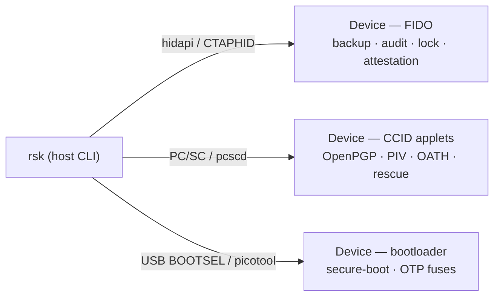

<!-- SPDX-License-Identifier: AGPL-3.0-only -->
<!-- Copyright (C) 2026 RS-Key contributors -->

# rsk — the device CLI

`rsk` is the host-side command-line tool for an RS-Key. It consolidates every
day-to-day and production task into one command: device status, seed backup,
secure-boot provisioning, OTP fuses, FIDO2 management, OpenPGP reset, audit
verification, fleet inventory, offboarding. It talks to the device directly:
CTAPHID over hidapi for the FIDO interface, and the CCID applets over PC/SC.

It is the canonical interface. The [terminal cockpit (`rsk-tui`)](tui.md) is a
read-mostly companion that points you back here for anything irreversible. Most
other guides in this section assume `rsk` is on your `PATH` and show the exact
`rsk <group> …` command for the task.



## Running it

In the Nix dev shell, `rsk` is already on `PATH` with every dependency pinned:

```sh
nix develop
rsk status            # FIDO getInfo + secure-boot + backup state
rsk --help            # all command groups
rsk <group> --help    # a group's subcommands and flags
```

### Without Nix

`rsk` also runs on any host with Python ≥ 3.9, packaged at `tools/`. With
[uv](https://docs.astral.sh/uv/) (no install step, an ephemeral environment),
from the repo root:

```sh
uvx --from ./tools rsk status
uvx --from ./tools rsk --help
```

Or install it as a persistent tool, so plain `rsk` is on your `PATH`:

```sh
uv tool install ./tools        # then: rsk status
pipx install ./tools           # or pipx
pip install ./tools            # or a venv + pip
```

Two dependencies wrap system libraries: `hidapi` (the CTAPHID transport) and
`pyscard` (PC/SC, for the CCID applets). macOS ships both frameworks and the
wheels work out of the box. On Linux install `pcsclite` and run `pcscd` for the
CCID half, plus udev rules for non-root HID. The full setup and the Apple-Silicon
`pyscard` rebuild note are in [tools/README.md](https://github.com/TheMaxMur/RS-Key/blob/main/tools/README.md)
and [Linux host setup](../linux.md).

The Nix shell stays the primary, reproducible path (it also carries `picotool`,
`ykman`, `gpg`, and the test suites). The uv/pip path is for hosts without Nix.

## Command groups

| Group | What it does | Guide |
|---|---|---|
| `status` | one-shot device overview (FIDO getInfo + secure-boot + backup) | [quickstart](../quickstart.md) |
| `inventory` | fleet enumeration (`list`) + identity proof (`verify`) | [Fleet tooling](fleet.md) |
| `backup` | wallet-style seed export / restore / finalize (BIP-39, SLIP-39) | [Seed backup](seed-backup.md) |
| `pair` | guided primary + backup (two independent keys) enrollment | [Backup key](backup-key.md) |
| `lock` | at-rest soft-lock of the FIDO seed (`enable`/`unlock`/`disable`) | [Soft-lock](soft-lock.md) |
| `secure-boot` | secure-boot provisioning + key rotation **(irreversible)** | [Production](../production.md), [OTP fuses](../otp-fuses.md) |
| `otp` | burn + lock the at-rest master key (MKEK) into OTP **(irreversible)** | [OTP fuses](../otp-fuses.md) |
| `fido` | FIDO2 management: `set-pin`, `list-passkeys`, `attestation` | [FIDO2](fido2.md), [Attestation](attestation.md) |
| `led` | LED color / brightness per device state | [LED](led.md) |
| `openpgp` | OpenPGP applet utilities (e.g. `reset` to factory PINs) | [OpenPGP card](openpgp.md) |
| `reboot` | reboot to the app or to BOOTSEL, over CCID | — |
| `audit` | read + cryptographically verify the tamper-evident journal | [Audit journal](audit.md) |
| `offboard` | guided full wipe + signed receipt **(destructive)** | [Fleet tooling](fleet.md) |

> Note the two distinct "OTP"s: **`rsk otp`** burns the device's at-rest master
> key into RP2350 one-time-programmable fuses (a production ritual). The
> Yubico-style **[OTP slots](otp.md)** feature (touch-to-type codes) is a runtime
> applet managed with `ykman`. They share a name, not a mechanism.

## Conventions

These hold across the whole CLI, so each group's guide does not repeat them.

### Entering a PIN

Every command that needs the **FIDO2 clientPIN** accepts it the same way: pass
`--pin <value>` for scripting, **or** omit it and `rsk` prompts interactively
(hidden input). You never have to remember which form a given command supports.

```sh
rsk backup export --pin 1234     # explicit, for scripts / CI
rsk backup export                # prompts:  FIDO2 PIN:
```

The prompt is **only** shown when the device actually has a clientPIN set. A
touch-only key is never asked, so the plug-and-touch flow is unchanged. If stdin
is not a terminal (a pipe) and no `--pin` was given, `rsk` skips the prompt and
lets the device report `device requires a PIN` rather than hanging. The
PIN-gated commands are:

- `backup export` / `backup restore`
- `audit log` / `audit verify`
- `lock enable` / `lock disable`
- `inventory verify`
- `fido list-passkeys`, `fido attestation import` / `clear`
- `fido set-pin`: `--pin` is the *current* PIN when changing. `--new-pin` sets
  the new one (prompted, with confirmation, if omitted)

This is always the FIDO2 clientPIN (the one `rsk fido set-pin` manages), never
an OpenPGP PW1/PW3 or a PIV PIN. Those are entered only in their own tools
(`gpg`, `ykman`).

### Touch

Operations that release or sign over a secret require a **physical touch**: a
press of the BOOTSEL button while the LED blinks, within a 30-second window.
`rsk` prints `touch the device …` to stderr before blocking. Touch-gated
commands include `backup export`/`restore`/`finalize`, `audit verify`,
`inventory verify`, `lock enable`/`disable`, and `fido attestation import`/
`clear`. Read-only commands (`status`, `inventory list`, `*/status`) need no
touch. `audit log` needs one only on a device with no PIN (the PIN token gates
it otherwise).

### Machine-readable output

`status` and `inventory list` take `--json` for scripting: a stable object you
can pipe to `jq`. Everything else is human-formatted text.

```sh
rsk status --json | jq '.secure_boot, .fido.clientPin'
rsk inventory list --json        # one JSON object per connected key, per line
```

### Irreversible actions

Destructive or fuse-burning commands (`offboard`, `secure-boot`, `otp`,
`lock enable`, `openpgp reset`) require a **typed confirmation**: you type an
exact token (e.g. `LOCK-SEED`) rather than pressing a single key. Anything else
aborts. The OTP and secure-boot rituals burn one-time-programmable fuses and
cannot be undone. Read [Production setup](../production.md) before running them.

### Errors and exit codes

On failure `rsk` prints `error: <message>` to stderr and exits non-zero (`1`),
so it composes in scripts. A device-reported status is surfaced with its CTAP
code where it helps (e.g. a wrong PIN, a sealed export window, a missing OTP
DEVK) instead of a bare stack trace.

## Where next

- A linear first-run walkthrough: [Quick start](../quickstart.md).
- The read-mostly TUI companion: [Terminal cockpit](tui.md).
- Each task in depth via the [Command groups](#command-groups) table above.

## For contributors

The CLI lives in `tools/rsk/`: one module per group, each exposing a
`register(sub)` that adds its argparse subparser, wired together in
`__main__.py`. Shared helpers (error exit, the `--pin` flag + PIN resolution,
the picotool runner, the FIDO HID connect) live in `common.py`. The raw CTAPHID
transport and CBOR codec are in `ctaphid.py`.

PIN entry goes through one chokepoint, `common.resolve_pin` (flag-or-prompt)
and `common.add_pin_arg` (the shared flag), so consistency is structural, not
per-command discipline. The pure-logic unit tests need no device:

```sh
# from tools/ (or: uv run --extra test python -m pytest …)
nix develop -c bash -c 'cd tools && python -m pytest rsk/'
```

Host-tool changes like these do **not** bump the firmware `bcdDevice`. See
[Versions](../versioning.md).
