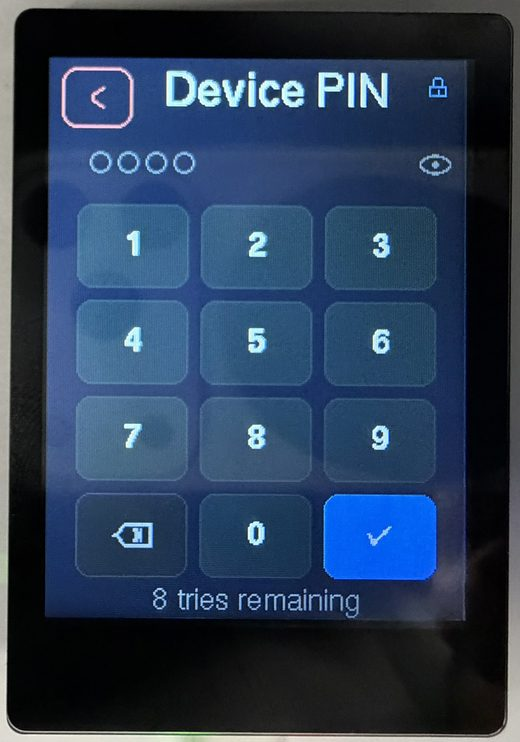
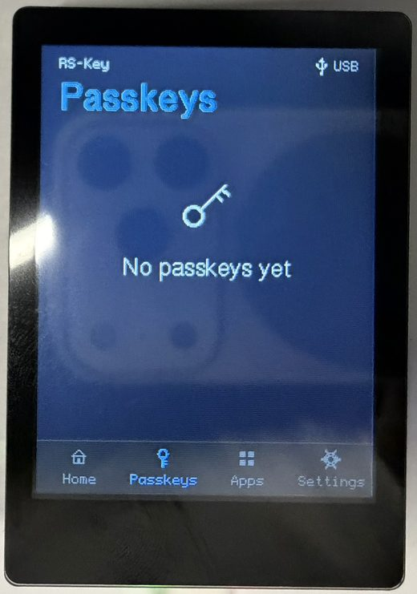
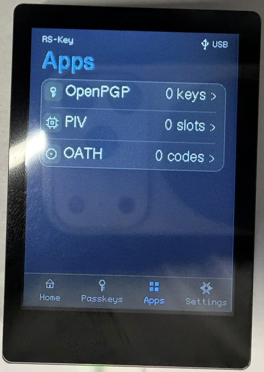
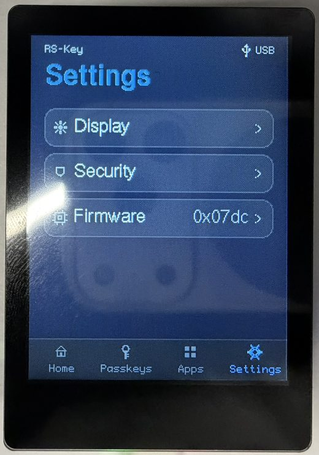
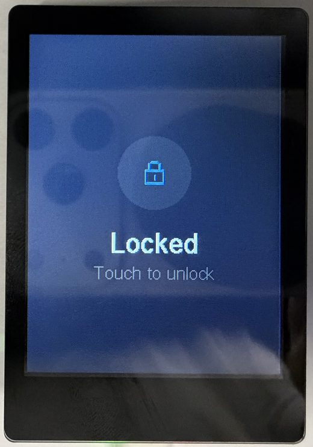

<!-- SPDX-License-Identifier: AGPL-3.0-only -->
<!-- Copyright (C) 2026 RS-Key contributors -->

# Trusted display

**Experimental.** An RS-Key variant for a screen-and-touch RP2350 board (the
reference target is the **Waveshare RP2350-Touch-LCD-2.8**). The screen turns the
key into a *trusted display*: the operations that matter — approving a sign-in,
typing a PIN — happen on the device's own glass, not on the host, so a
compromised or phishing host cannot fake what you see or capture what you type.
Concretely:

- An **Approve / Deny** prompt paints the *real* relying party for every
  signature; a signature cannot be obtained without a physical tap on a screen
  showing the true `rpId`.
- **PINs are entered on-screen** — a FIDO `clientPIN`/UV, a device PIN, and the
  OpenPGP / PIV PINs over CCID — and never cross USB.
- An on-device browser lets you **inspect and prune** credentials (delete a
  passkey, read the applet state) without a host.

The whole feature is `dep:`-gated. A standard key without a screen compiles
**none** of the UI or driver code — the gate asserts the `rsk-ui` crate is absent
from the default firmware image — so an ordinary build is byte-for-byte
unaffected.


## Building and flashing

The panel takes over the addressable-LED pin, so the display flavor is built
`LED_KIND=none` (a compile-time guard enforces this) with the larger flash the UI
assets want:

```sh
env LED_KIND=none FLASH_SIZE=16M cargo build --release -p firmware --features display
# or the hermetic package:
nix build .#firmware-display        # → result/firmware.uf2
```

`GPIO16` (the WS2812 pin on a standard board) drives the backlight here;
`WAKE_PIN` (default `25`, the board's BAT_PWR button) both wakes the panel from
display sleep and, while awake, sleeps it on demand from *any* screen — a press
blanks the panel and (when a device PIN is set) locks the on-device UI, aborting
any host prompt it interrupts. See the full knob table in [build.md](../build.md)
— the `display`-only knobs are `WAKE_PIN` / `WAKE_ACTIVE_HIGH`.

Flash it like any other image (BOOTSEL → `picotool load`, [hardware.md](../hardware.md)).
Two notes:

- The build output is **unsigned**. On a secure-boot device you still
  `picotool seal --sign` it before loading ([signing-keys.md](../signing-keys.md),
  [anti-rollback.md](../anti-rollback.md)); the RP2350 boot ROM verifies the
  signature on boot.
- You can reach BOOTSEL from the panel itself: **Settings → Firmware → reboot to
  BOOTSEL** (a deliberate hold). The reboot routes through the worker so live RAM
  secrets are scrubbed first.

## What's on screen

A bottom **navigation bar** carries four peer tabs, each captioned:

| Tab | What it shows |
|---|---|
| **Home** | A calm "Ready" and a status card — USB, whether a device PIN is set, and the resident-passkey count (cached, refreshed only at modal boundaries). |
| **Passkeys** | The resident credentials, one row per relying party. |
| **Apps** | A read-only browser for the OpenPGP / PIV / OATH applets. |
| **Settings** | Display, Security, Firmware, Audit log, Backup, Factory reset. |

## Approve / Deny — the anti-phishing core

Any operation that needs user presence paints a **trusted prompt** naming the
operation and the **real relying party**, and waits for a deliberate action:

- A WebAuthn **registration** shows a *Save new passkey?* card (relying party +
  account, **Cancel / Save**).
- A **sign-in** and the generic OpenPGP / PIV touch prompts share an **approve**
  screen (shield + relying party + a hold-to-approve button). **Deny** refuses
  with `OPERATION_DENIED`.

Because the device only knows the relying-party *string* (and its hash), it
shows that string verbatim — never a host-supplied brand logo. A relying-party id
too long for the box is **clipped with a truncation marker**, and the clip keeps
the **registrable-domain suffix** (a leading `…` ellipsis) rather than the head —
so a padded look-alike such as `accounts.google.com.attacker.com` can never hide
its real domain (`…attacker.com`) behind the cut. This holds on every screen that
shows an attacker-chosen `rpId`: the approve and enrollment prompts and the
Passkeys manager's list, service-detail title and Confirm-Delete card. A
device-local nickname (which you set, not the host) keeps its head instead.

## Entering a PIN on the trusted screen



The panel has an on-screen numeric **PIN pad**: digits are masked, an **eye
toggle** reveals them briefly so you can check before committing, and the minimum
length shows as placeholder dots. Every PIN screen **names which credential it is
collecting** in the header — **Device PIN**, **FIDO PIN**, **PIV PIN** / **PIV
PUK**, or the OpenPGP PINs — so the independent PINs are never confused; the
New / Confirm / current step rides in the caption beneath. The PIN never leaves
the device.

This backs three things:

- **Built-in user verification.** getInfo advertises `options.uv`; a PIN typed on
  the pad mints a `pinUvAuthToken` via `clientPIN` (`getPinUvAuthTokenUsingUvWithPermissions`),
  checked against the same `EF_PIN` the host `clientPIN` path uses.
- **CCID secure PIN entry (pinpad).** A display build advertises `bPINSupport`
  and handles `PC_to_RDR_Secure`, so GnuPG (OpenPGP PW1/PW3) and OpenSC (PIV PIN)
  collect the PIN on the trusted screen — the PIN never crosses USB in pinpad
  mode. Details and host-driver caveats: [protocol.md §1.3](../protocol.md).
- **First-run onboarding.** A fresh, PIN-less device offers a *Set a PIN?* screen
  at first run; declining is remembered (a flag in `EF_DISPLAY`) so the offer
  isn't repeated until a factory reset.

## Passkeys



The Passkeys tab lists resident credentials by relying party (real `rpId` +
account count) and drills into a per-account detail where a passkey can be
**deleted** on-device (gated by the device PIN, then a hold) — decrypted on the
device, never on the host. The detail's pencil opens a character-wheel **rename**
that sets a short **device-local nickname** for the relying party, shown in place
of its `rpId`. The nickname is sealed at rest (a dedicated `EF_RPNICK` region),
wiped by a reset, and — unlike a host `updateUserInformation` — never re-seals the
credential, so the passkey keeps working. The trade-off: the nickname is
device-local and not seen by host credential managers.

## Apps — a read-only credential browser



The Apps tab reads applet state **without a PIN**; no key material, PIN or public
point is ever shown, and no OATH code is computed (the device has no clock).

- **OpenPGP** — the Signature / Encryption / Authentication slots with each one's
  algorithm, the signature counter and PW1/PW3 attempts; a per-slot detail with
  the SHA-1 fingerprint and touch policy; and a **Card holder** row (name / login
  / URL / language).
- **PIV** — the 9A/9C/9D/9E slots with algorithm and PIN/PUK attempts, a per-slot
  detail (PIN/touch policy, key origin, cert presence), and a **Retired & F9** row
  listing the *populated* retired key-management slots (82–95) and F9. From it,
  **Generate key** creates a key (EC P-256/P-384, Ed25519, X25519, or RSA
  2048/3072/4096) into the next *free* retired slot — gated by the device PIN and
  a hold, restricted to empty slots (add-only, never overwrite). There is no
  management-key auth: physical presence at the panel *is* the authorisation.
- **OATH** — the stored credentials (label, TOTP/HOTP, a padlock when
  touch-gated), each with a detail (type, HMAC algorithm, digits, TOTP step).

## Settings



Grouped into three domains, plus the journal / backup / reset actions:

- **Display** — backlight brightness (PWM), the display-sleep timeout, and the
  touch timeout, each adjusted live. All three **persist across reboots**:
  brightness and sleep in an `EF_DISPLAY` flash record; the touch timeout in
  `EF_PHY`'s `PresenceTimeout` — the same field `rsk hw --touch-timeout` writes,
  so the panel and the host tool stay in sync.
- **Security** — set / change the **device PIN** and the **FIDO clientPIN** (each
  chosen entirely on the panel), and a **PIV PIN** sub-menu: change the PIV PIN,
  change the PUK, unblock a blocked PIN with the PUK, or **protect the management
  key**. *Protect mgmt key* generates a random AES-256 management key, seals it
  and marks it PIN-protected — the ykman `--protect` scheme, so a host then uses
  the management key with just the PIV PIN (which alone grants management access,
  a trade-off the panel states and gates behind the device PIN and a hold). Any
  existing host `PivmanData` — its PIN-change timestamp and other flags — is
  preserved (the obsolete derived-key salt is dropped, exactly as ykman does).
- **Firmware** — the installed `bcdDevice` build and chip serial, the real OTP
  secure-boot fuse state (it warns when secure boot is off rather than claiming a
  check it isn't doing), and the hold-to-**reboot into BOOTSEL** for an over-USB
  update.
- **Audit log** — the most recent device-journal events (sign-ins, passkeys
  added, PIN changes, lockouts, resets, power cycles), colour-coded, newest first.
- **Backup** — an honest view of the recovery-seed export **window**: whether a
  seed is present and whether its one-time export has been **sealed**. While the
  window is open, **Show recovery** (gated by the device PIN) paints a 24-word
  **BIP-39** phrase or a `T`-of-`N` **SLIP-39** share set **on the trusted
  screen** — derived on the device, never crossing USB, behind a hold + warning,
  wiped the instant they're shown. **Seal backup** closes the window for good
  (until a factory reset). See [seed-backup.md](seed-backup.md).
- **Factory reset** — erases every applet's data (FIDO, PIV, OpenPGP, OATH),
  scrubs the flash, and reboots to a blank device (gated by the device PIN, then
  a hold). Only the org attestation and the fused OTP / secure-boot state survive.

## Security model



The device PIN (`EF_DEVICE_PIN`, its own sealed record + retry counter) gates the
on-device UI — unlock, on-device delete, factory reset — independently of FIDO.
The device **boot-locks** when a device PIN is set; a *forgotten* device PIN is
cleared only by a host `authenticatorReset` (the sole recovery, since the lock
gates on-device Settings). Every device-driven ceremony — a granted Approve, an
on-device delete, a factory wipe — ends on a brief success confirmation.

This is an experimental variant; read [threat-model.md](../threat-model.md) and
[limitations.md](../limitations.md) for what the trusted display does and does not
defend against.

## See also

- [Build options](../build.md) — the `display` feature and its knobs.
- [Hardware](../hardware.md) — boards and flashing.
- [Host protocol §1.3](../protocol.md) — CCID pinpad secure PIN entry.
- [FIDO2 / WebAuthn](fido2.md) · [PIV](piv.md) · [OpenPGP](openpgp.md) · [Seed backup](seed-backup.md).
