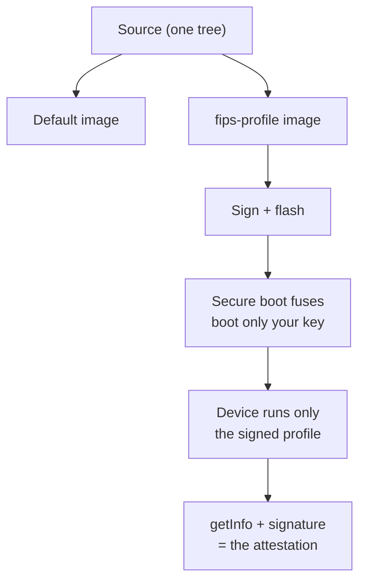

# FIPS-style profile (`fips-profile`)

An **opt-in build flavor** that bakes a locked, FIPS-style algorithm policy
into the image. Nothing is removed from the codebase or from the default
build — without the flag the firmware is byte-for-byte the usual one. With
it, the policy is part of the signed image, and once
[secure boot](../production.md#stage-2--secure-boot) is enabled the device
runs nothing but that signed image: a policy you cannot toggle off at
runtime, because there is no runtime knob to toggle.

```sh
cargo build --release -p firmware --features fips-profile
# or the reproducible Nix target (same flag):
nix build .#firmware-fips
# then sign + flash as usual (production.md)
```

> **A profile, not a validation.** Nothing here is FIPS 140-3 *validated* —
> no CMVP certificate, no validated module boundary, no tested entropy
> source. This profile restricts the device to FIPS-approved *algorithms*
> and documents exactly where the line is drawn. If your compliance regime
> needs a certificate number, this is not it; if it needs "the device will
> not negotiate a non-approved algorithm," this is exactly it.

## What the profile locks

The flag wires through to two crates only — the FIDO applet
(`rsk-fido/fips-profile`) and the PIV applet (`rsk-piv/fips-profile`). Every
gate below is a compile-time `cfg`, so the restricted path is the *only* path
compiled into the image.

| Area | Default build | `fips-profile` build | Gate |
|---|---|---|---|
| FIDO algorithms | ES256, EdDSA, ES384, ES512, ES256K, (ML-DSA-44/-65) | drops **ES256K** (secp256k1 — never NIST-approved) from both the advertised list and credential negotiation | `getinfo.rs`, `makecredential.rs` |
| FIDO minimum PIN | 4 | **6** (and `setMinPINLength` can only raise it, never lower it) | `consts.rs`, `config.rs` |
| Seed backup | one-time export window | **export refused** — non-exportable key material; restore (`BACKUP_LOAD`) still works, so keys may migrate *into* a profile device, never out | `vendor.rs` |
| PIV management key | 3DES or AES | **no new 3DES keys** (SP 800-131A); an existing 3DES key still authenticates so a reflashed device can migrate itself to AES | `piv/lib.rs` |
| PIV RSA | 1024 / 2048 | **no RSA-1024** generation *or* import | `piv/keygen.rs` |

Two things worth reading carefully:

- **ES256K leaves on both sides.** `getInfo`'s `algorithms` list no longer
  carries `-47`, so a relying party never offers it; and even if a client
  asks for `-47` anyway, `makeCredential` maps it to "unsupported" and
  declines. There is no path to a *new* secp256k1 FIDO credential.
- **RSA-1024 is blocked on two independent gates** — the generation template
  parser (`piv/keygen.rs:48`) and the separate import path
  (`piv/keygen.rs:242`), which does not go through that parser. So neither
  `ykman piv keys generate ... RSA1024` nor importing an external 1024-bit
  key onto a slot succeeds; both return `6A 80` (incorrect data).

## What deliberately stays

- **Ed25519 / X25519** — approved by FIPS 186-5 (EdDSA) and SP 800-186;
  `ssh ed25519-sk` keeps working, and so do Ed25519/cv25519 OpenPGP keys.
- **NIST P-256 / P-384 / P-521** FIDO and PIV keys — the whole point of the
  profile is to keep these and drop the curve that was never on the list.
- **ML-DSA-44 / ML-DSA-65** — FIPS 204. The post-quantum path is the *point*,
  not an extra; the profile does not touch it. (Whether they are *advertised* in
  `getInfo` is the separate `advertise-pqc` flag — capability is on either
  way; see [build.md](../build.md).)
- **HMAC-SHA-1 in OATH HOTP/TOTP** — RFC 4226 mandates it, and HMAC-SHA-1
  (unlike bare SHA-1 signatures) remains approved.
- **The whole OpenPGP applet, unchanged.** The profile is FIDO + PIV; it
  does not narrow OpenPGP key attributes. If you want only approved curves
  there, that is a card-edit policy choice ([openpgp.md](openpgp.md)), not
  something this flag enforces — state it honestly to anyone relying on the
  profile.
- **Existing credentials still work.** A secp256k1 credential created by a
  default build still asserts after you reflash with the profile — the gate
  is on `makeCredential` (creation), not on `getAssertion` (login). Same
  shape everywhere: an existing 3DES management key still authenticates
  (you can use it to set an AES one), existing RSA-1024 PIV keys still sign
  and decrypt. The profile gates *creation and import*, never your ability
  to keep using what is already on the device.

## Migrating a device into the profile

Because the profile blocks creation but not use, an in-place migration is
mechanical:

```sh
# 1. flash the profile image (signed, per production.md)
# 2. replace any non-approved long-lived keys:
ykman piv access change-management-key --algorithm AES256 --generate --protect
ykman piv keys generate 9a pub.pem            # re-issue any RSA-1024 slots as
                                              # ECC P-256 or RSA-2048
# 3. FIDO: re-register any sites that hold a secp256k1 credential with an
#    ES256 / EdDSA passkey; the old credential keeps working until you do.
```

> **`ykman` needs the opt-in `VIDPID=Yubikey5` build.** It gates on the "Yubico
> YubiKey" reader name, which the default RS-Key build (`0x1209:0x0001`) does not
> present. Build that flavor for the `ykman` commands here and under *Verifying*
> below, or drive the device with `rsk` / `rsk-tui` on the default build.

There is no "convert" command — you generate a new approved key and retire
the old one through normal applet flows. The old 3DES/RSA-1024/secp256k1
material lingers only as long as you let it.

## Verifying a device runs the profile

```sh
ykman fido info        # Minimum PIN length: 6
ykman info             # firmware version, applet capabilities
```

A profile build shows `Minimum PIN length: 6`. The absence of `-47` (ES256K)
is *not* something `ykman fido info` prints — it lists the AAGUID, options,
PIN retries and minimum PIN length, but not the COSE `algorithms` array. To
confirm secp256k1 is gone you need a raw `getInfo` dump (e.g. `fido2-token -I`
or python-fido2): read the `0x0A` array and confirm `-47` is absent.

That advertisement is *evidence*, not *proof* on its own — a default build
can have its minimum PIN raised to 6 by hand, which makes the PIN field
alone ambiguous. The proof is the image signature. Combined with secure
boot, the firmware's own signature is the policy attestation: the fuses boot
only your signed profile image, and that image is the only code present, so
"the device enforces the profile" reduces to "the device booted, and your
signature is the only one it accepts."



## Why compile-time, not a runtime switch

A runtime "FIPS mode" toggle is one admin command away from not being FIPS
mode — and one malware-driven APDU away from being turned off without you
noticing. A compile-time profile under secure boot is a different object:
the restricted menu is the *only* code in the image, the image is signed,
and the fuses only boot your signatures. Changing the policy means signing
and flashing a different image — which is exactly the auditable, physical
event you want a policy change to be, rather than a silent state flip.

This mirrors how the rest of RS-Key's hardening works: every knob is
[compile-time](../build.md), and the irreversible posture lives in
[OTP fuses](../otp-fuses.md), not in mutable runtime state.

## Honest limits

- **No CMVP certificate, no validated boundary.** Read the first callout
  again — this is an algorithm policy, not a validation. The
  [limitations](../limitations.md) and [threat model](../threat-model.md)
  pages apply unchanged.
- **The entropy source is the RP2350's, untested against SP 800-90B.** A
  validated module needs a validated RNG; this profile does not provide one.
- **OpenPGP and OATH are not narrowed by the flag.** If your policy needs
  approved-only algorithms there too, you enforce that through the applets'
  own configuration, not through `fips-profile`.
- **"Approved algorithm" ≠ "approved usage."** The profile keeps you from
  negotiating a disapproved primitive; it does not audit key sizes,
  rotation, or how you use the device. That part is on you.

## Related

- [build.md](../build.md) — all compile-time flags, including the
  `.#firmware-fips` Nix target.
- [production.md](../production.md) — signing and the secure-boot fuse
  sequence that seals the profile in place.
- [seed-backup.md](seed-backup.md) — the seed export/finalize flow on a
  default build (and why the profile refuses it).
- [piv.md](piv.md), [fido2.md](fido2.md), [openpgp.md](openpgp.md) — the
  applets the profile narrows (and the one it leaves alone).
