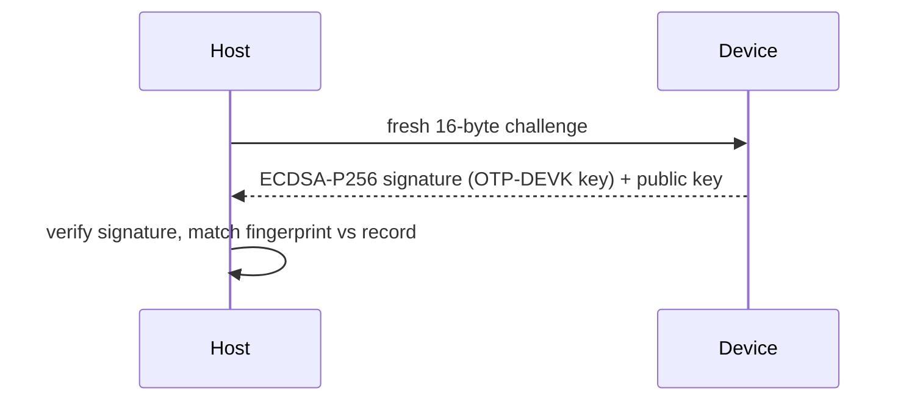

# Fleet tooling

Inventory, identity verification, and offboarding for a fleet of RS-Keys.
Three commands cover the lifecycle:

| Command | Question it answers | Gates |
|---|---|---|
| `rsk inventory list` | *what is this key?* | none — touch-free, PIN-free |
| `rsk inventory verify` | *is this the key we enrolled?* | touch; `--pin` if set |
| `rsk offboard` | *wipe a returned key, keep proof* | typed confirmation, up to 3 touches |

`list` reads only ungated state, so it is safe against a whole hub of keys.
`verify` is the enrollment anchor. `offboard` is destructive and is the only
one of the three that changes the device.

## Inventory

```sh
rsk inventory list          # human-readable, one block per key
rsk inventory list --json   # one JSON object per line, for scripting
```

Walks every connected key over both transports and prints one record per
device — serial, firmware version, bcdDevice (the build counter), secure-boot
state, flash usage, FIDO options, backup/soft-lock state, org-attestation
state:

```
device 37bebfdca282523b  (ccid+hid)
  firmware   : 5.7.4  bcdDevice 0x0748  sdk 8.6
  secure boot: LOCKED  (bootkey 0x0)
  flash      : 16711/1572864 B used, 469 files
  fido       : U2F_V2, FIDO_2_0  clientPin=True
  backup     : sealed=False has_seed=True  seed lock: off
  org attest : installed  chain sha256 74d9f98c3fb0bb5c…
```

The serial is the RP2350's OTP chip id, read from the rescue applet's SELECT
response — unique per chip, unlike the USB descriptor serial (identical across
devices). Everything `list` reads is gate-free: no PIN, no touch, safe to run
against a hub full of keys.

`secure boot` decodes to one of three states — `not enabled` (a blank dev
board), `ENABLED` (the `SECURE_BOOT_ENABLE` fuse is set but the key pages are
not yet locked), `LOCKED` (fully sealed). The `bootkey` index is the active
key slot. See [otp-fuses.md](../otp-fuses.md) for what those fuses mean and
[production.md](../production.md) for how they get burned.

With several keys connected the CCID and HID transports cannot be matched to
one another, so the records stay separate (tagged `ccid` / `hid`); the output
ends with a `note:` saying so. Plug keys in one at a time when you want a
single merged `ccid+hid` record per device.

### The `--json` records

`--json` prints one object per line (JSON Lines — pipe it to `jq`, not
`json.load`). The fields present depend on which applets answered; a merged
record carries all of them:

| Field | Meaning |
|---|---|
| `transport` | `ccid`, `hid`, or `ccid+hid` (merged) |
| `serial` | RP2350 OTP chip id (CCID only) |
| `sdk` | RS-Key `rsk-sdk` framework version (major.minor) from the rescue SELECT |
| `secure_boot` | `{enabled, locked, bootkey}` |
| `flash` | `{free, used, kv_total, files, chip}` (bytes) |
| `fw`, `bcd_device` | firmware version string, build counter (HID) |
| `versions`, `client_pin` | FIDO CTAP versions, PIN-set flag |
| `aaguid` | the device AAGUID (hex) |
| `backup` | `{sealed, has_seed}` — seed-export lifecycle |
| `lock` | `{locked, unlocked}` — [soft-lock](soft-lock.md) state |
| `org_attestation` | `{installed, chain_sha256}` |
| `error` | populated if an applet threw mid-read |

A foreign PC/SC reader that does not answer the rescue SELECT is skipped, not
reported — `list` only emits records for things that identify as RS-Keys.

Worked scripting — dump a fleet sweep to a ledger keyed by serial:

```sh
rsk inventory list --json | jq -s '
  map(select(.serial)) | INDEX(.serial)' > fleet-$(date +%F).json
```

Flag any key not on the current firmware (replace with your floor):

```sh
rsk inventory list --json \
  | jq -r 'select(.bcd_device and (.bcd_device < "0x0759"))
           | "\(.serial // .product)\tstale \(.bcd_device)"'
```

## Identity verification

```sh
rsk inventory verify                            # print the fingerprint (touch)
rsk inventory verify --expect-key 66573f74ca06359a   # pin it (--pin if set)
rsk inventory verify --expect-key 04ab…   # or the full 65-byte SEC1 pubkey
```

Challenge-response against the device's attestation key: the host sends a
fresh 16-byte challenge, the device signs it (vendor `AUDIT_CHECKPOINT`) with
the ECDSA P-256 key derived from its OTP DEVK, and the host verifies the
signature. The printed fingerprint (SHA-256 of the public key, first 16 hex
digits) is the same one `rsk audit verify` prints — one identity anchor for
both workflows.



`--expect-key` accepts either form printed by a prior run: the 16-hex
`fingerprint` or the full hex `att key` (65-byte uncompressed SEC1 point).
Either matches; the full key is the stronger pin since the fingerprint is a
truncated hash.

This only proves identity once the device has a provisioned OTP DEVK; on an
unprovisioned dev board there is no device-bound key and `verify` is refused.
The error messages map to the vendor status:

| Symptom | Status | Meaning |
|---|---|---|
| `device requires a PIN — pass --pin` | `0x36` | a FIDO PIN is set; add `--pin` |
| `refused — no OTP DEVK provisioned` | `0x30` | blank board, no device key ([production.md](../production.md)) |
| `denied — no touch within 30 s` | `0x27` | press the button when the LED blinks |
| `attestation key MISMATCH` | — | not the enrolled device (or a clone without the OTP DEVK) |
| `SIGNATURE INVALID` | — | the device could not prove identity at all |

**Enrollment:** when you hand a key out, run `rsk inventory verify` once and
record `serial + fingerprint` (or the full `att key`). Any later verify with
`--expect-key <fingerprint>` (or the full SEC1 public key) proves you are
talking to that physical chip — a clone without the OTP DEVK cannot answer.
Every verify is itself journaled as a `CHECKPOINT` event, so the device's
[audit log](audit.md) shows each time it was checked.

`verify` has no `--json` (only `inventory list` does), so at provisioning time
capture the two lines from its plain output — or just paste them into your
record by hand:

```sh
rsk inventory verify | sed -n 's/^\(serial\|fingerprint\) *: //p'
```

## Offboarding

```sh
rsk offboard                       # guided, typed confirmation, ~3 touches
rsk offboard --report ret-42.json  # choose the receipt path
```

Decommissions a returned key: wipes the OTP slots, OATH credentials, PIV
(block PIN+PUK, then factory reset), OpenPGP (block PWs, then factory reset),
the FIDO seed/passkeys/PIN, and the [org attestation](attestation.md) — then
signs a final audit checkpoint over the post-wipe journal window and saves it
as a JSON receipt. It needs **both interfaces** (CCID for the applet wipes,
FIDO HID for the reset and the signature); if either is missing it refuses
before touching anything.

The order is fixed and each step reports its own result:

| Step | What it does | Records on success |
|---|---|---|
| OTP | writes an all-zero config to slots 1–4 (the protocol's "delete") | `ok` |
| OATH | sends the OATH RESET command | `ok` |
| PIV | exhausts PIN + PUK retry counters with two distinct wrong values, then factory RESET | `ok` |
| OpenPGP | `rsk openpgp reset` (TERMINATE + ACTIVATE) | `ok` |
| FIDO | CTAP `authenticatorReset` — **touch** | `ok` |
| org attestation | clears the chain if one was installed — **touch** | `cleared` / `none` |
| receipt | signs a checkpoint over the post-wipe journal — **touch** | signed |

The PIV step blocks the PIN and PUK with *two different* wrong values
(`00000000` then `11111111`, eight tries each) before the reset, so even a
device whose real PIN happened to be one of those still ends up with a dead
retry counter — the reset then always succeeds regardless of the original
credentials.

The receipt is a cryptographic statement that **this** device (attestation
fingerprint) was factory-reset (the signed window contains the `RESET` event):

```json
{
  "device": "37bebfdca282523b",
  "timestamp": "2026-06-13T14:22:09-04:00",
  "steps": {"otp": "ok", "oath": "ok", "piv": "ok", "openpgp": "ok",
            "fido_reset": "ok", "org_attestation": "cleared"},
  "journal_window": [{"seq": 412, "event": "RESET", "...": "..."}],
  "signed": true,
  "challenge": "…", "signed_head": "…", "seq": 414,
  "signature": "…", "attestation_pubkey": "04…",
  "fingerprint": "66573f74ca06359a"
}
```

The default receipt path is `offboard-<serial>-<YYYYMMDD-HHMMSS>.json` in the
working directory; `--report` overrides it. The file is always written, even
on a partial failure — a failed step leaves its error string in `steps`, the
report still saves, and `rsk offboard` then exits non-zero so a script notices.

To re-check a receipt offline, verify `signature` (ECDSA P-256, SHA-256) over
`"RSK-AUDIT-CKPT-v1" ‖ signed_head ‖ seq (LE32) ‖ challenge` with
`attestation_pubkey`, and match `fingerprint` against your inventory record:

```sh
jq -r '"\(.fingerprint)\t\([.steps[]] | join(" "))"' ret-42.json
```

### Why it needs no PIN

No PIN is needed anywhere in the flow — every wipe path is deliberately
reachable without credentials (the PIV/OpenPGP paths block the PINs first,
which is the spec's own anyone-can-reset design; OATH and FIDO have resetting
paths of their own), so a key that comes back with unknown PINs can still be
offboarded. What it *cannot* do is impersonate: nothing in the wipe path can
read or export secrets, and the receipt's signature still requires the
device's own OTP DEVK — a wipe tool cannot forge it.

### Footguns and partial wipes

- **OTP slots protected by an access code** are the one exception — they
  refuse the PIN-free delete (`SW 6982`), and the receipt's `steps.otp`
  records exactly which slots stayed (e.g. `slots [2] protected by access
  codes — NOT wiped`). A follow-up `rsk offboard` after recovering the code,
  or a full [`rsk-wipe`](https://github.com/TheMaxMur/RS-Key/blob/main/rsk-wipe/README.md)
  flash nuke, covers that case.
- **The CCID wipes are idempotent.** If the FIDO reset fails the tool stops
  before signing anything (`nothing signed`) — just re-run `rsk offboard`; the
  applet wipes already done are harmless to repeat.
- **Unsigned receipt.** On a board with no OTP DEVK the wipes still happen but
  the checkpoint is refused (`0x30`); the report saves with `"signed": false`
  and a warning. That is expected on dev boards, not a fault.
- **`signed window does not contain the RESET event`** in the report means the
  journal ring had already evicted the `RESET` past the export window before
  the checkpoint — rare, but it weakens the receipt's claim; re-running gives a
  clean window.

## See also

- [audit.md](audit.md) — the journal and `rsk audit verify`; same attestation
  key and fingerprint as `inventory verify`.
- [attestation.md](attestation.md) — the org-attestation chain that `offboard`
  clears and `list` reports.
- [seed-backup.md](seed-backup.md) / [backup-key.md](backup-key.md) — back up
  *before* you offboard if the key holds a recoverable seed.
- [production.md](../production.md), [otp-fuses.md](../otp-fuses.md) — burning
  the OTP DEVK that makes `verify` and the signed receipt possible.
- [linux.md](../linux.md) — `pcscd` / `scdaemon` setup so the CCID interface
  is visible to the inventory and offboard flows.
