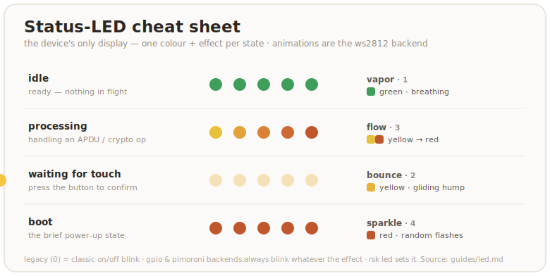

# LED

The status LED is the device's only display. On the reference board — the
**Waveshare RP2350-One** — it's a WS2812 addressable RGB on GPIO16.

## Build-time knobs

Three hardware properties of the indicator are **compile-time** knobs set by build
flags; a fourth, `MAX_LEDS`, sets the upper bound for the PIO buffer. The actual
number of connected LEDs is configured at **runtime** via `rsk hw --led-num` (or
PicoForge) and must be ≤ `MAX_LEDS`.

| Knob | Default | When to change it |
|---|---|---|
| `LED_KIND` | `ws2812` | `ws2812` (addressable RGB, default), `gpio` (plain on/off), `pimoroni` (3-pin PWM RGB), or `none` (no indicator). See [build.md](../build.md). |
| `LED_PIN` | `16` | A board whose addressable LED is on a different GPIO (`0..=29`). |
| `LED_ORDER` | `rgb` | A WS2812 board with swapped red/green — set `grb` (the WS2812B standard). The Waveshare RP2350-One is `rgb`; most other parts are `grb`. |
| `MAX_LEDS` | `1` | A board with **multiple** daisy-chained addressable LEDs — set it to the chain length (max `64`). Default `1` is a single onboard LED. The actual connected count is set at runtime with `rsk hw --led-num`. |

```sh
# example: build for a 4-LED board with standard GRB order
env MAX_LEDS=4 LED_ORDER=grb cargo build --release -p firmware
# then set the runtime count (persists across reboots):
rsk hw --led-num 4
```

Once built, a non-`none` build compiles all backends, so the pin, driver, wire
order, and LED count are **runtime-changeable** — no reflash — with `rsk hw`
([build.md](../build.md)). The build knobs set the boot defaults.

What the LED shows — colour, brightness, and the **visual effect** — is
runtime-configurable separately, covered next.

## Effects

Each of the four states can run one of several animated effects. The effect
determines *how* the LED(s) display the state's colour and brightness. All
effects work with any number of LEDs — `vapor` and `sparkle` shine on a single
LED too; `bounce` and `flow` naturally reduce to a static colour or a single
pixel when there is only one LED.

Effects only render on the **`ws2812`** backend (addressable RGB). The `gpio` and
`pimoroni` backends always use the classic on/off blink, regardless of the
effect setting — they lack per-LED control and pixel-level colour.

| Effect | ID | What you see | Suits |
|---|---|---|---|
| `legacy` | 0 | Classic on/off blink (TIMING table) | Original blink behaviour |
| `vapor` | 1 | All LEDs breathe together — smooth triangle-wave brightness | Idle (default) |
| `bounce` | 2 | A wide hump of light glides back and forth with half-step interpolation | Touch (default) |
| `flow` | 3 | Yellow→red gradient flowing left to right with a trailing wake | Processing (default) |
| `sparkle` | 4 | Each LED flashes an independent random colour | Boot (default) |

### Default mapping (multiple LEDs)

| State | Default effect | Default colour | Means |
|---|---|---|---|
| idle | `vapor` — gentle breathing | green | ready, nothing in flight |
| processing | `flow` — warm-colour flow | yellow→red gradient | handling an APDU / crypto op |
| **waiting for touch** | `bounce` — smooth bounce | yellow | press the button to confirm |
| boot | `sparkle` — random sparkle | red | the brief power-up state |



A few honest details:

- **No dedicated error colour.** The firmware does not light a distinct "error"
  state; a failed operation just drops back to idle. Read the host tool's exit
  code, not the LED, for success or failure.
- **The touch state needs the touch build.** It is only ever shown on the
  default touch build; a no-touch build (`--features no-touch`) never enters it.
  The processing state still flashes during the operation either way
  ([build.md](../build.md)).
- **Default brightness is gentle** — 16 of 255 per channel, so the indicator
  is visible without being a flashlight. Turn it up if you want.
- **Boot is brief.** You normally see it only for the moment between power-up
  and the first idle, so don't tune your eye to it.

This is *not* the BOOTSEL / `picotool` state. Holding the button while
plugging in puts the RP2350 in its ROM bootloader, where this firmware — and
therefore this LED engine — isn't running, so the LED is dark or shows
whatever the ROM does. That mode is for flashing firmware and OTP, covered in
[build.md](../build.md) and [otp-fuses.md](../otp-fuses.md).

## Customize

### Colour & brightness

Per-state colour and per-channel brightness are configurable; the values
persist in flash (`EF_LED_CONF`) and apply live — no reboot:

```sh
rsk led --get                                  # print the current config
rsk led --status idle --color blue             # recolor a state
rsk led --status idle --brightness 64          # 0–255; 0 = that state goes dark
rsk led --status idle --color blue --brightness 64
```

### Effect & speed

Each state's effect and animation speed are configurable the same way:

```sh
rsk led --status idle --effect vapor          # change the effect
rsk led --status touch --effect bounce --speed 15  # custom speed (ticks per step)
rsk led --status processing --effect legacy   # revert to classic on/off blink
```

`--speed 0` (or omitting `--speed`) uses the effect's built-in default.

### Steady / blink

`--steady` and `--blink` are global, not per-state: the firmware keeps each
state's timing internally, but a single flag decides whether *any* of them
blink. So `--steady` makes the whole indicator a solid lamp whose colour tracks
the current state, and `--blink` brings the blink patterns back.

```sh
rsk led --status idle --color cyan --steady    # solid cyan at idle, no pulse
rsk led --blink                                # back to the blink patterns
```

`rsk-tui` has a "cycle idle color" action that steps the idle state through
the palette, plus "Read LED state" — for per-state colour, brightness, or the
steady toggle, use `rsk led`.

### Selectors and values

| Flag | Values |
|---|---|
| `--status` | `idle`, `processing`, `touch`, `boot` (default `idle`) |
| `--color` | `off`, `red`, `green`, `blue`, `yellow`, `magenta`, `cyan`, `white` |
| `--brightness` | `0`–`255` per channel (`0` = off) |
| `--effect` | `legacy`, `vapor`, `bounce`, `flow`, `sparkle` |
| `--speed` | `0`–`255` (`0` = effect's built-in default) |
| `--steady` | solid colour, no blinking — **global**, affects every state |
| `--blink` | the opposite: restore blinking |

## Hardware wiring (`rsk hw`)

See the [phy record spec](../protocol.md) for the full reference. The LED wiring
— pin, driver, wire order — lives in the `phy` record, shared with PicoForge:

```sh
rsk hw --led-pin 22                     # move the WS2812/gpio data pin to GPIO22
rsk hw --led-driver gpio                # switch to a plain on/off LED
rsk hw --led-order grb                  # fix a red/green swap on a GRB part
```

### Reset to defaults

```sh
rsk led --status idle       --color green  --brightness 16 --effect vapor
rsk led --status processing --color green  --brightness 16 --effect flow
rsk led --status touch      --color yellow --brightness 16 --effect bounce
rsk led --status boot       --color red    --brightness 16 --effect sparkle
rsk led --blink
```

## Under the hood

`rsk led` talks to the firmware's vendor applet over CCID
(`tools/rsk/led.py`, `firmware/src/vendor.rs`):

- **SET LED** (`INS 0x10`) packs brightness into `P1` and colour + the steady
  bit + the target state into `P2`. When the caller sends 1–2 data bytes, they
  set the effect and speed for that state.
- **GET LED** (`INS 0x11`) returns the whole config block:
  `[steady:1, (effect:1, color:1, brightness:1, speed:1) × 4]` (17 bytes).

The firmware writes the block to `EF_LED_CONF` and reloads it on every boot,
so your settings survive a power cycle but not an OpenPGP/FIDO factory reset
(those don't touch this file). The `led.rs` module keeps per-status atomics
that the render task reads live — SET LED updates them immediately, then
persists the full block to flash.

For the wiring half (`rsk hw`), see the [phy record spec](../protocol.md); it
writes to `EF_PHY` via the rescue applet and applies at next boot.

## Troubleshooting

- **LED is dark and stays dark.** Either the board has no addressable LED, or
  the data pin / driver is wrong for your wiring — fix it live with `rsk hw
  --led-pin N` / `--led-driver …` (or rebuild with the right `LED_PIN` /
  `LED_KIND`, [build.md](../build.md)). If a known-good board goes dark
  mid-session, the firmware task is likely wedged, not the LED.
- **Red and green look swapped.** Wrong wire order for your LED part — flip it
  with `rsk hw --led-order grb` (or build with `LED_ORDER=grb`); see the
  RGB-vs-GRB note above.
- **Only the first LED lights up; the rest stay dark.** The board has multiple
  daisy-chained addressable LEDs, but the runtime LED count was never set.
  Run `rsk hw --led-num <your count>` to configure it (persists across reboots;
  the change applies after a warm reboot). If you need a higher buffer ceiling,
  rebuild with `MAX_LEDS=<n>`.
- **`rsk led` can't reach the device.** It needs the CCID interface up
  (`pcscd` on Linux); if `gpg --card-status` / `rsk status` also fail, fix that
  first ([linux.md](../linux.md)).
- **An app looks frozen.** Check for the long-on yellow touch state and tap the
  button. If the LED is idle-green and the app is still stuck, it isn't waiting
  on the device.
