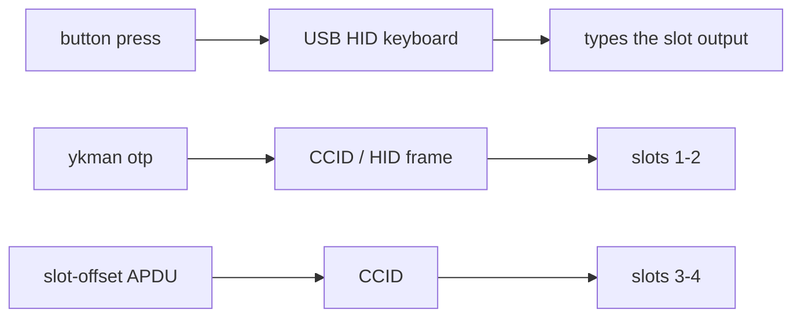

# OTP slots — Yubico OTP, challenge-response, static passwords

The YubiKey "OTP" feature: four slots, each holding one credential, output by a
button press or read over USB. Program slots 1–2 with stock `ykman otp`. Slots
3–4 are two extra slots reached over the same protocol with a slot offset.

> **`ykman otp` needs the opt-in Yubico flavor.** `ykman` gates on the "Yubico
> YubiKey" reader name. Only the opt-in `VIDPID=Yubikey5` build presents it. The
> default `RSKey` build (VID:PID `0x1209:0x0001`, reader "RS-Key") is invisible
> to it. The HID-keyboard *typing* of a slot's output is identity-independent and
> works on either build. Only programming and reading slots over `ykman` needs
> the Yubico flavor.

> Not the RP2350 fuses. This page is the Yubico one-time-password feature. The
> chip's One-Time-Programmable fuses (secure-boot key, master sealing key) are a
> different thing with the same three letters. See
> [otp-fuses.md](../otp-fuses.md).

The device is also a **USB keyboard**: pressing the button *types* the selected
slot's output wherever the cursor is. That keyboard is a third USB interface
(standard boot keyboard). It sits after the FIDO HID and CCID interfaces. If
your OS asks about a new keyboard at first plug, that's this one.



## Slot selection by clicks

The firmware runs a click counter: clicks landing within **1 second** of each
other count toward one gesture. The gesture types that slot when the window
closes.

| Clicks | Slot | `ykman otp` |
|---|---|---|
| 1 (short) | 1 | yes |
| 2 | 2 | yes |
| 3 | 3 | slot-offset APDU only |
| 4 | 4 | slot-offset APDU only |

`ykman otp` only knows slots 1 and 2, the classic short/long-press pair. Slots
3 and 4 use the same wire protocol with a 1- or 2-step slot offset (the
firmware addresses all four as one contiguous block). A tool has to send that
offset itself. Most setups never need them. Everything below targets 1/2 unless
noted.

## What each slot type does

Four credential types share the slots. Only some *type* on a press:

| Type | On button press | Over USB (`ykman otp calculate`) |
|---|---|---|
| Yubico OTP | types a 44-char modhex OTP | — |
| Static password | types the stored password | — |
| OATH-HOTP | types the 6/8-digit code | — |
| Challenge-response (HMAC-SHA1) | nothing | answers the challenge |
| Challenge-response (Yubico mode) | nothing | answers the challenge |

A challenge-response slot types nothing on a press. The button only *gates* the
USB calculate when the slot was programmed touch-required. So a slot can hold a
Yubico OTP **or** a static password **or** a HOTP secret **or** a
challenge-response secret, not several at once.

## Program a slot

```sh
ykman otp info                                                   # what's in each slot
ykman otp yubiotp 1 --serial-public-id -g -G                     # classic Yubico OTP (random ids + key)
ykman otp chalresp 2 --generate --touch                          # HMAC-SHA1 challenge-response
ykman otp static 1 --generate --length 38                        # typed static password
ykman otp hotp 2 --digits 6 'base32secret'                       # OATH-HOTP
ykman otp swap                                                   # swap slots 1 and 2
ykman otp delete 2                                               # clear a slot
```

Notes on the options:

- **`--touch`** (chalresp) sets the touch-trigger bit: the USB calculate then
  waits for a button press and refuses without one. Touch-typing slots (Yubico
  OTP, static, HOTP) always need the press anyway. That's the only way to fire
  them.
- **`yubiotp`**: `-S/--serial-public-id` uses the device serial as the public
  id, `-g/--generate-private-id` randomises the private id, `-G/--generate-key`
  randomises the AES key. All three together give a self-contained random
  credential.
- **`--length`** on a static slot is the typed-password length, **max 38**
  characters (the slot stores 38 password bytes). `--length 38` fills it. By
  default `static` only uses the modhex alphabet (`cbdefghijklnrtuv`) so the
  password types the same on any keyboard layout. `--keyboard-layout us` (etc.)
  widens the character set at the cost of layout-dependence.
- **Reprogramming a slot is destructive.** The new secret overwrites the old.
  There is no "read it back." Yubico OTP and chal-resp secrets are random and
  exist only on the device once programmed (see *Validation* below for the
  exception).
- **Access code:** set one with `ykman otp settings <slot> --new-access-code`.
  The firmware then refuses to overwrite, update, delete, **or swap** that slot
  unless the code is presented (`ykman otp --access-code <hex> …`, given *before*
  the sub-command). Lose the code and the only way out is a factory reset of the
  OTP applet.

`ykman otp` reaches the device over the HID frame protocol on the keyboard
interface (and over CCID). Both work without any PIN. OTP slots are not
PIN-protected, only optionally access-code-protected.

## Challenge-response from software

```sh
ykman otp calculate 2 <hex-challenge>     # HMAC-SHA1, returns the 20-byte HMAC
```

This is the KeePassXC / LUKS pattern: the database (or disk) key is mixed with
the slot's HMAC of a fixed challenge. `--touch` slots wait for a press first.
The keyboard interface answers the same protocol, so tools written for YubiKeys
("YubiKey challenge-response" in KeePassXC, `ykchalresp`, the `pam_yubico`
HMAC mode) work unchanged.

Two challenge-response modes exist:

- **HMAC-SHA1** is the common one. Variable-length challenges (`HMAC_LT64`) are
  supported with the classic YubiKey trim quirk: a short challenge is padded by
  repeating its last byte, and a challenge that *ends* in its own last byte
  loses that tail. KeePassXC and `ykchalresp -H` already account for this.
- **Yubico mode** is a 6-byte challenge, AES-encrypted with the slot key after
  mixing in the device serial. Rarely used. HMAC-SHA1 is what tools expect.

## Yubico OTP validation

A Yubico-OTP slot types 44-modhex one-time passwords (a 6-byte public id in
clear, then an AES-128-ECB block over the private id, a 16-bit usage counter, a
session counter, an uptime stamp, two random bytes and a CRC). A validation
server decrypts and replay-checks them.

- The usage counter advances every power-up and every session wrap, so a token
  never repeats across reboots: the standard replay defence.
- **Public validation (YubiCloud)** requires uploading the slot's AES key to
  Yubico. `--generate-key` prints the key, public id and private id at
  programming time. Capture them then, because they cannot be read back later.
- **Self-hosted validation** (`yubikey-val`, or a custom verifier) keeps the AES
  key on your own server. Nothing leaves the building.

## Static passwords

A static slot types a fixed string on each press. Handy for a long machine
password or a prefix you append a moving code to. It is **not** a secret store:
anyone who can press the button gets the password typed out, and a static
password is replayable by definition. The string is typed as raw HID scancodes,
so it is keyboard-layout independent up to the characters `ykman` will accept.

## OATH-HOTP slots

An OTP-slot HOTP credential types an RFC 4226 code (6 or 8 digits, `--digits`)
and advances its counter on each press. This is the *typed* HOTP, distinct from
the full [OATH applet](oath.md), which stores many TOTP/HOTP accounts and is
read by an authenticator app rather than typed. Use a slot when you want one
HOTP typed by a button. Use the OATH applet for a list of accounts.

## Reading status / serial

```sh
ykman otp info               # slot 1/2 programmed? touch? type?
ykman info                   # device serial, firmware version, enabled apps
```

The serial that OTP reports is the YubiKey-style 8-digit serial derived from the
chip id, the same value `ykman info` shows. A serial derived from the same chip
id is mixed into Yubico-mode challenge-response, though it draws on more of the
chip-id bytes than the reported 8-digit value, so the two aren't byte-identical.

## Disabling the keyboard interface

If the extra keyboard is unwanted (some KVMs or login screens dislike a button
that types), the obvious move is `ykman config usb --disable otp`. But on this
firmware that does **not** actually remove the keyboard:

```sh
ykman config usb --disable otp        # flips the reported OTP capability bit only
ykman config usb --list               # what ykman thinks is on
```

`ykman config usb` writes the Yubico management capability blob (`EF_DEV_CONF`),
which is just the set of bits `ykman` reports back. Whether the keyboard HID
interface actually enumerates is decided at boot by a separate interface mask in
the rescue `phy` record (`EF_PHY` / `USB_ITF_KB`), and nothing translates a
capability-bit change into that mask. So after `--disable otp` the keyboard
keeps enumerating across reboots. `ykman` merely *reports* OTP as disabled.

To genuinely drop the keyboard interface you have to clear the `USB_ITF_KB` bit
in the rescue `phy` mask via the rescue applet. Stock `ykman` can't do it. If
typing is the problem and you don't need that path, leaving the slots empty (or
behind an access code) avoids accidental presses without touching the interface
set.

## Troubleshooting

- **`ykman otp info` hangs or errors right after gpg/ssh used the device** →
  scdaemon is holding the CCID interface. `gpgconf --kill scdaemon`, then retry.
  See [linux.md](../linux.md) and [openpgp.md](openpgp.md#troubleshooting).
- **A press types nothing** → the slot is empty, or it's a challenge-response
  slot (those never type). `ykman otp info` shows which.
- **`ykman otp calculate` returns `CONDITIONS_NOT_SATISFIED` / waits forever** →
  the slot is `--touch`. Press the button.
- **Overwrite/delete refused** → the slot has an access code. Pass it with
  `ykman otp --access-code <hex> …` (before the sub-command), or factory-reset
  the OTP applet.
- **Slots 3/4 don't show in `ykman otp info`** → expected. `ykman otp` only
  enumerates 1 and 2.

## Notes and limits

- OTP slot secrets are **not** covered by the [seed backup](seed-backup.md) and
  not by a primary/[backup-key pair](backup-key.md). They're sealed to this
  chip. Re-program the slots on a replacement board, or keep the AES keys / HOTP
  seeds you generated somewhere safe.
- Touch-triggered typing always requires the physical press. Only the
  challenge-response USB path honours each slot's touch-trigger flag.
- No PINs here. Anything that can reach the USB interfaces can press-by-proxy a
  typing slot and can run `calculate` on a non-touch chal-resp slot. Make the
  sensitive ones `--touch`, and put an access code on slots you don't want
  silently reprogrammed.
