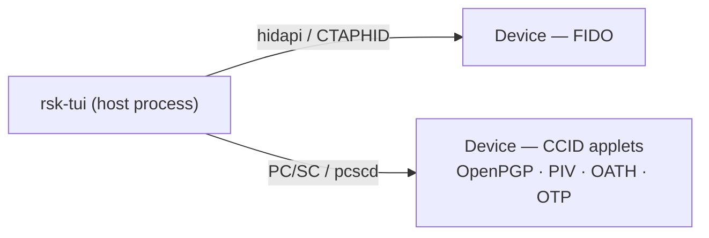

<!-- SPDX-License-Identifier: AGPL-3.0-only -->
<!-- Copyright (C) 2026 RS-Key contributors -->

# rsk-tui — the terminal cockpit

`rsk-tui` is a host-side dashboard for an RS-Key. It talks to the device
directly — CTAPHID over hidapi and the CCID applets over PC/SC — so it does not
shell out to `rsk` or any other process. It lives in its own workspace
(`tools/tui`), separate from the firmware, and links the host PC/SC and HID
stacks.

It is a companion to the `rsk` CLI, not a replacement: the cockpit covers the
safe, day-to-day reads and a few in-band actions (LED, seed backup, reboot,
audit, identity verify). Irreversible production rituals — secure-boot staging,
OTP fuses, factory resets, soft-lock, attestation import — stay in the CLI on
purpose, and the cockpit points you at the exact command instead of doing them.




## Running it

In the dev shell `rsk-tui` is on `PATH`:

```sh
nix develop
rsk-tui              # interactive cockpit
```

Without Nix, run it from its workspace (the repo defaults to the firmware
target, so name the host target explicitly — this is what the launcher does):

```sh
cargo run --release --manifest-path tools/tui/Cargo.toml \
  --target "$(rustc -vV | sed -n 's/host: //p')"
```

On Linux the CCID half needs `pcscd` + a polkit rule; see
[linux.md](../linux.md). FIDO works as soon as the udev rules are in place. If
PC/SC is down, the cockpit still starts — the FIDO sections work and every CCID
field shows `CCID unavailable` rather than a fabricated value.

### Flags

| Flag            | Effect                                                          |
|-----------------|----------------------------------------------------------------|
| *(none)*        | interactive cockpit                                            |
| `--demo`, `--mock` | interactive cockpit against a **simulated** device — no hardware needed |
| `--once`        | print the gathered status once (human-readable) and exit       |
| `--json`        | one-shot machine-readable status (JSON) and exit               |
| `--selftest [PIN]` | native backup export/restore round-trip (needs a no-touch build) |
| `-h`, `--help`  | usage                                                          |

`--demo` is handy for screenshots, docs, and trying the navigation without a
key plugged in. Demo data is clearly labelled `[DEMO]` and every simulated
action is prefixed `[demo]`; it never pretends to touch hardware.

`--json` and `--once` are the scriptable paths — both gather one snapshot and
exit, so they fit a health check or a CI probe. `--json` emits a stable,
explicit object (`identity`, `fido`, `backup`, `secure_boot`, `rollback`,
`applets`, `errors`, …); `--once` is the same data formatted for a human. Either
honours `--demo`, so you can shape a pipeline against the mock first:

```sh
rsk-tui --json | jq '.secure_boot, .rollback'
rsk-tui --once --demo            # see the field layout without a key
```

`--selftest` drives the native MSE channel + clientPIN token + BIP-39 path
end-to-end — export a seed, re-derive its fingerprint, restore it, confirm the
fingerprint is stable — without revealing the seed. It needs a **no-touch
firmware build** (the touch build would block waiting for a button press), and
takes the FIDO2 PIN as an optional positional argument if one is set.

A non-interactive snapshot of the simulated device (`rsk-tui --once --demo`)
gives a sense of what the cockpit reads:

```text
[DEMO — simulated device]
device     : serial 37bebfdca282 · fw 5.7.4 · bcd 0x0759
transports : HID present  PC/SC present  CCID present
serial     : 37bebfdca282523b
firmware   : 5.7.4  bcdDevice 0x0759  sdk 3.4
fido       : U2F_V2, FIDO_2_0, FIDO_2_1  clientPin=true
backup     : sealed=false  has_seed=true
seed lock  : off
secure boot: ENABLED (not locked)  (enabled=true locked=false bootkey=0x1)
rollback   : not required  boot version 0/48
org attest : not installed
applets    : OpenPGP present  PIV present  OATH present  OTP present
```

<!-- TODO(docs): a screenshot of the interactive cockpit could live in docs/assets/,
     but rsk-tui --demo is a full-screen TUI and can't be rendered headlessly here.
     Capture it manually with `rsk-tui --demo` rather than committing a fabricated
     image. The ASCII layout below and the --once snapshot above are honest stand-ins. -->

## Layout

```
┌ header: app · health · device identity · refreshed ─────────────┐
│ sections │ selected section: status fields + action menu        │
│  …       │                                                      │
├──────────┴──────────────────────────────────────────────────────┤
│ events: recent operations and errors                            │
├─────────────────────────────────────────────────────────────────┤
│ last result · key bindings                                      │
└─────────────────────────────────────────────────────────────────┘
```

The sidebar narrows and the event panel drops away on small terminals; the UI
keeps working down to a few rows. Status uses an `OK / WARN / ERR / UNK / N/A`
word plus a colored glyph, so it reads on a monochrome or color-blind terminal.
`N/A` is reserved for things the device supports but the TUI deliberately leaves
to the CLI — it is never a faked or unknown value. Set `RSK_TUI_ASCII=1` (or run
in a non-UTF-8 locale) to force ASCII glyphs (`[+] [!] [x] [?] [-]` instead of
`● ▲ ✖ ○ –`); a UTF-8 `LANG`/`LC_*` is auto-detected otherwise.

## Key bindings

| Key | Action |
|-----|--------|
| `Tab` / `Shift-Tab`, `←` / `→` | switch section |
| `↑` `↓` or `j` `k` | move selection in the action list |
| `Enter` | run the selected action |
| `r` | refresh device status |
| `/` | search actions across all sections |
| `?` | jump to Help |
| `Esc` | cancel a modal / input |
| `q` or `Ctrl-C` | quit (terminal restored on exit) |

The status also auto-refreshes every few seconds while you are in the normal
view — never while a modal is open, so a read can't redraw over a PIN prompt or
hammer the CCID bus mid-task.

Inside a modal the keys narrow to that modal: a text/PIN input takes characters +
`Backspace`, `Enter` submits, `Esc` cancels (and wipes the buffer); a yes/no
prompt takes `y`/`n` or `Enter`/`Esc`; a reveal or message panel dismisses on any
key. The `/` palette filters by a case-insensitive substring of the action label
as you type, `↑`/`↓` pick, `Enter` jumps to that action's section and starts it.

## Sections and what they do

| Section | Reads (safe) | In-band actions |
|---------|--------------|-----------------|
| Overview | identity (serial, fw, bcdDevice, sdk, aaguid), transports, backup/lock/secure-boot/rollback/attestation/flash | Refresh, Verify identity |
| FIDO | CTAPHID presence, versions, clientPIN, options | — |
| OpenPGP | applet presence | — |
| PIV | applet presence | — |
| OATH / OTP | applet presence | — |
| Backup | seed / sealed / lock state | Export, Restore, Finalize (BIP-39) |
| LED | LED mode + per-state color/brightness | Read state, Cycle idle color |
| Audit | journal head + checkpoint key hint | Read journal, Verify identity |
| Reboot / Maintenance | device summary | Reboot → app, Reboot → BOOTSEL |
| Help | key bindings, section guide, safety model | — |

The applet sections (OpenPGP, PIV, OATH, OTP) show **presence only** — whether
the applet answered `SELECT`. Reading their contents (keys, accounts, retry
counters) needs the applet's own tooling, so those rows point you at the command
instead: `gpg --card-status` ([openpgp.md](openpgp.md)), `ykman piv info`,
`ykman oath accounts`, and so on.

**Verify identity** issues a fresh 16-byte challenge, has the device sign it
with its DEVK-derived P-256 attestation key (vendor `AUDIT_CHECKPOINT`), and
**verifies the ECDSA signature locally** over `tag‖head‖seq‖challenge` — it is a
real cryptographic check, not a display of device-asserted bytes. On success it
prints an 8-byte **fingerprint** of the attestation public key. Record that
fingerprint: a later `rsk inventory verify --expect-key <hex>` (or `rsk audit
verify --expect-key …`) pins it, so a swapped or cloned board fails the check
instead of quietly verifying. Verify needs a touch, the FIDO2 PIN if one is set,
and a provisioned OTP DEVK — without the DEVK it says
`no OTP DEVK provisioned — attestation unavailable` rather than guessing.

**Read journal** dumps the tamper-evident audit log (vendor `AUDIT_READ`): a
hash-chained sequence of events (`BOOT`, `MAKE_CREDENTIAL`, `GET_ASSERTION`,
`PIN_SET`, `BACKUP_EXPORT`, `CHECKPOINT`, …) folded into an epoch, with the
running chain `head`. It is read-only — the device never lets the host rewrite
it — and asks for the FIDO2 PIN if one is set. The full cross-check against the
signed head lives in `rsk audit verify`.

**LED** reads the four LED states the firmware drives — `idle`, `processing`,
`touch`, `boot` — each with a color and brightness, plus whether the idle LED is
steady or blinking. *Cycle idle color* steps the idle color through the palette
(`red → green → blue → yellow → magenta → cyan → white`, then wraps) and writes
it back; it is a cosmetic, unauthenticated setting, not a security control.

### PINs in the cockpit

Every PIN the TUI asks for is the **FIDO2 clientPIN** — the same one
`rsk fido set-pin` manages — not an OpenPGP PW1/PW3 or a PIV PIN. It gates the
in-band actions that need it: Verify, Read journal, and seed Export/Restore (when
a PIN is set). If no clientPIN is set, those actions skip the prompt. OpenPGP and
PIV PINs are only ever entered in their own tools (`gpg`, `ykman`), never here.

### CLI-only / unsupported in the TUI

These are surfaced as menu entries that, when selected, print the exact command
to run — they are never performed from the cockpit:

- **FIDO**: set/change PIN (`rsk fido set-pin`), list resident passkeys (`rsk
  fido list-passkeys --pin …`), factory reset (`ykman fido reset`)
- **OpenPGP / PIV / OATH / OTP**: full card data and factory resets (`gpg
  --card-status`, `ykman piv info`, `ykman oath accounts`, `rsk openpgp reset`,
  `ykman piv reset`, …). The `ykman` commands gate on the "Yubico YubiKey"
  reader name, so they only see the device on the opt-in `VIDPID=Yubikey5`
  build; `gpg` and `rsk` work on the default RS-Key build.
- **Backup**: SLIP-39 (Shamir T-of-N) export/restore — `rsk backup export
  --scheme slip39` ([seed-backup.md](seed-backup.md))
- **Maintenance** (Reboot section): seed soft-lock (`rsk lock enable | unlock |
  disable`), org-attestation import/clear (`rsk fido attestation import | clear`),
  secure-boot staging, OTP fuses — see [production.md](../production.md) and
  [otp-fuses.md](../otp-fuses.md)

Credential and passkey counts are not shown because there is no unauthenticated
way to read them; use `rsk fido list-passkeys --pin …`.

## Safety model — what is and is not logged

- **Destructive or irreversible operations require a typed confirmation**, not a
  single keypress: export (`EXPORT`), restore (`RESTORE`), finalize/seal
  (`SEAL`), reboot to BOOTSEL (`BOOTSEL`). The typed word must match exactly
  (case-sensitive); anything else cancels the action. Reboot to app uses a
  yes/no prompt. *Finalize* is refused outright once the window is already
  sealed — it explains rather than re-confirming.
- **PINs are masked** on entry and **never written to the event log**. The log
  additionally redacts any live PIN/phrase substring as a backstop, and it is a
  bounded ring (the last 200 lines), so nothing accumulates on disk — it is only
  ever in memory.
- **The seed is shown only after you confirm export.** It appears once, in a
  modal, is zeroized from memory when you press a key, and **never reaches the
  event log or any file**. The same goes for a restore phrase you type in.
- Sensitive buffers (PIN, phrase, revealed seed) are wiped (`zeroize`) on cancel,
  on submit, and on Ctrl-C — `Ctrl-C` wipes the in-flight buffer *before* it
  quits, from any modal.
- The terminal is restored on every exit path — `q`, `Ctrl-C`, an I/O error, or
  a panic (device I/O can panic, so a panic hook leaves the alternate screen and
  raw mode first).

The seed backup flows here are exactly the BIP-39 export/restore/finalize of
`rsk backup`, just interactive — same touch + PIN + setup-window gates, same
forever-sealed semantics after finalize. Read [seed-backup.md](seed-backup.md)
for what a backup does and does not recover before you rely on it.

## Architecture (for contributors)

`tools/tui/src` is split so rendering, state, and I/O stay separate and the UI
is testable without hardware:

- `model.rs` — typed state (`DeviceSnapshot`, `TransportStatus`, `Section`,
  `Action`, `ActionResult`, `EventLog`, …) and `--json` serialization. No I/O.
- `device.rs` — native CTAPHID + PC/SC I/O behind a `DeviceProvider` trait, with
  `HardwareProvider` (real) and `MockProvider` (`--demo`). Holds the native seed
  backup crypto: the MSE channel (P-256 ECDH → HKDF → ChaCha20-Poly1305) and the
  clientPIN protocol-two token (ECDH + HKDF + AES-CBC + HMAC).
- `app.rs` — app state, navigation, and the modal/confirmation flow.
- `actions.rs` — action dispatch + result handling (the one place that blocks on
  device I/O; it paints a "working — touch the device…" line and redraws *before*
  the blocking call so the prompt is visible).
- `input.rs` — key handling → state change + `Flow`.
- `ui.rs` — rendering only.
- `theme.rs` — styles, colors, ASCII fallback.

Because the UI is driven by a `DeviceProvider`, the whole cockpit — navigation,
confirmation flows, secret redaction, rendering — is unit-tested against the
mock with no device attached.

```sh
# fmt / clippy / test / build, host target (the merge gate runs these too):
H="$(rustc -vV | sed -n 's/host: //p')"
cargo fmt   --manifest-path tools/tui/Cargo.toml --check
cargo clippy --manifest-path tools/tui/Cargo.toml --target "$H" --all-targets -- -D warnings
cargo test   --manifest-path tools/tui/Cargo.toml --target "$H"
cargo build --release --manifest-path tools/tui/Cargo.toml --target "$H"
```

The `--target "$H"` is load-bearing: the repo's `.cargo/config.toml` defaults to
the `thumbv8m` firmware target, and `tools/tui` is a detached workspace (note the
empty `[workspace]` table in its `Cargo.toml`) precisely so it builds for the
host instead. See [build.md](../build.md) for the workspace layout.
