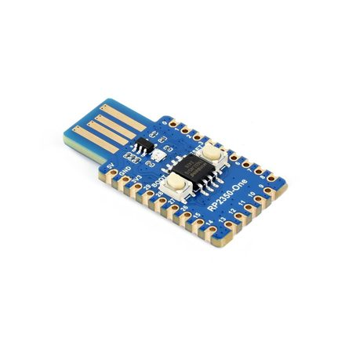
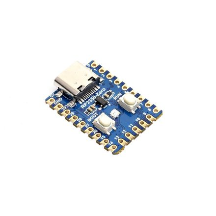
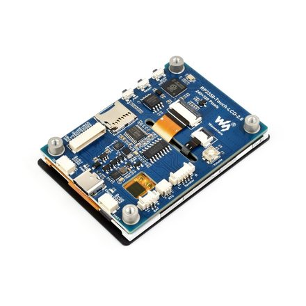

<!-- SPDX-License-Identifier: AGPL-3.0-only -->
<!-- Copyright (C) 2026 RS-Key contributors -->

# Hardware

What RS-Key runs on, and the build knobs you need for a board other than the
reference one. The full knob reference is in [build.md](build.md); this page is
the short version.

## Supported boards

<table>
<tr>
<td align="center"></td>
<td align="center"></td>
<td align="center"></td>
</tr>
<tr>
<td align="center"><b>RP2350-One</b><br>reference board · USB-A<br>WS2812 on GPIO16</td>
<td align="center"><b>RP2350-Zero</b><br>mini stick · USB-C</td>
<td align="center"><b>RP2350-Touch-LCD-2.8</b><br>trusted display<br><code>LED_KIND=none FLASH_SIZE=16M</code></td>
</tr>
</table>

<sub>Board photos: Waveshare.</sub>

Any RP2350 board with a USB connector should work. Development and on-device
testing happen on the **Waveshare RP2350-One**, where the WS2812 status LED on
GPIO16 works out of the box. Boards without an addressable LED run fine — the
indicator is optional and the firmware just runs dark.

The RP2350's dual Cortex-M33, 520 KB SRAM, hardware TRNG, OTP fuses, and glitch
detectors do the work. There is **no secure element** and no debugger
requirement: the firmware flashes over USB BOOTSEL, so a bare board and a USB
cable are enough.

## Defaults and the knobs to change them

The default build targets a 4 MB flash chip with the LED on GPIO16, uses BOOTSEL
for user presence, and assumes a standard 12 MHz crystal. For a different board,
three compile-time knobs usually cover it:

| Knob | Default | When to change it |
|---|---|---|
| `FLASH_SIZE` | `4M` | A board with a different QSPI flash chip (e.g. `8M`). `build.rs` regenerates `memory.x` from it. Must be ≥ ~2 MB and ≤ 16 MB. |
| `LED_PIN` | `16` | A board that uses GPIO16 for something else, or wires its addressable LED elsewhere (RP2350A: GPIO `0..=29`). |
| `PRESENCE_PIN` | `bootsel` | A board with a dedicated user-presence button on a GPIO. Set a pin number (`0..=29`); active-low with a pull-up by default (e.g. `0` for GPIO0-to-GND). |
| `PRESENCE_ACTIVE_HIGH` | `0` | A presence button/sensor that reads **high** when pressed (a capacitive touch sensor, or a button to VCC). `1` flips the GPIO to pull-down + active-high. Only with a GPIO `PRESENCE_PIN`. |
| `LED_KIND` | `ws2812` | `ws2812` (addressable RGB, default), `gpio` (plain on/off), `pimoroni` (3-pin PWM RGB), or `none` (no indicator). See [build.md](build.md). |
| `LED_ORDER` | `rgb` | A `ws2812` board whose red and green come out swapped (blue fine): set `grb` (the WS2812B standard). The Waveshare RP2350-One is `rgb`; most other parts are `grb`. |
| `MAX_LEDS` | `8` | A board with **more than 8** daisy-chained addressable LEDs. The buffer ceiling; the actual connected count is set at runtime ([guides/led.md](guides/led.md)). |

```sh
# example: an 8 MB board with a plain LED on GPIO25
env FLASH_SIZE=8M LED_KIND=gpio LED_PIN=25 cargo build --release -p firmware

# example: a 16 MB TenStar RP2350-USB — WS2812 on GP22, standard GRB order
env FLASH_SIZE=16M LED_PIN=22 LED_ORDER=grb cargo build --release -p firmware

# example: WS2812 on GP22 and a button-to-GND on GP0 (active-low)
env LED_PIN=22 PRESENCE_PIN=0 cargo build --release -p firmware

# example: an active-high capacitive touch sensor on GP0
env PRESENCE_PIN=0 PRESENCE_ACTIVE_HIGH=1 cargo build --release -p firmware
```

The four LED knobs (`LED_PIN` / `LED_KIND` / `LED_ORDER` / `MAX_LEDS`) set only the
*boot defaults*: a non-`none` build compiles all three backends, so the pin,
driver, wire order, and buffer ceiling are also changeable at **runtime** — no
reflash — with `rsk hw` or PicoForge, which write them to the device's `phy`
record
([guides/led.md](guides/led.md)). The build knobs still matter for picking a
lean `none` build and for the out-of-the-box default.

So most RP2350A boards work with at most a one-line change. Everything else
(USB descriptors, applets, flash layout) is board-independent.

## Enclosures

A bare board works fine, but a printed case makes it pocketable. Two community
designs fit the boards above:

- **[Waveshare RP2040-One / RP2350-One case](https://www.printables.com/model/1129764-waveshare-rp2040-one-and-rp2350-one-case)**
  by Patrick van der Leer — sized for the reference board.
- **[RP2350 USB case](https://www.printables.com/model/1248338-rp2350-usb-case)**
  by Vladimir Varzaru (a remix of Patrick's design) — a slimmer USB-stick form.

Both are licensed **CC BY-SA 4.0**: print, sell, and remix them freely, as long
as you credit the authors and keep any derivative under the same license. They
are third-party designs, linked for convenience — not part of this project.

## What the hardware does not give you

The OTP fuses and secure boot ([production.md](production.md)) are real
hardening, but the RP2350 is a general-purpose microcontroller, not a certified
secure element. Physical attacks — decapping, microprobing, fault injection
beyond the on-chip glitch detectors, power/EM side channels — are out of scope.
See the [threat model](threat-model.md) and [limitations](limitations.md).
