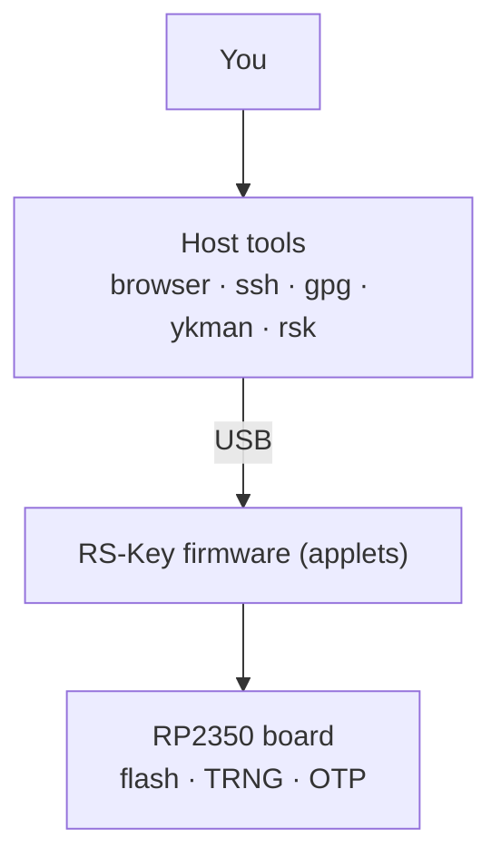

<!-- SPDX-License-Identifier: AGPL-3.0-only -->
<!-- Copyright (C) 2026 RS-Key contributors -->

# RS-Key

RS-Key (RSK) is open-source security-key firmware for the Raspberry Pi RP2350.
It turns an RP2350 board into a USB authenticator: FIDO2/WebAuthn/U2F,
OpenPGP card, PIV, OATH, Yubico-style OTP. It ships the host-side tooling to
drive and provision it.

Written in Rust (`no_std`, [embassy](https://embassy.dev)). For development,
research, and controlled experiments.

> **This project is experimental.** It has had no external security audit. The
> RP2350 is not a secure element. A stolen board is only as strong as the
> optional OTP / secure-boot hardening you have applied to it. Do not use it to
> guard credentials you cannot afford to lose or have stolen. Read the
> [threat model](threat-model.md) and [limitations](limitations.md) before
> trusting it with anything real.

## Start here

- **[Quick start](quickstart.md)**: build, flash, set a PIN, enroll something
- **[Hardware](hardware.md)**: supported boards and the knobs for them
- **[Build options](build.md)**: every compile-time flag and environment knob
- **[Using the device](guides/fido2.md)**: per-feature guides for FIDO2, SSH,
  OpenPGP, PIV, OATH, OTP, seed backup, soft-lock, and more
- **[Production hardening](production.md)**: OTP master key + secure boot
  (**irreversible** fuses; read it end to end first)
- **[Security](threat-model.md)**: threat model, [limitations](limitations.md),
  and the [`unsafe` audit](unsafe.md)
- **Project**:
  [Contributing](https://github.com/TheMaxMur/RS-Key/blob/main/CONTRIBUTING.md) ·
  [Security policy](https://github.com/TheMaxMur/RS-Key/blob/main/SECURITY.md) ·
  [Licensing & compliance](https://github.com/TheMaxMur/RS-Key/blob/main/COMPLIANCE.md)

## What it is, plainly

- It aims to behave like a USB security key and to work with the host software
  people already use: `ssh`, `gpg`, browsers, libfido2, and `ykman` (which needs
  the opt-in `VIDPID=Yubikey5` build, see below). What has actually been checked
  on hardware is recorded in the [interop matrix](interop.md), with dates.
- It is **not** a certified hardware security key, and not a drop-in replacement
  for an audited commercial key in production. There is no secure element.
- The default USB identity is RS-Key's own (VID `0x1209` / PID `0x0001`, from
  [pid.codes](https://pid.codes), the open-source USB VID), presenting as
  "RS-Key Security Key". An opt-in `VIDPID=Yubikey5` build instead borrows a
  YubiKey's identity (VID `0x1050` / PID `0x0407`) so that `ykman` and Yubico
  Authenticator (which key off the "Yubico YubiKey" reader name) work without
  custom rules. That flavor is for interop only and is never distributed. See
  [limitations](limitations.md). RS-Key is not affiliated with or endorsed by
  Yubico, Nitrokey, or Raspberry Pi.

## License

AGPL-3.0-only. RS-Key is a from-scratch Rust reimplementation of the
AGPL-3.0-only [pico-keys](https://github.com/polhenarejos) firmware family, so it
inherits that license and cannot be relicensed. See
[NOTICE](https://github.com/TheMaxMur/RS-Key/blob/main/NOTICE) and
[COMPLIANCE.md](https://github.com/TheMaxMur/RS-Key/blob/main/COMPLIANCE.md).
