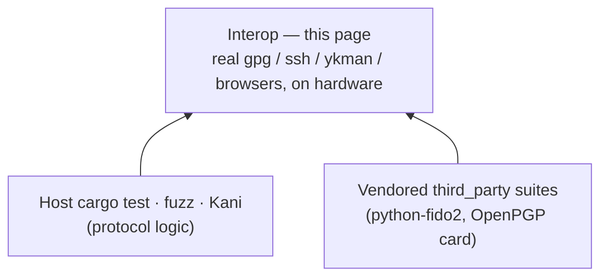
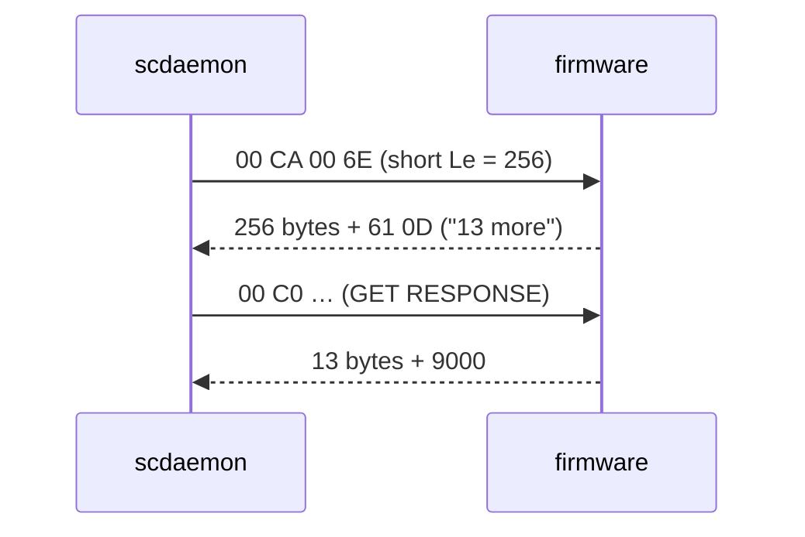

# Interop — does it actually work with the real tools?

RS-Key has three test layers below this one (`tests/`, the vendored
[`third_party/`](https://github.com/TheMaxMur/RS-Key/tree/main/third_party)
suites, and the host `cargo test` / fuzz / Kani stack — see
[testing.md](testing.md)). All of them drive the device at the **protocol**
level: APDUs, CBOR, CTAPHID frames. They prove the wire format is correct
against *our* reading of the specs and against two upstream suites.



This document is the layer above: **does the device work end-to-end with the
software a real user actually runs** — `gpg`, `ssh`, a browser's WebAuthn
stack, `ykman`, `fido2-token`, OpenSC — not with our own scripts. Protocol
conformance is necessary but not sufficient: a response can be spec-arguable
yet still trip a strict third-party parser. (The canonical example is the
`ykman openpgp info` crash below: our GET DATA `6E` was readable by `gpg` but
rejected by ykman's stricter `Tlv.unpack(0x6E, …)`.)

> This is experimental firmware with no security audit. Most cells below run on
> the **default RS-Key build** (USB VID:PID `0x1209:0x0001`, reader name
> "RS-Key") — `gpg`, `ssh`, browsers, OpenSC, and libfido2 bind the ATR / FIDO
> HID usage page, not the VID/PID, so they don't care about branding. The
> `ykman` and Yubico Authenticator cells are the exception: they derive the
> device from the "Yubico YubiKey" reader name, so they need the opt-in
> `VIDPID=Yubikey5` interop flavor (`0x1050:0x0407`) — see [build.md](build.md).
> A ✅ means the cell was observed working on the dated build; it is a record,
> not a guarantee of future builds or other hosts.

The matrix is a living artifact. A cell is **evidence** only once it has been
run on hardware and dated; everything else is `⏳ untested`. The `0758` /
`0759` tags in the Status column are the firmware `bcdDevice` the cell was run
against.

**Baseline — 2026-06-13, firmware `0x0758`** (`tests/interop/run.py`, live
device): libfido2 enumeration + getInfo, `gpg --card-status`, and `ykman`
`piv`/`oath`/`otp` info all ✅; `ykman openpgp info` ❌ (the GET DATA `6E`
wrapper bug below — reproduced live as `ERROR: Incorrect TLV length`).

**Re-verified — 2026-06-13, firmware `0x0759`** (the fix): the full CLI sweep
is green — **7 passed, 0 failed**, `ssh-sk` skipped (touch). `ykman openpgp
info` now prints the card (`OpenPGP version: 3.4`, app `4.6.0`, PIN counters)
instead of the TLV error.

**Touch / GUI round — 2026-06-13, firmware `0x0759`→`0x075A`** (`--features
up-button` confirmed live): `ssh-keygen -t ed25519-sk` enrol, `fido2-cred`/
`fido2-assert` (assertion verified), and the OTP HID keyboard (short-tap typed
the static slot verbatim) all ✅ with a real button press; Chrome / Firefox /
Safari WebAuthn ✅ by user attestation. `gpg --edit-card generate` was the lone
❌ on `0x0759` — **not** a crypto failure (the APDU suites GENERATE
P-256/Ed25519/RSA-2048 and UIF-sign fine) but a GET DATA `6E` short-`Le`
overflow in scdaemon; **fixed in `0x075A`** (dispatcher response chaining) and
re-verified end-to-end. See
[Known issues](#get-data-short-le-chaining-fixed-on-0x075a).

## Status legend

| Mark | Meaning |
|---|---|
| ✅ | verified end-to-end on hardware (date + firmware in Notes) |
| ⚠️ | works with caveats / partial coverage |
| ❌ | broken — known defect (link the issue/fix) |
| ⏳ | not yet run on hardware |
| 🚫 | not applicable on this platform / not implemented |

## A note on firmware builds

The CLI suites cannot press the BOOTSEL button, so anything touch-gated either
needs the **no-touch test build** (`cargo build -p firmware
--features no-touch`, see [build.md](build.md)) or a human. The matrix splits
accordingly:

- **CLI sweep** — run on the **no-touch** build; fully automatable
  (`tests/interop/run.py`).
- **GUI / ceremony** — run on the **touch** build with a finger on the button
  (browser WebAuthn, `ssh-keygen -t ed25519-sk`, OpenPGP UIF signing).

## Matrix

### FIDO2 / WebAuthn / U2F

| Consumer | What it exercises | Build | How | Status |
|---|---|---|---|---|
| `fido2-token -L` / `-I` (libfido2) | enumeration + getInfo | no-touch | `tests/interop/run.py` | ✅ `0759` |
| `fido2-cred` / `fido2-assert` (libfido2) | make credential / get assertion | touch | manual (`fido2-cred -M` ‖ `fido2-assert -G`) | ✅ `0759` (touch ×2, assertion verified `2026-06-13`) |
| python-fido2 (Yubico) | full CTAP2 flows | **no-touch** build | `pytest third_party/pico-fido-tests/pico-fido` | ⚠️ `075A` — 191 passed / 4 failed / 9 errored; [all test-side, not firmware defects](#suite-triage) |
| Chrome WebAuthn | register + authenticate | touch | [webauthn.io](https://webauthn.io) (manual) | ✅ user-attested (macOS/Linux/Win, `2026-06-13`) |
| Firefox WebAuthn | register + authenticate | touch | [webauthn.io](https://webauthn.io) (manual) | ✅ user-attested (macOS/Linux/Win, `2026-06-13`) |
| Safari WebAuthn | register + authenticate | touch | [webauthn.io](https://webauthn.io) (manual) | ✅ user-attested (`2026-06-13`) |
| `ssh-keygen -t ed25519-sk` + `ssh` | sk-key enrol + auth | touch | `tests/interop/run.py --touch` | ✅ `0759` (touch, ed25519-sk enrolled `2026-06-13`) |

### OpenPGP card

| Consumer | What it exercises | Build | How | Status |
|---|---|---|---|---|
| `gpg --card-status` | application-related-data read | either | `tests/interop/run.py` | ✅ `0759` |
| `gpg --edit-card` keygen/sign/encrypt | full card lifecycle | touch (UIF) | manual | ✅ `075A` (EC+RSA `generate` land on-card after the [GET DATA short-Le fix](#get-data-short-le-chaining-fixed-on-0x075a); was ❌ on `0759`) |
| `ykman openpgp info` | `Tlv.unpack(0x6E, …)` strict parse | either (needs `VIDPID=Yubikey5`) | `tests/interop/run.py` | ✅ `0759` (was ❌ on `0758`) |
| openpgp-card-tests (Gnuk-derived) | spec suite | no-touch | `pytest third_party/openpgp-card-tests/…` | ⚠️ `075A` — `001_initial_check` 31/34; [3 fails, one root, not a defect](#suite-triage) |

### PIV

| Consumer | What it exercises | Build | How | Status |
|---|---|---|---|---|
| `ykman piv info` | discovery + slot state | no-touch (needs `VIDPID=Yubikey5`) | `tests/interop/run.py` | ✅ `0759` |
| OpenSC `pkcs11-tool` | PKCS#11 module load + enumerate | no-touch | `pkcs11-tool --module …/opensc-pkcs11.so -L -O` | ✅ `075A` (loads + enumerates; OpenSC auto-selects the OpenPGP app via PKCS#15 emulation — 2 slots, metadata + object store read clean; sign/cert untested on a fresh card) |
| macOS native (`sc_auth`, Keychain) | system smartcard discovery | no-touch | `sc_auth identities`, `system_profiler SPSmartCardsDataType` | ✅ `075A` (CryptoTokenKit sees the reader + ATR, binds `pivtoken.appex`; no paired identity on a fresh card) |

### OATH / OTP

| Consumer | What it exercises | Build | How | Status |
|---|---|---|---|---|
| `ykman oath accounts list` | OATH credential listing | no-touch (needs `VIDPID=Yubikey5`) | `tests/interop/run.py` | ✅ `0759` |
| Yubico Authenticator (app) | TOTP/HOTP GUI | no-touch (needs `VIDPID=Yubikey5`) | manual (desktop app) | ✅ `075A` — detects the key + all 6 apps; OATH add/calc/delete work; [TOTP crypto-verified](#suite-triage) (`2026-06-13`) |
| `ykman otp info` | OTP slot state | no-touch (needs `VIDPID=Yubikey5`) | `tests/interop/run.py` | ✅ `0759` |
| OTP keyboard (types the code) | USB-HID keyboard emulation | touch | manual (focus a text field) | ✅ `0759` (short-tap typed the static slot verbatim, `2026-06-13`) |

## Suite triage

Detail for the ⚠️ / multi-result cells above.

**python-fido2 (Yubico) — `075A`, 191 passed / 4 failed / 9 errored (8m26s).** All
four failures are test-side, not firmware defects:

- `test_lockout` / `test_pin_attempts` need a manual `device.reboot()`
  (conftest.py:205 human prompt, unanswered headless) → our spec-correct
  `PIN_AUTH_BLOCKED` correctly persists.
- `test_option_up` calls `doGA(options=…)` — no such kwarg; broken upstream test.
- `test_bad_auth` expects the upstream `0xE0` for an invalid `(0,0)` EC
  keyAgreement, where our `INVALID_PARAMETER` is spec-reasonable.
- The 9 errors are `test_070_oath` fixture setup, not core CTAP2.

**openpgp-card-tests (Gnuk-derived) — `075A`, `001_initial_check` 31/34.** The
3 fails (`6E`, `65`, `7A`) share one root and are not a defect:
`util.get_data_object` strips the constructed-DO wrapper only when
`is_yubikey=True` (never set in this Gnuk config), so our deliberately-wrapped
templates (the bug-#1 ykman/real-Yubikey requirement) fail the Gnuk "unwrapped"
asserts. Wrapping is mandatory for ykman; the two expectations are mutually
exclusive.

**Yubico Authenticator (app) — `075A`** (built `VIDPID=Yubikey5`; the GUI gates
on the "Yubico YubiKey" reader name). Detects the key + all 6 apps
(OTP/PIV/OATH/OpenPGP/U2F/FIDO2); OATH add → calculate → delete all work in-GUI.
The displayed TOTP `111429` then `629022` cryptographically matched an
independent software HMAC-SHA1 TOTP of the same secret/window (`2026-06-13`).

## Known issues

### `ykman openpgp info` rejected our GET DATA `6E` — FIXED (`0x0759`)

ykman/yubikit parse the application-related-data response with
`ApplicationRelatedData.parse`, which calls
`Tlv.unpack(0x6E, response)` — it requires the whole GET DATA `6E` reply to be
a single TLV tagged `6E`. RS-Key stripped the outer `6E 82 LL LL` wrapper for
*every* non-flash DO, returning the bare nested `4F …`, so ykman failed with
`ERROR: Incorrect TLV length` (the `4F` TLV parses but leaves a trailing
remainder `Tlv.unpack` rejects) while `gpg` (which tolerates either form)
worked. Fixed by keeping
the wrapper on **constructed** template DOs (`6E/65/73/7A/FA`, BER constructed
bit `0x20`) and stripping only **primitive** DOs — which is what real OpenPGP
cards do. See `crates/rsk-openpgp/src/getdata.rs`. **Verified on hardware
2026-06-13 (firmware `0x0759`):** `ykman openpgp info` prints the card data
(`OpenPGP version: 3.4`, app `4.6.0`, PIN counters) instead of `ERROR:
Incorrect TLV length`.

```sh
ykman openpgp info     # prints card data, no TLV traceback
```

### GET DATA short-Le chaining FIXED on 0x075A

**Was (`0x0759`):** `gpg`/`scdaemon` read the application-related-data template
with the **short** APDU `00 CA 00 6E 00` (Le = 256). Once keys are present the
`6E` template is **269 bytes** (> 256); the firmware returned the whole 269-byte
body instead of truncating to 256 with `61 0D` ("13 more bytes") for a
`GET RESPONSE` follow-up. scdaemon's 256-byte buffer overflowed → PC/SC
`SCARD_E_INSUFFICIENT_BUFFER (0x80100008)` → `apdu_send_simple … failed: invalid
value`, so key enumeration and `gpg --edit-card generate` aborted with
`card_key_generate … General error` / `KEY_NOT_CREATED`. Reproduced on **two
boards**. The on-card crypto was never the problem — `tests/36_openpgp_keygen.py`
GENERATEs P-256/Ed25519/ECDH/**RSA-2048 (3.7 s)** and `tests/52_openpgp_uif_touch.py`
UIF-signs with a real touch, both fine, because they use **extended** Le and so
never overran the buffer (which masked the bug). Likely surfaced by the bug-#1
fix, which restored the `6E` wrapper and pushed the template past 256 bytes.

**Fix:** the dispatcher (`crates/rsk-sdk/src/applet.rs`) now does ISO 7816-4
outgoing response chaining — when an opted-in applet's body exceeds the command's
short `Le` it ships the first `Le` bytes with `61xx` and serves the remainder on
GET RESPONSE (`0xC0`); the held tail is zeroized after delivery. OpenPGP and PIV
opt in via `Applet::response_chaining`; OATH (own `0xA5` SEND REMAINING) and the
vendor/rescue tools (extended `Le`) are untouched, so every extended-`Le`
consumer (ykman, the APDU suites) is byte-for-byte unchanged.

**Verified on hardware `2026-06-13` (`0x075A`):** with EC keys present the `6E`
read returns `256 + 61 0D` then `GET RESPONSE → 13 + 9000` (**0** `insufficient
buffer` in the scdaemon log), `gpg --card-status` prints the full card, and both
EC and RSA `gpg --edit-card generate` complete (`KEY_CREATED`, keys land
on-card). The RSA GENERATE response itself never needed chaining — scdaemon
issues GENERATE with extended `Le` (`em=1`), so its 270-byte pubkey is fine.

```text
# before (0x0759): short-Le 6E with keys present
send apdu: c=00 i=CA p1=00 p2=6E  le=256 em=0  ->  pcsc: insufficient buffer (0x80100008)
# after (0x075A): chained per ISO 7816-4
send apdu: c=00 i=CA p1=00 p2=6E  le=256 em=0  ->  response sw=610D datalen=256
send apdu: c=00 i=C0 00 00 ...                 ->  response sw=9000 (remaining 13 B)
```



## How to run the CLI sweep

```sh
# Flash the no-touch build first (signed, if secure boot is on).
nix develop -c python tests/interop/run.py            # automatable cells only
nix develop -c python tests/interop/run.py --touch    # also the touch cells (presses needed)
nix develop -c python tests/interop/run.py --json      # machine-readable
```

The runner discovers the device via `fido2-token -L` (HID) and `ykman info`
(CCID), runs each probe, and prints this matrix's automatable rows with live
results. The `ykman`-based probes only see the device on the opt-in
`VIDPID=Yubikey5` build (they gate on the "Yubico YubiKey" reader name); on the
default RS-Key build the HID and `gpg`/PC/SC probes still run. It never mutates
state by default (read-only probes); destructive cells (enrol/keygen) are
opt-in.
