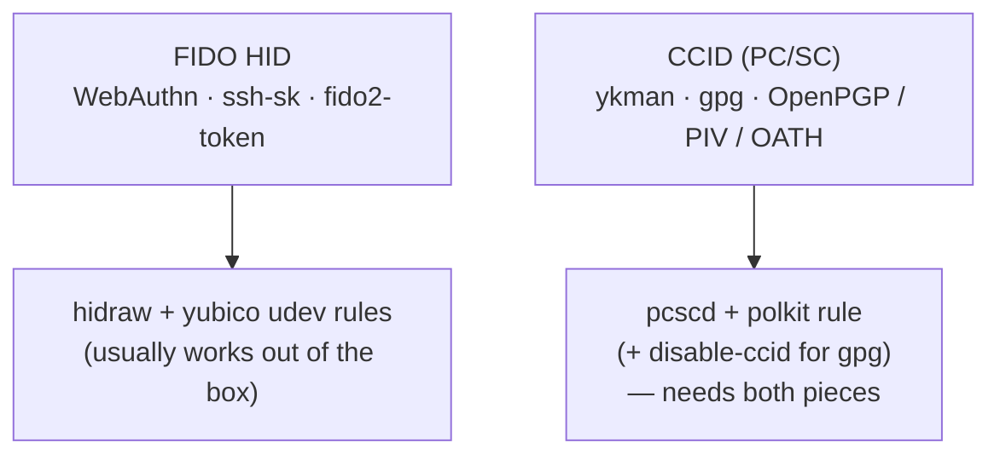

# Linux host setup

The board enumerates as a composite **FIDO HID + CCID** device. By default it
uses the project's own RS-Key USB identity `0x1209:0x0001` (pid.codes), with the
PC/SC reader name containing `RS-Key`. The opt-in `VIDPID=Yubikey5` interop build
instead presents the YubiKey identity `0x1050:0x0407` (other presets:
[build.md](build.md)). The two transports have different host requirements on
Linux:

| Transport | Used by | Out of the box? |
|---|---|---|
| **FIDO HID** (`0xF1D0`) | WebAuthn, `ssh ed25519-sk`, `fido2-token`, python-fido2 | yes, once the yubico udev rules grant your user access to the hidraw node |
| **CCID** (PC/SC) | OpenPGP, PIV, OATH, Yubico-OTP, `gpg --card-status` (`ykman` only on the opt-in `VIDPID=Yubikey5` build) | needs `pcscd` running **and** a polkit rule to use it as a non-root / SSH-session user |



FIDO generally works after installing the standard yubico udev rules. CCID needs
the extra two pieces below: a **polkit rule** (so a non-root user, including one
over SSH, may talk to `pcscd`) and, if you also use GnuPG, **`disable-ccid`** in
`scdaemon.conf` so `gpg`'s `scdaemon` goes through `pcscd` instead of grabbing
the raw CCID interface and locking out `ykman`/`pcsc-tools`.

> Verified on a **NixOS 25.11** host (kernel 6.18.x): FIDO `getInfo` works as a
> plain user over SSH once the udev rule below is in place, and `gpg
> --card-status` works with `disable-ccid`. `ykman info` works the same way on
> the opt-in `VIDPID=Yubikey5` build (it gates on the `Yubico YubiKey` reader
> name, which the default RS-Key build does not present).

Replace `youruser` with your login name throughout.

## NixOS (declarative)

Add to your `configuration.nix`:

```nix
{ pkgs, ... }:
{
  # PC/SC daemon for the CCID applets (OpenPGP / PIV / OATH / OTP).
  services.pcscd.enable = true;

  # udev rules that grant access to the FIDO hidraw node. The stock yubico
  # rules match VID 0x1050 only, so the default RS-Key identity (0x1209) needs
  # its own rule; build VIDPID=Yubikey5 instead if you want to reuse the stock
  # yubico rules unchanged.
  services.udev.packages = [
    pkgs.yubikey-personalization
    pkgs.libfido2
  ];
  services.udev.extraRules = ''
    # RS-Key own identity (pid.codes 0x1209:0x0001) — FIDO HID + CCID access.
    SUBSYSTEM=="hidraw", ATTRS{idVendor}=="1209", ATTRS{idProduct}=="0001", TAG+="uaccess"
    SUBSYSTEM=="usb", ATTRS{idVendor}=="1209", ATTRS{idProduct}=="0001", TAG+="uaccess"
  '';

  # Let a non-root user (e.g. over SSH) talk to pcscd. Without this, CCID works
  # only as root and `ykman`/`gpg --card-status` fail from an SSH session.
  security.polkit.extraConfig = ''
    polkit.addRule(function(action, subject) {
      if ((action.id == "org.debian.pcsc-lite.access_pcsc" ||
           action.id == "org.debian.pcsc-lite.access_card") &&
          subject.user == "youruser") {
        return polkit.Result.YES;
      }
    });
  '';

  # Optional: the host tools (ykman, gpg, openssh with FIDO support).
  environment.systemPackages = with pkgs; [
    yubikey-manager   # ykman
    libfido2          # fido2-token, fido2-assert
    opensc            # opensc-tool -l, pkcs11
    pcsctools         # pcsc_scan
  ];
}
```

`nixos-rebuild switch`, then re-plug the board (or restart `pcscd`).

## Generic Linux (Debian / Ubuntu / Fedora / Arch)

1. **Install the stack.** Package names vary by distro:
   - Debian/Ubuntu: `pcscd pcsc-tools libfido2-1 yubikey-manager opensc`
   - Fedora: `pcsc-lite pcsc-tools libfido2 yubikey-manager opensc`
   - Arch: `pcsclite ccid yubikey-manager libfido2 opensc`

2. **Enable pcscd:** `sudo systemctl enable --now pcscd.socket`

3. **udev rules.** The stock yubico rules that ship with `libfido2` /
   `yubikey-personalization` / `libu2f-host` match VID `0x1050` only, so they do
   **not** cover the default RS-Key identity (`0x1209`). Add your own rule.
   Create `/etc/udev/rules.d/70-rsk.rules`:

   ```udev
   # RS-Key own identity (pid.codes 0x1209:0x0001) — FIDO HID + CCID access.
   SUBSYSTEM=="hidraw", ATTRS{idVendor}=="1209", ATTRS{idProduct}=="0001", TAG+="uaccess", GROUP="plugdev", MODE="0660"
   SUBSYSTEM=="usb", ATTRS{idVendor}=="1209", ATTRS{idProduct}=="0001", TAG+="uaccess", GROUP="plugdev", MODE="0660"
   ```

   Then `sudo udevadm control --reload && sudo udevadm trigger` and re-plug.
   (Alternatively, build `VIDPID=Yubikey5` to reuse the stock yubico rules
   unchanged.) If your user still can't open the device, confirm you're in the
   right group (`plugdev` on Debian/Ubuntu).

4. **polkit rule** for non-root pcscd access. Create
   `/etc/polkit-1/rules.d/41-pcsc-rsk.rules`:

   ```javascript
   polkit.addRule(function(action, subject) {
     if ((action.id == "org.debian.pcsc-lite.access_pcsc" ||
          action.id == "org.debian.pcsc-lite.access_card") &&
         subject.user == "youruser") {
       return polkit.Result.YES;
     }
   });
   ```

   (Use `subject.isInGroup("plugdev")` instead of `subject.user == …` to grant
   a whole group.) Restart polkit/pcscd or re-plug afterwards.

## GnuPG (`gpg --card-status`, OpenPGP)

`scdaemon` defaults to grabbing the CCID interface directly, which fights
`pcscd` and locks out `ykman`/`pcsc_scan`. Route it through `pcscd` instead by
adding to `~/.gnupg/scdaemon.conf`:

```
disable-ccid
pcsc-shared
```

Then reload it: `gpgconf --kill scdaemon`. After this, `gpg --card-status` and
`pcsc_scan` (and `ykman`, on the opt-in `VIDPID=Yubikey5` build) coexist (they
share the one reader through `pcscd`).

## FIDO / SSH (`ed25519-sk`)

Once the udev rules are in place, OpenSSH with libfido2 support works directly.
No pcscd involved (FIDO is HID, not CCID):

```sh
ssh-keygen -t ed25519-sk -f ~/.ssh/id_ed25519_sk   # enroll (touch + PIN)
ssh -i ~/.ssh/id_ed25519_sk youruser@host          # login (one touch)
```

The key file is a handle, copyable between machines. Use lowercase `-i` (not
`-I`, which is PKCS#11). Most distro OpenSSH builds already link libfido2; if
`ssh-keygen` reports "no FIDO SecurityKeyProvider", install `libfido2` and point
`SSH_SK_PROVIDER` / `SecurityKeyProvider` at `libsk-libfido2.so`.

## Going further (NixOS quality-of-life)

The FIDO-based YubiKey-on-NixOS recipes (PAM U2F for `sudo`/login, LUKS
FIDO2 unlock, gpg-agent SSH) bind the FIDO HID usage page (or the OpenPGP
card via PC/SC), not the VID/PID, so they apply to the default RS-Key build
unchanged. (Recipes that gate on `ykman` or the `Yubico YubiKey` reader name
need the opt-in `VIDPID=Yubikey5` build.) A good walkthrough:
[Improving QoL on NixOS with a YubiKey](https://unmovedcentre.com/posts/improving-qol-on-nixos-with-yubikey/).
Substitute this device wherever it says YubiKey.

## Troubleshooting

- **`pcsc_scan` (or `ykman`, on the `VIDPID=Yubikey5` build) says no reader, or
  "Failed to connect":** `scdaemon` (from a prior `gpg`) is holding the reader
  exclusively. `gpgconf --kill scdaemon`, then retry. The `disable-ccid` +
  `pcsc-shared` config above prevents the recurrence.
- **`ykman` does not see the device at all:** `ykman` derives the device purely
  from the **PC/SC reader name**, which must contain `Yubico YubiKey`. The
  default RS-Key build names the reader `RS-Key Security Key`, so `ykman` will
  not recognize it. Build the opt-in `VIDPID=Yubikey5` flavor (reader name
  `Yubico YubiKey RSK OTP+FIDO+CCID`) to use `ykman` (see [build.md](build.md)).
- **Everything hangs after heavy USB debugging:** the `pcscd` + `scdaemon` +
  kernel USB stack can wedge in a way that surviving `pcscd`/`scdaemon`
  restarts or a re-plug do **not** clear. A **full host reboot** does. This is
  a host-stack quirk, not a firmware issue.
- **Verify the reader:** `pcsc_scan` (or `opensc-tool -l`) should list
  `RS-Key Security Key` on the default build (or `Yubico YubiKey RSK
  OTP+FIDO+CCID` on the opt-in `VIDPID=Yubikey5` build). On that opt-in build,
  `ykman info` should report `5.7.4` with all six applications enabled.
