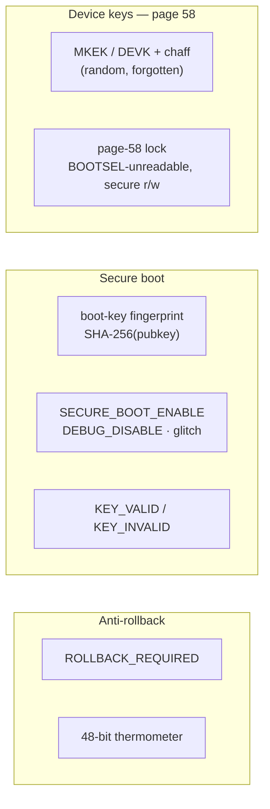

<!-- SPDX-License-Identifier: AGPL-3.0-only -->
<!-- Copyright (C) 2026 RS-Key contributors -->

# OTP fuses (RP2350)

The "production" hardening in RS-Key — the OTP master key, secure boot, and
anti-rollback — all come down to writing the RP2350's **OTP**. This page
explains what OTP is, why it is irreversible, how RS-Key writes it, and exactly
which rows it touches. Read it before [production.md](production.md); it is the
substrate everything else stands on.

> "OTP" here means **One-Time-Programmable fuses on the chip** — not the Yubico
> one-time-password feature ([guides/otp.md](guides/otp.md)). Different thing,
> same three letters.

## What OTP is

OTP is a block of on-chip memory made of **antifuses**: writing a bit physically
and permanently changes the silicon. A bit goes **0 → 1 and never back.** There
is no erase, no reset, no "factory default" — for OTP, *factory* is wherever you
left it. Every chip has its own OTP; nothing about it is shared between boards.

This is the whole point. The value of OTP for a security key is exactly that it
**cannot be undone**: a key fused here can't be un-fused, a secure-boot bit
can't be cleared, a rollback floor can't be lowered. Hardening that you could
reverse would be hardening an attacker could reverse too.

> ⚠️ **Every write on this page is permanent.** A mistake can lock you out of
> reading a value forever, or brick the board for new firmware. The tools refuse
> to act without typed confirmations and support `--dry-run` — use it.

## Layout: pages, rows, and reliability copies

OTP is addressed in **rows** (24 bits each), grouped into **pages of 64 rows**
(so page *N* starts at row `N × 0x40`; page 58 begins at row `0xE80`). Page
granularity matters because **read/write locks are applied per page**, not per
row.

A single antifuse can be marginal, so the values that the bootrom and firmware
depend on are stored redundantly:

- **RBIT-3** — the value is written into **three consecutive rows**, and the
  reader takes the **bitwise 2-of-3 majority**. An interrupted burn that set
  only one copy doesn't count; two copies do. The secure-boot flags, the
  boot-key fingerprints, and the rollback rows are all RBIT-3.
- **ECC** — other pages store an error-correcting code alongside the data.

## Who can write OTP, and when

Two paths write OTP, and the difference is central to how RS-Key stays safe:

- **BOOTSEL / `picotool`** — with the board in BOOTSEL you can read and write OTP
  directly from the host. This is how the bulk of provisioning happens (the
  master key, the secure-boot key, the enable bits).
- **Secure firmware (the rescue applet)** — a handful of rows must be written by
  the running, secure-boot-validated firmware, not from BOOTSEL. Two cases:
  - rows that are made **bootloader-read-only** by a page lock (so BOOTSEL can no
    longer write them) but stay **secure-writable** — the page-58 lock and the
    `ROLLBACK_REQUIRED` flag are applied this way, by `rsk otp lock-page58` /
    `rsk otp rollback-require`, each guarded by an exact magic payload so a
    stray APDU can never trigger them.

Each OTP page lock is a byte encoding three independent levels —
`LOCK_BL` (bootloader), `LOCK_NS` (non-secure), `LOCK_S` (secure) — each of
`read-write` / `read-only` / `inaccessible`. That three-way split is what lets a
page be **unreadable to BOOTSEL but still readable/writable by secure
firmware** (see page 58 below).

## What RS-Key burns

These are the rows RS-Key provisions, grouped by the stage that writes them. The
authoritative source is the code (`tools/rsk/otp.py`, `tools/rsk/secureboot.py`,
`crates/rsk-rescue/src/rollback.rs`); the table is the map.

| Region | Rows | What it holds | Written by |
|---|---|---|---|
| **Page 58** | `0xE80…` | `DEVK` (device attestation key), `MKEK` (master sealing key), anti-imaging chaff | `rsk otp burn` (BOOTSEL) |
| Page-58 lock | `0xFF5` | makes page 58 **BOOTSEL-unreadable, secure read/write** | `rsk otp lock-page58` (firmware) |
| **Boot key** | `0x80…` | `SHA-256` fingerprint of your secure-boot public key (slot 0 of 4) | `rsk secure-boot load-key` |
| `BOOT_FLAGS1` | `0x4B` | `KEY_VALID` / `KEY_INVALID` (which key slots are live / revoked) | `load-key`, `lock` |
| `CRIT1` | `0x40` | `SECURE_BOOT_ENABLE`, `DEBUG_DISABLE`, `GLITCH_DETECTOR_ENABLE/SENS` | `harden`, `enable` |
| `BOOT_FLAGS0` | `0x48` | `ROLLBACK_REQUIRED` (bit 11) | `rsk otp rollback-require` (firmware) |
| `DEFAULT_BOOT_VERSION` | `0x4E`, `0x51` | the **48-bit rollback thermometer** (two 24-bit rows) | the bootrom, on boot |
| Page 1/2 locks | `0xF83`, `0xF85` | make the flag + key pages **bootloader-read-only** | `rsk secure-boot lock` |

A few notes that matter:

- **Page 58 is read-write to secure firmware even after the lock.** The lock
  value (`0x3C3C3C`) sets BL and NS to *inaccessible* but leaves S
  *read-write* — so only secure-mode firmware can ever read the MKEK/DEVK again,
  and a BOOTSEL flash dump cannot.
- **The MKEK/DEVK are generated randomly and forgotten.** `rsk otp burn` does not
  keep a copy — the fuses *are* the key. There is nothing to back up and nothing
  to lose.
- **The rollback thermometer is advanced by the bootrom**, not by a host write —
  when a higher-version image boots. See [anti-rollback.md](anti-rollback.md).
- **Pages 1 and 2 stay bootloader-*read-only* after `lock`** (`0x141414`), not
  inaccessible — the bootrom must read the keys and flags on every boot. They
  remain secure-writable, which is how the firmware applies `ROLLBACK_REQUIRED`
  after the pages are otherwise locked down.



## Reading OTP

OTP is readable until a lock says otherwise:

```sh
rsk secure-boot status        # decodes the secure-boot + rollback rows for you
picotool otp get -r -n 0x48   # raw row read (BOOTSEL), if you want the bytes
```

`rsk inventory list` / `rsk status` surface the human-readable state. Once page
58 is locked, `picotool otp get` on it fails with a permission error forever —
that failure is the lock working, not a fault.

## Honest limits

- **OTP is not a secure element.** It hardens against software and BOOTSEL-level
  attacks, but the antifuses are still on a general-purpose die: decapping and
  microprobing can read OTP, and that is out of scope ([threat-model.md](threat-model.md)).
- **It is finite.** The rollback thermometer is 48 bits for the board's life;
  there are 4 key slots. Neither resets. See [anti-rollback.md](anti-rollback.md).
- **It is per-chip.** None of this carries to another board. A new board is a
  fresh, blank OTP.
