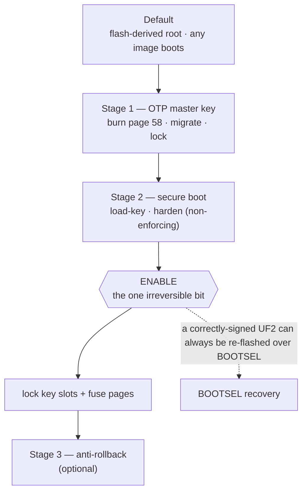

# Production setup — signed boot + OTP master key

> ⚠️ **EXPERIMENTAL. IRREVERSIBLE. BRICK RISK.**
> Everything on this page burns one-time-programmable fuses or changes what
> the chip will ever boot again. A mistake can permanently brick the board or
> permanently lose your enrolled credentials. Read the whole page before
> running anything. The tools refuse to act without typed confirmations and
> support `--dry-run`. Use it.

Out of the box, RS-Key's at-rest encryption roots in a key derived on the
device and stored sealed in flash. That stops casual key extraction. But a
motivated attacker who steals the board can dump flash over BOOTSEL and grind
offline. The production path closes that in two independent stages:

1. **OTP master key (MKEK)**: fuse a random 32-byte key into RP2350 OTP
   page 58 and re-root all at-rest sealing in it, then hard-lock the page so
   neither BOOTSEL nor non-secure code can ever read it. A flash dump alone
   is now worthless.
2. **Secure boot**: fuse your public-key fingerprint and the
   `SECURE_BOOT_ENABLE` bit so the bootrom runs *only* images you signed.
   Attacker-flashed firmware (the remaining way to read the OTP key) no
   longer runs.

A third, optional stage builds on those: **anti-rollback**, so that *old*
images you signed (with bugs you have since fixed) stop booting too. It has
its own page: [anti-rollback.md](anti-rollback.md).

Each stage is usable alone. Together they are the full story. All are driven
from the host. The firmware never burns a fuse behind your back. The two
exceptions are rows that physically cannot be written from BOOTSEL
(bootloader-read-only OTP pages): the page-58 *lock* and the
`ROLLBACK_REQUIRED` flag, each applied by the firmware on explicit command. The
fuses these stages write are explained in [otp-fuses.md](otp-fuses.md).



## Before you start

- **Make a seed backup first** if you haven't:
  `rsk backup export` ([guides/seed-backup.md](guides/seed-backup.md)). It is
  the only thing that survives a board swap. The production path is exactly
  when you start caring about that.
- **Plan for the signing key.** Stage 2 generates an ECDSA key. Losing it bricks
  the board for *new* firmware. Decide now where you'll keep it durably.
- **Understand the substrate.** These stages write OTP fuses.
  [otp-fuses.md](otp-fuses.md) explains what is irreversible and why.
- **Rehearse.** Every step supports `--dry-run`, which prints the exact
  `picotool` commands without touching anything.

## Stage 1 — OTP master key

What it does: writes a random DEVK (device attestation key) and MKEK (master
sealing key) plus anti-imaging chaff into OTP page 58, ECC-verified, then
locks the page. On the next boot the firmware notices the provisioned key and
**migrates everything already on the device** (FIDO seed, PIV keys, OpenPGP
key wraps, PIN verifiers) under the new root. Your enrolled credentials
survive. That is the point of the migration layer.

> **At-rest hardening pass.** The migration re-seals each secret under the new
> root. But the flash store is append-only, so the old chip-serial-sealed
> copies linger until their page is reclaimed. To stop a flash dump from
> recovering them, that same first post-burn boot runs a one-shot compaction
> that physically scrubs the credential partition. It is a multi-second stall
> that runs **before** the device re-attaches to USB, so on that one boot the
> device stays dark a little longer than usual. **Don't cut power during it.**
> It runs once (a flash marker gates it) and re-runs if interrupted.
>
> **New deployments: burn OTP _before_ you enroll.** A seed generated after the
> burn is sealed under the fused root from birth, so no chip-serial-sealed copy
> ever exists and the hardening pass has nothing to scrub. The
> migrate-in-place path above is for hardening a device you have *already* been
> using.

```sh
rsk reboot bootsel               # picotool needs the chip in BOOTSEL
rsk otp burn --dry-run           # preview every step
rsk otp burn                     # typed confirmation; keys are generated and FORGOTTEN
picotool reboot -a               # back to the app; migration runs at boot
rsk otp lock-page58              # firmware applies the page-58 hard lock (typed confirm)
```

Facts to internalize first:

- The burn tool generates MKEK/DEVK randomly and **forgets them**. There is
  no copy to lose, and none to back up. The fuses *are* the key.
- After the burn, the **device attestation public key changes** (it now
  derives from the fused DEVK). FIDO/PIV identities survive. The rescue
  attestation key does not. That is expected, not data loss. If you use audit
  or fleet verification, re-record the device's fingerprint afterward
  ([guides/fleet.md](guides/fleet.md)).
- **The lock is the half that matters for at-rest.** Burning the MKEK without
  `lock-page58` leaves the key fused but still readable over BOOTSEL. The flash
  dump is not yet worthless. Run `lock-page58` to actually close it.
- After `lock-page58`, `picotool otp get` on page 58 fails with a permission
  error forever. Only the secure-mode firmware can read the keys. That failure
  is the lock working.
- A seed backup (`rsk backup`) made before or after is unaffected. Backups
  carry the seed value, which gets re-sealed under whatever root the device
  has.
- **Never flash a `FAKE_MKEK` test build onto a provisioned board.** It migrates
  the data under a fake, greppable key and orphans it ([build.md](build.md)).

## Stage 2 — secure boot

What it does: the RP2350 bootrom verifies an ECDSA (secp256k1 + SHA-256)
signature on every image against a fingerprint fused into OTP. Unsigned or
foreign-signed images do not boot. The chip falls back to BOOTSEL, where you
can always drag a correctly-signed UF2 (recovery path).


**The permanent consequences:**

- **Every future flash must be signed with your key.** The dev loop becomes
  build → `picotool seal --sign` → flash.
- **Losing the signing key bricks the board for new firmware** (the current
  signed image keeps booting). Back the key up before enabling enforcement.
- `DEBUG_DISABLE` is burned along the way. SWD is gone (flashing is BOOTSEL
  anyway).

### 2a. Generate a signing key (once, off-repo)

```sh
mkdir -p ~/.rs-key-secrets && cd ~/.rs-key-secrets
openssl ecparam -genkey -name secp256k1 -noout -out secure_boot_key.pem
openssl ec -in secure_boot_key.pem -pubout -out secure_boot_pub.pem
chmod 600 secure_boot_key.pem
# BACK IT UP somewhere that survives this machine.
```

This key is the root of trust for the board's whole life. Treat it like the most
important secret you have here: if you lose it after `enable`, you can never
flash new firmware to that board (the running image keeps booting). It is also
what makes [key rotation](anti-rollback.md#key-revocation--downgrade-defense-without-the-thermometer)
possible later, so a single, well-kept key with a backup is the goal. The full
key lifecycle is in [signing-keys.md](signing-keys.md): passphrase protection
(and the decrypt-for-`seal` step it implies), backup, **one fresh key per
board**, rotation, and recovery.

### 2b. Sign and prove a signed image boots (before any fuse)

```sh
picotool seal --sign --hash firmware.uf2 firmware-signed.uf2 \
    ~/.rs-key-secrets/secure_boot_key.pem ~/.rs-key-secrets/otp_secureboot.json \
    --major 1 --minor 0 --rollback 1
picotool info firmware-signed.uf2        # must say "signature: verified"
# BOOTSEL, then flash + confirm the device works:
picotool load -v firmware-signed.uf2 && picotool reboot   # or drag it onto the RP2350 drive
```

The arguments:

- `secure_boot_key.pem`: your signing key. It signs the image.
- `otp_secureboot.json`: `seal` writes the **boot-key fingerprint** here. You
  fuse it into OTP with `load-key` below.
- `--major` / `--minor`: an **image version** (`major.minor`) stamped into the
  RP2350 boot metadata. It is a plain version label, distinct from the firmware
  version RS-Key reports (`5.7.x`, [build.md](build.md)) and from the rollback
  version. The bootrom can use it to prefer the newer of two images in an A/B
  setup. RS-Key ships a single image, so here it is effectively a label. Keep
  `1 0`.
- `--rollback`: the **anti-rollback version**, a separate counter (*not* the
  image version). It is harmless before anti-rollback is enabled, and having a
  version in every sealed image from day one makes that stage cheap. What it
  means and how to choose it: [anti-rollback.md](anti-rollback.md).

`picotool info firmware-signed.uf2` must report `signature: verified`. The
firmware's image definition is already secure-boot compatible. The sealed UF2
carries the signature block.

### 2c. Burn, staged

`rsk secure-boot` splits provisioning so every irreversible write is proven
by a real boot before the next. The only true point of no return is one
bit:

```sh
rsk secure-boot status      # read the current fuse state any time
rsk secure-boot load-key    # 1. boot-key fingerprint + KEY_VALID   (non-enforcing)
rsk secure-boot harden      # 2. DEBUG_DISABLE + glitch detectors   (non-enforcing)
rsk secure-boot enable      # 3. SECURE_BOOT_ENABLE = 1  ← the brick bit
rsk secure-boot lock        # 4. revoke unused key slots + lock the fuse pages
```

Each step has `--dry-run` and a typed confirmation. Between steps, reboot and
confirm the device still works. After `enable`, verify the negative case:
drag an *unsigned* UF2. The bootrom must reject it and fall back to BOOTSEL.
Re-drag the signed one to recover.

> **`lock` and key rotation: a decision to make now.** The `lock` stage revokes
> the three unused boot-key slots (`KEY_INVALID`), maximizing hardening against
> an attacker who tries to inject their own key. It also forecloses *key
> rotation*, the escape valve if you ever exhaust the 48-step anti-rollback
> budget (you rotate to a new signing key and revoke the old one). If you want to
> keep that valve, don't run the full `lock`. Leave a slot. The trade-off is in
> [anti-rollback.md](anti-rollback.md#a-decision-you-must-make-before-the-ceiling).
> Most users should run the full `lock`. You will almost certainly never reach
> the ceiling.

### The new flash workflow (forever)

```sh
cargo build --release -p firmware
picotool uf2 convert target/thumbv8m.main-none-eabihf/release/firmware -t elf firmware.uf2
picotool seal --sign --hash firmware.uf2 firmware-signed.uf2 \
    ~/.rs-key-secrets/secure_boot_key.pem ~/.rs-key-secrets/otp_secureboot.json \
    --major 1 --minor 0 --rollback 1
# BOOTSEL (hands-free: rsk reboot bootsel), then:
picotool load -v firmware-signed.uf2 && picotool reboot   # or drag it onto the RP2350 drive
```

The `--rollback` value is your board's current floor (see
[anti-rollback.md](anti-rollback.md)). `1` is the usual starting value.

To seal an image others can independently verify, build it with
`nix build .#firmware` instead of the dev-shell `cargo build`. That path is
bit-for-bit reproducible from the source tree
([build.md](build.md#nix-build-hermetic-no-dev-shell)), so anyone can rebuild
at your release commit and confirm the payload you signed.

## Stage 3 — anti-rollback (optional)

This stage stops your *own older signed images* from booting, so a bug you have
since fixed can't be re-introduced by downgrading. **Read
[anti-rollback.md](anti-rollback.md) first.** It is the full model: how the
floor works, the 48-burn budget, when (and whether) to raise it, what to do at
the ceiling, and the new-board case. This section is only the steps to turn it
on.

The mechanism is two RP2350-native pieces: a per-image rollback version
(`--rollback N` at seal time) checked against a 48-bit OTP thermometer, and the
`ROLLBACK_REQUIRED` fuse that makes that check mandatory. Until the fuse is
burned, versionless images boot and the feature is off.

### Turning it on

1. Seal and flash firmware with a rollback version (start at `--rollback 1`),
   reboot, and confirm `rsk secure-boot status` reports `boot version 1/48`. If
   it still reads `0/48`, stop and investigate. Never burn the fuse on an
   unproven setup.
2. Re-seal `rsk-wipe` at the **same** version. The recovery escape hatch must
   stay bootable.
3. From the running firmware: `rsk otp rollback-require` (typed confirmation;
   `--dry-run` reports state without burning). The firmware refuses unless secure
   boot is enabled, so it can only run from an image that itself passed the
   rollback check, and the "fuse before a versioned image" footgun can't happen.
4. Negative-test: drag any *versionless* signed UF2. The bootrom must refuse it
   and fall back to BOOTSEL. Re-drag the current image to recover.

### After it's on

- Every `picotool seal` must include `--rollback <your floor>`. A versionless
  sealed image no longer boots (fail-closed). You find out at flash time and
  recover by re-sealing.
- To raise the floor and close a downgrade-fix, seal one step higher
  (`--rollback <floor + 1>`). **The default is not to raise it.** When, why, and
  the budget math are all in [anti-rollback.md](anti-rollback.md).
- A board that has burned to floor N never boots an image below N again. No undo.

Everything about *whether* to bump, the 48-budget, the ceiling, key rotation, and
moving to a new board lives in [anti-rollback.md](anti-rollback.md).

## Recovery and failure cases

| Situation | What happens / what to do |
|---|---|
| Bad or wrong flash | BOOTSEL stays enabled — drag a correctly-signed UF2 to recover. |
| Unsigned / foreign-signed image (secure boot on) | Bootrom refuses it, falls back to BOOTSEL. Drag your signed image. |
| **Lost the signing key** (secure boot on) | The current signed image keeps booting, but you can **never flash new firmware**. There is no recovery for the key — back it up *before* `enable`. |
| Image sealed below your rollback floor | Refused at boot → BOOTSEL. Re-seal at ≥ your floor. |
| Image sealed *above* your floor by accident | It boots and **burns the thermometer up to it**, spending budget irreversibly. Seal at exactly your floor unless you mean to raise it. |
| `rsk-wipe` won't boot after enabling anti-rollback | Re-seal it at your current floor — the recovery image must carry a version too. |
| 48-step rollback budget exhausted | Key rotation, or a new board — see [anti-rollback.md](anti-rollback.md#when-the-48-budget-is-exhausted--the-ladder). |
| Page 58 read fails after `lock-page58` | That's the lock working — only secure firmware can read the keys now. |
| Replacing the board entirely | Provision the new chip with a **new** signing key; restore your FIDO identity with `rsk backup restore`. Resident passkeys / OpenPGP / PIV don't migrate — see [anti-rollback.md](anti-rollback.md#moving-to-a-new-board). |

## Deliberate choices

- **USB BOOTSEL stays enabled.** It is the only reflash and the only recovery
  path (no debugger). It cannot bypass signature enforcement, and after the
  page-58 lock it cannot read the OTP keys. Disabling it (the datasheet's
  full checklist) would turn every bad flash into a permanent brick.
- **No image encryption.** The code is open source. There is nothing secret
  in the image (secrets live sealed in flash, rooted in OTP). The RP2350 also
  has no transparent XIP decryption. Encrypted boot requires fitting the
  image in SRAM, which a ~1.7 MB image does not.

## Residual risks (still open after all stages)

- **XIP TOCTOU:** the image executes from external QSPI flash. Hardware that
  swaps or emulates the flash chip between the bootrom's signature check and
  execution can subvert it. Decap/side-channel-class attack, out of scope.
- A host compromised while the device is plugged in can drive normal
  operations (as with any security key). See
  [threat-model.md](threat-model.md).
