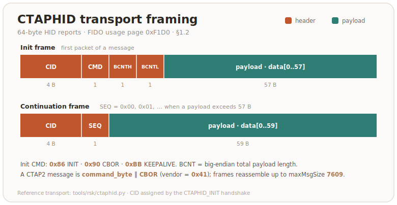
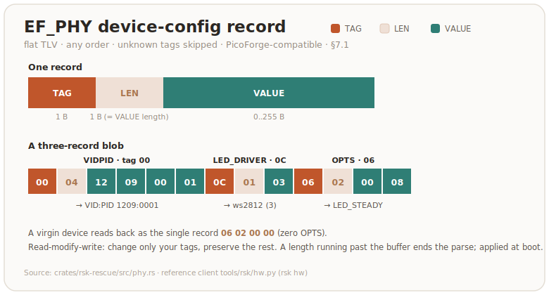

# RS-Key host protocol reference

This document specifies the **host-facing protocol** of the RS-Key firmware: how a
configuration/management tool talks to the device, what commands exist, the exact
byte layout of each request and response, and what authenticates each one.

It exists so that third-party tooling (e.g. **PicoForge**) can configure and
manage RS-Key devices without reverse-engineering the firmware. The canonical,
runnable reference client is the `rsk` Python CLI — every command
below is implemented there; file/line pointers are given throughout.

> **Audience & scope.** This is a wire spec, not a tutorial. It documents the
> commands a host sends and the bytes it gets back. It does **not** cover the
> on-device storage format, the crypto internals, or the build system — those live
> in [architecture.md](architecture.md) and the crate sources.

> **Licensing.** RS-Key firmware is AGPL-3.0-only. This protocol description is
> published as part of the same repository; you are free to implement a client
> against it under any license. Interop implementations do not inherit AGPL by
> talking to the device.

> **Stability.** The two transports and the **standard** applets (FIDO2, U2F, PIV,
> OATH, OTP, OpenPGP, Yubico Management) are stable — they follow public specs.
> The **RS-Key-specific** surface (Rescue applet, Vendor/LED applet, CTAPHID
> `authenticatorVendor 0x41`) is versioned by `bcdDevice` and may grow; new
> tags/subcommands are added, existing ones are not silently repurposed. Probe the
> version handshakes (§3, §6.1) and treat unknown tags as skippable.

---

## 1. Transports

RS-Key is a USB composite device exposing two host-reachable transports:

| Transport | Carries | Host API |
|---|---|---|
| **CTAPHID** (FIDO HID, usage page `0xF1D0`) | CTAP1/U2F, CTAP2, and the `authenticatorVendor 0x41` vendor command | `hidapi` |
| **CCID** (PC/SC smart-card) | All ISO-7816 applets, selected by AID | `pyscard` / PC/SC |

A keyboard (HID) interface also exists for Yubico OTP; it is not a configuration
surface and is out of scope here.

### 1.1 CCID APDU framing

Standard ISO-7816 short APDUs. SELECT is always `00 A4 04 00 Lc <AID> 00`; the
selected applet then receives `CLA INS P1 P2 [Lc <data>] [Le]`. The reference
transport is `tools/rsk/ccid.py`:

```python
def select(conn, aid):
    return transmit(conn, [0x00, 0xA4, 0x04, 0x00, len(aid)] + list(aid) + [0x00])
```


### 1.2 CTAPHID framing

64-byte HID reports. Init frame: `CID(4) | CMD(1) | BCNT_HI | BCNT_LO | data[:57]`;
continuation frames: `CID(4) | SEQ(1) | data[:59]`. `CTAPHID_INIT = 0x86`,
`CTAPHID_CBOR = 0x90`, `CTAPHID_KEEPALIVE = 0xBB`. A CTAP2 message is
`command_byte | CBOR_payload`. Reference: `tools/rsk/ctaphid.py`.



### 1.3 CCID secure PIN entry (pinpad) — **display builds only**

A trusted-display build advertises `bPINSupport = 0x01` (VERIFY) in its CCID class
descriptor (body byte 50 / full descriptor byte 52), so a host driver treats it as
a **pinpad reader** and sends `PC_to_RDR_Secure` (`0x69`) instead of a plaintext
VERIFY; the PIN is then typed **on the device's own screen**. A standard (no-screen)
build leaves `bPINSupport = 0x00` and rejects `0x69`. No control transfer is
involved — the host CCID driver reads `bPINSupport` straight from the descriptor;
the device only has to handle `0x69`. The validated trigger is **GnuPG's internal
CCID** driver (keys solely off `bPINSupport`); PC/SC + libccid and macOS
CryptoTokenKit also expose pinpad from the descriptor, but their `FEATURE_VERIFY_PIN_DIRECT`
coverage varies, so treat the GnuPG-internal path as the reliable one.

**Scope (honest):** this keeps the PIN off the wire **only when the host uses
pinpad mode**. The device still accepts a normal plaintext `XfrBlock` VERIFY
(`00 20 P1 P2 Lc <PIN>`), so a host that chooses to send one puts the PIN on the
wire — standard pinpad *enables* on-device entry, it does not *enforce* it (a
device-enforced mode is a planned opt-in follow-up).

Whatever the host driver, the bytes on the wire follow the **CCID** structure
below, not the PC/SC v2 Part 10 IOCTL structure (the driver drops that structure's
`bTimeOut2` and `ulDataLength` when it builds the `0x69`), so the VERIFY template is
always at abData offset 15. The `0x69` payload is the CCID `abPINDataStructure` for
VERIFY:

```text
bPINOperation(1)=0x00 verify | bTimeOut(1) | bmFormatString(1) | bmPINBlockString(1) |
bmPINLengthFormat(1) | wPINMaxExtraDigit(2 LE) | bEntryValidationCondition(1) |
bNumberMessage(1) | wLangId(2 LE) | bMsgIndex(1) | bTeoPrologue(3) |
abPINApdu = CLA INS=0x20 P1 P2 …   (the VERIFY template, at offset 15)
```

The device reads the template's `P2` (OpenPGP `0x81`/`0x82`/`0x83` = PW1-sign /
PW1-other / PW3-admin; PIV `0x80` = application PIN), collects the PIN on the pad,
builds the real VERIFY APDU (`00 20 P1 P2 Lc <ASCII PIN>`; PIV pads with `0xFF` to
8 bytes), runs it through the selected applet, and replies with a normal
`RDR_to_PC_DataBlock` (`0x80`) carrying only the status word:

- **success** → `90 00`, `bStatus = 0`, `bError = 0`.
- **wrong PIN** → the card's real `63 Cx` (tries left) / `69 83` (blocked),
  `bStatus = 0`, `bError = 0` (the command succeeded; the card said wrong).
- **user cancel** → `bStatus = 0x40` (failed), `bError = 0xEF` → `SCARD_W_CANCELLED_BY_USER`.
- **pad timeout** → `bStatus = 0x40`, `bError = 0xF0` → `SCARD_E_TIMEOUT`.

The transport streams T=1 time-extensions for the whole on-screen entry, so the host
transaction does not time out. The device ignores the host's format/offset bits and
builds the APDU from its own buffers, so a crafted `0x69` can't index out of bounds.
Trigger from GnuPG: `gpg-connect-agent "scd checkpin OPENPGP.1" /bye` (internal CCID,
no host config). PIN parse + APDU assembly: `crates/rsk-usb/src/secure_pin.rs`.

---

## 2. Status words & error codes

### 2.1 CCID status words (ISO-7816 `SW1 SW2`)

Source: `crates/rsk-sdk/src/sw.rs`.

| SW | Name | Meaning |
|---|---|---|
| `9000` | OK | success |
| `6400` | EXEC_ERROR | execution error (internal) |
| `6581` | MEMORY_FAILURE | flash write failed |
| `6700` | WRONG_LENGTH | bad `Lc`/`Le` for this command |
| `6982` | SECURITY_STATUS_NOT_SATISFIED | auth/precondition missing |
| `6984` | DATA_INVALID | malformed payload (e.g. bad guard magic) |
| `6985` | CONDITIONS_NOT_SATISFIED | state precondition unmet (e.g. RTC unset) |
| `6A80` | INCORRECT_PARAMS | bad data field |
| `6A86` | INCORRECT_P1P2 | unsupported P1/P2 |
| `6D00` | INS_NOT_SUPPORTED | unknown INS for this applet |
| `6E00` | CLA_NOT_SUPPORTED | wrong CLA for this applet |

### 2.2 CTAP2 errors

Standard CTAP2 status bytes (`0x00` = success), returned by CTAP2 and by the
`0x41` vendor command. Source: `crates/rsk-fido/src/error.rs`. The ones the vendor
surface returns:

| Byte | Name | Meaning here |
|---|---|---|
| `0x00` | OK | success |
| `0x02` | INVALID_PARAMETER | malformed param / bad key / wrong blob length |
| `0x14` | MISSING_PARAMETER | required field absent (e.g. blob/`pinUvAuthParam`) |
| `0x27` | OPERATION_DENIED | touch declined / timed out |
| `0x30` | NOT_ALLOWED | precondition unmet (no MSE channel, sealed, soft-locked) |
| `0x33` | PIN_AUTH_INVALID | `pinUvAuthParam` MAC or `acfg` permission wrong |
| `0x36` | PUAT_REQUIRED | a PIN is set but no `pinUvAuthToken` was supplied |
| `0x39` | REQUEST_TOO_LARGE | `subCommandParams` over the limit |
| `0x3D` | INTEGRITY_FAILURE | blob failed authenticated decryption |

---

## 3. Device identity & discovery

### 3.1 USB identity

The build picks a VID/PID preset (`firmware/build.rs`):

| Preset | VID:PID | Manufacturer / Product strings | Notes |
|---|---|---|---|
| `RSKey` (**default**) | `1209:0001` | `RS-Key` / `RS-Key Security Key` | pid.codes identity; not a masquerade |
| `Yubikey5` (opt-in interop) | `1050:0407` | `Yubico` / `YubiKey RSK OTP+FIDO+CCID` | so `ykman`/Yubico Authenticator derive PID from the PC/SC reader name |
| others | NitroHSM, NitroFIDO2, GnuPG, Pico, Dev | — | local interop only |

VID/PID can also be overridden at **runtime** via the phy record (§7, tag `0x00`),
which takes effect at the next boot.

**Recognizing an RS-Key by PC/SC reader name:** the reader name contains `RS-Key`
(default build) or `RSK` (Yubico-interop build). Neither appears in a genuine
YubiKey's reader name. Reference: `RSK_READER_TOKENS` in
`tools/rsk/ccid.py`.

### 3.2 Firmware version & `bcdDevice`

| Field | Value | Where |
|---|---|---|
| firmwareVersion | `5.7.4` → `0x00050704` | CTAP getInfo `0x0E`; Management/OTP DeviceInfo `TAG_VERSION`; Management SELECT (`"5.7.4"` ASCII) |
| `bcdDevice` | `0x0780` (build counter, increments per firmware change) | USB device descriptor (`firmware/src/main.rs` `device_release`) |
| AAGUID | `2479c7bf-6b30-5683-9ec8-0e8171a918b7` | CTAP getInfo `0x03`; one value across every VID/PID flavor |

The firmware version is overridable at build time (`FW_VERSION=X.Y.Z`); `5.7.4`
mirrors a current YubiKey 5 so Yubico tooling is satisfied under the Yubico VID.

---

## 4. AID registry

SELECT an applet with `00 A4 04 00 Lc <AID> 00`.

| Applet | AID | Spec status | Config-relevant? |
|---|---|---|---|
| FIDO2 | `A0 00 00 06 47 2F 00 01` | Standard (CTAP2) | identity only |
| FIDO2 (backup id) | `B0 00 00 06 47 2F 00 01` | RS-Key | — |
| U2F | `A0 00 00 05 27 10 02` | Standard (CTAP1/U2F) | — |
| **Management** | `A0 00 00 05 27 47 11 17` | Yubico-compatible | **yes — §6** |
| OATH | `A0 00 00 05 27 21 01` | Yubico OATH | data only |
| OTP | `A0 00 00 05 27 20 01` | Yubico OTP | data only |
| PIV | `A0 00 00 03 08` | NIST SP 800-73 | data only |
| OpenPGP | `D2 76 00 01 24 01` | OpenPGP card 3.x | data only |
| **Rescue** | `A0 58 3F C1 9B 7E 4F 21` | **RS-Key-specific** | **yes — §7** |
| **Vendor / LED** | `F0 00 00 00 01` | **RS-Key-specific** | **yes — §8** |

Sources: `crates/rsk-fido/src/consts.rs`,
`crates/rsk-mgmt`,
`crates/rsk-oath`,
`crates/rsk-otp`,
`crates/rsk-piv`,
`crates/rsk-openpgp/src/consts.rs`,
`crates/rsk-rescue`,
`firmware/src/vendor.rs`.

---

## 5. Standard interfaces (pointers, not re-specified)

These follow public specifications; a tool that already speaks YubiKey/FIDO2
needs only the identifiers above. RS-Key implements:

- **FIDO2 / CTAP 2.1** — getInfo, makeCredential, getAssertion, getNextAssertion,
  clientPIN, reset, selection, credentialManagement, authenticatorConfig,
  largeBlobs. `maxMsgSize` = `7609`. Supported COSE algorithms:
  ES256 `-7`, ES384 `-35`, ES512 `-36`, ES256K `-47`, EdDSA `-8`, ML-DSA-44 `-48`.
  (`crates/rsk-fido/src/consts.rs`.)
- **CTAP1 / U2F 1.1/1.2.**
- **PIV** — NIST SP 800-73 (Yubico PIV extensions for metadata).
- **OATH** — Yubico OATH (TOTP/HOTP).
- **OTP** — Yubico OTP / HOTP keyboard + CCID.
- **OpenPGP card 3.x.**

The only RS-Key-specific bytes a config tool needs are §6 (Management config),
§7 (Rescue), §8 (Vendor/LED) and §9 (CTAPHID `0x41`).

---

## 6. Management applet (Yubico-compatible) — applet enable/disable

**AID `A0 00 00 05 27 47 11 17`. CLA `00`.** This is what `ykman` / Yubico
Authenticator SELECT first to identify the key and to read/write which
applications are enabled. Source:
`crates/rsk-mgmt/src/lib.rs`.

**SELECT** returns the firmware version as an ASCII string, e.g. `35 2E 37 2E 34`
(`"5.7.4"`).

| INS | Name | Request | Response |
|---|---|---|---|
| `1D` | READ CONFIG | — | DeviceInfo TLV (see below) |
| `1C` | WRITE CONFIG | `data[0]` = inner length `n`, then `n` bytes of enabled-apps TLV (`n ≤ 64`) | — (user-presence-gated) |
| `1E` | RESET | — | `6D00` (device-wide reset not implemented; reset FIDO over CTAP) |

### 6.1 DeviceInfo TLV (READ CONFIG `0x1D`)

Response = one **leading overall-length byte**, then concatenated `TAG LEN VALUE`:

| Tag | Name | Len | Value |
|---|---|---|---|
| `01` | USB_SUPPORTED | 2 | capability bitmask (BE16) of applications the firmware implements |
| `02` | SERIAL | 4 | 8-digit serial (chip-id\[0..4], MSB masked `& 0x03`) |
| `04` | FORM_FACTOR | 1 | `01` = USB-A keychain |
| `05` | VERSION | 3 | `major, minor, patch` (`05 07 04`) |
| `03` | USB_ENABLED | 2 | currently-enabled capability bitmask (BE16) |
| `08` | DEVICE_FLAGS | 1 | `80` = eject |
| `0A` | CONFIG_LOCK | 1 | `00` = unlocked |

When no host config has been written, the device returns the **defaults**:
`USB_ENABLED` = all-supported, `DEVICE_FLAGS = 80`, `CONFIG_LOCK = 00`. Once
WRITE CONFIG has stored a blob, READ CONFIG echoes that blob verbatim after the
fixed `USB_SUPPORTED/SERIAL/FORM_FACTOR/VERSION` prefix.

**Capability bits** (`USB_SUPPORTED` / `USB_ENABLED`):

| Bit | Application |
|---|---|
| `0x0001` | OTP |
| `0x0002` | U2F |
| `0x0008` | OpenPGP |
| `0x0010` | PIV |
| `0x0020` | OATH |
| `0x0200` | FIDO2 |

`USB_SUPPORTED` is fixed at `0x023B` (all six). To **enable/disable applications**,
WRITE CONFIG a `TAG_USB_ENABLED(03)` TLV with the desired mask, e.g. enable only
FIDO2+U2F → inner blob `03 02 02 02`, full APDU
`00 1C 00 00 05 04 03 02 02 02`.

> WRITE CONFIG refuses an inner blob > 64 bytes (`6A80`) so a malformed config
> can't wedge later reads. It also requires an **on-device user-presence
> confirmation** (Approve on the trusted-display build, a BOOTSEL press
> otherwise) — a hostile USB host cannot rewrite the reported config on its own;
> declined/timed-out → `6985`. There is no separate config-lock code.

---

## 7. Rescue applet (RS-Key configuration conduit)

**AID `A0 58 3F C1 9B 7E 4F 21`. CLA `80`** for every INS below (SELECT itself is
the standard `00 A4 …`). This applet carries the **phy device-config record**
(USB identity + LED hardware), RTC, flash/secure-boot status, the device
attestation key, and the one-way OTP fuses. Source:
`crates/rsk-rescue/src/lib.rs`.

**SELECT response** (identity): `MCU(1) | PRODUCT(1) | SDK_MAJOR(1) | SDK_MINOR(1) | serial(8)`
= `01 02 08 06 <8-byte chip serial>`. (`MCU 1` = RP2350, `PRODUCT 2` = FIDO,
`SDK 8.6` is the applet SDK version — distinct from the `5.7.4` firmware version.)
Use this as the **capability/version handshake**: a non-`9000` here means the
firmware predates the rescue applet.

| INS | P1 | P2 | Request data | Response | Purpose |
|---|---|---|---|---|---|
| `10` | `01` | `00` | 32-byte SHA-256 digest | 64-byte secp256k1 signature | KEYDEV: sign a digest with the device attestation key |
| `10` | `02` | `00` | — | 65-byte uncompressed pubkey (`04 ‖ X ‖ Y`) | KEYDEV: read the device attestation pubkey |
| `10` | `03` | `00` | X.509 DER cert | — | KEYDEV: store the device end-entity cert |
| `1C` | `01` | `00` | phy TLV blob (§7.1) | — | WRITE phy record |
| `1C` | `02` | `01` | `YYYY(BE2) Mon Day Wday Hour Min Sec` (8 B) | — | SET RTC (civil; Wday ignored) |
| `1C` | `02` | `02` | epoch seconds (BE4) | — | SET RTC (Unix) |
| `1E` | `01` | `00` | — | phy TLV blob (§7.1) | READ phy record |
| `1E` | `02` | `00` | — | `free ‖ used ‖ kv_total ‖ nfiles ‖ flash_size` (5×BE4 = 20 B) | READ flash usage |
| `1E` | `03` | `00` | — | `enabled(1) ‖ locked(1) ‖ bootkey_slot(1)` (`FF` = none) | READ secure-boot status |
| `1E` | `04` | `01` | — | `YYYY(BE2) Mon Day Wday Hour Min Sec` (8 B) | READ RTC (civil); `6985` if unset |
| `1E` | `04` | `02` | — | epoch seconds (BE4) | READ RTC (Unix); `6985` if unset |
| `1E` | `06` | `00` | — | `required(1) ‖ version(1) ‖ capacity(1)` | READ anti-rollback state |
| `1B` | `58` | `00` | `"LOCK58"` | — | ⚠️ **IRREVERSIBLE** — burn page-58 access lock (user-presence-gated) |
| `1B` | `48` | `00` | `"ROLLBK"` | — | ⚠️ **IRREVERSIBLE** — set ROLLBACK_REQUIRED fuse (user-presence-gated) |
| `1F` | `00` | `00` | — | — | REBOOT (warm; device drops off bus) |
| `1F` | `01` | `00` | — | — | REBOOT to BOOTSEL bootloader |

> ### ⚠️ Irreversible operations — handle with explicit confirmation
> `1B/58` (`"LOCK58"`) permanently locks OTP page-58; `1B/48` (`"ROLLBK"`)
> permanently sets the anti-rollback-required fuse. **Both are one-way fuse burns
> that cannot be undone and can brick a device if misapplied.** The firmware
> triple-guards each (exact P1, exact magic payload, and a provisioning
> precondition), both are idempotent, and the firmware now also requires an
> **on-device user-presence confirmation** before the burn (the magic payload is
> a source-visible constant, not authentication). A config tool **must** still put
> these behind an explicit, clearly-worded user confirmation — never a default
> action, never a bulk "apply". Most management tools should not expose them at all.
> `1F/01` (BOOTSEL) drops the device into the bootloader for reflashing; also
> confirm.

> ### User-presence gate (runtime)
> The runtime-reachable privileged commands require an **on-device user-presence
> confirmation** — a button touch, or an Approve on the trusted-display build —
> before the firmware acts, and return `6985` (CONDITIONS_NOT_SATISFIED) if the
> operator declines or the wait times out. This gates `10/01` (attestation
> sign), `10/03` (store cert), `1C/01` (WRITE phy record), the irreversible OTP
> fuse burns `1B/58` and `1B/48`, and `1F/01` (reboot to BOOTSEL) against a
> hostile USB host. Read-only status (`1E/*`), the pubkey read (`10/02`), SET RTC
> (`1C/02`) and a warm reboot (`1F/00`) stay ungated.
>
> The **Management** applet's WRITE CONFIG (`§6`, INS `1C`) is gated the same way.
>
> The **vendor** applet (§8) exposes the same reboot verb, reachable over both the
> CCID and CTAPHID transports; its `1F/01` (BOOTSEL) is gated identically, so the
> gate cannot be bypassed via the vendor AID. Its warm reboot (`1F/00`) is ungated.

### 7.1 The phy record (`EF_PHY`) — **PicoForge-compatible**

The phy record is the device-config TLV blob. **It is the same format PicoForge
already writes**, so an existing PicoForge config path largely works
as-is. Source: `crates/rsk-rescue/src/phy.rs`.

Wire format: a flat sequence of `TAG(1) LEN(1) VALUE(LEN)` records, any order, all
optional. An unknown tag is skipped; a record whose length runs past the buffer
ends the parse. The firmware applies the record at **boot** (USB identity + LED
hardware).



| Tag | Name | Len | Value |
|---|---|---|---|
| `00` | VIDPID | 4 | `VID(BE2) ‖ PID(BE2)` |
| `04` | LED_GPIO | 1 | data-pin GPIO `0..=29` |
| `05` | LED_BRIGHTNESS | 1 | global channel max `0..=255` |
| `06` | OPTS | 2 | flags (BE16): `WCID 0x1`, `DIMM 0x2`, `DISABLE_POWER_RESET 0x4`, `LED_STEADY 0x8` |
| `08` | PRESENCE_TIMEOUT | 1 | touch-wait timeout in **seconds** (`0`/absent ⇒ firmware default 30 s). Matches PicoForge `PresenceTimeout`. |
| `09` | USB_PRODUCT | 1..33 | product string + trailing `NUL` (length **includes** the NUL) |
| `0A` | ENABLED_CURVES | 4 | FIDO curve bitmask (BE32) |
| `0B` | ENABLED_USB_ITF | 1 | interface mask: `CCID 0x1`, `WCID 0x2`, `HID 0x4`, `KB 0x8`, `LWIP 0x10` |
| `0C` | LED_DRIVER | 1 | `1` = gpio, `2` = pimoroni, `3` = ws2812 (follows PicoForge `LedDriverType`) |
| `0D` | LED_ORDER | 1 | **RS-Key extension** — WS2812 wire order: `0` = rgb, `1` = grb |
| `0E` | LED_NUM | 1 | **RS-Key extension** — addressable LEDs actually connected (`1..=255`; `0`/absent = the build's `MAX_LEDS`). Firmware saturates a value above its compiled `MAX_LEDS` ceiling. |

Notes for a host implementation:
- **Read-modify-write.** READ the record, change only your tags, WRITE it back —
  this is exactly what `rsk hw` does (`tools/rsk/hw.py`).
  Preserve tags you don't recognize.
- **RS-Key-specific tags** PicoForge skips as unknown: `0x0B` (ENABLED_USB_ITF)
  and `0x0E` (LED_NUM). RS-Key's own tools preserve them across a RMW; LED_NUM
  sets how many daisy-chained addressable LEDs are lit (the binary carries a
  compile-time `MAX_LEDS` ceiling and drives the first LED_NUM of it). The rest —
  including `0x08` (PRESENCE_TIMEOUT) and `0x0D` (LED_ORDER) — is shared with
  PicoForge.
- **`ENABLED_USB_ITF`**: absent ⇒ ALL. A mask that would disable every interface
  the firmware actually builds (`CCID | HID | KB`) is rejected and falls back to
  ALL — otherwise CCID would vanish and the rescue applet that could fix it would
  be unreachable. **Never write a mask without CCID** unless you intend that.
- A never-written record reads back as the single zero-OPTS TLV `06 02 00 00`.

---

## 8. Vendor / LED applet — per-status LED color & effects

**AID `F0 00 00 00 01`. CLA `00`.** Live LED customization (color/brightness/effect
per device status), persisted in flash and applied immediately. Source:
`firmware/src/vendor.rs`,
`firmware/src/led.rs`. Reference client:
`tools/rsk/led.py`.

| INS | P1 | P2 | Request | Response | Purpose |
|---|---|---|---|---|---|
| `01` | — | — | — | counter (BE4) | INCREMENT test counter, return new value |
| `02` | — | — | — | counter (BE4) | GET test counter |
| `10` | brightness `0..255` | `color \| steady \| status<<4` | `[effect[, speed]]` opt. | — | SET LED for one status |
| `11` | `00` | `00` | — | 17-byte config block | GET LED config |
| `1F` | `00`/`01` | `00` | — | — | REBOOT (warm / BOOTSEL). `01` is user-presence-gated (`6985` if declined; see §7) |

`INS 12` (CORE1_STATS) and `INS 13` (KEYGEN_BENCH) exist only in debug/bench
builds and are not part of the stable surface.

**SET LED `0x10` P2 layout:** bits `[2:0]` = color, bit `3` (`0x08`) = steady
(solid, no blink — a **global** toggle), bits `[5:4]` = status. P1 = per-channel
brightness. The command data field is optional: `data[0]` sets the status's
**effect**, `data[1]` its **speed** (`0` = the effect's built-in default). They
are independent — send no data to leave both unchanged, one byte to set only the
effect (the current speed is kept), two bytes to set both.

**GET LED `0x11` response** (`config_block`, 17 bytes):
`steady(1) | (effect, color, brightness, speed) × 4` for statuses **idle,
processing, touch, boot** in that order. (`block[0]` = steady; status *s* →
effect `block[1+4s]`, color `block[2+4s]`, brightness `block[3+4s]`, speed
`block[4+4s]`.) **Read the response length:** older firmware returns a 13-byte
(`effect, color, brightness`) or 9-byte (`color, brightness`) block — the stride
is `(len − 1) / 4`.

| Color | Code |  | Status | Code |
|---|---|---|---|---|
| off | 0 |  | idle | 0 |
| red | 1 |  | processing | 1 |
| green | 2 |  | touch | 2 |
| blue | 3 |  | boot | 3 |
| yellow | 4 |  | | |
| magenta | 5 |  | | |
| cyan | 6 |  | | |
| white | 7 |  | | |

**Effects** (the `effect` byte — `ws2812` backend only; `gpio`/`pimoroni` always
use the classic on/off blink). `legacy` reproduces the original blink; the rest
animate across the connected LEDs and reduce gracefully on a single LED:

| Effect | Code |  | Effect | Code |
|---|---|---|---|---|
| legacy (classic blink) | 0 |  | flow | 3 |
| vapor (breathing) | 1 |  | sparkle | 4 |
| bounce | 2 |  | | |

Example — set the **idle** status to solid blue at brightness `0x20`:
P2 = `color 3 | steady 0x08 | status 0<<4` = `0x0B`, APDU `00 10 20 0B`.
Example — set **touch** to yellow `bounce` at brightness `0x10`, speed `0x0F`:
P2 = `color 4 | status 2<<4` = `0x24`, data = `effect 2 ‖ speed 0x0F`,
APDU `00 10 10 24 02 02 0F`.

---

## 9. CTAPHID `authenticatorVendor` (`0x41`) — seed backup, attestation, audit

A CTAP2 vendor command (command byte `0x41`) carrying a CBOR map. This is the
**most security-sensitive** surface: it can export the device master seed. Source:
`crates/rsk-fido/src/vendor.rs`, constants in
`crates/rsk-fido/src/consts.rs`.

**Request map:** `{1: subcommand(uint), 2: subCommandParams(map), 3: pinUvAuthProtocol(uint), 4: pinUvAuthParam(bstr)}`.
Keys 3/4 are present only when a PIN is set (see gating).

| Sub | Name | Params (key 2) | Response | Gate |
|---|---|---|---|---|
| `01` | MSE | `{1: COSE_Key, 2: mlkem_ek?}` | `{1: COSE_Key, 2: ct?}` | none (establishes channel) |
| `02` | BACKUP_EXPORT | — | `{1: blob(60)}` | MSE + touch + PIN-token; refused if sealed |
| `03` | BACKUP_LOAD | `{1: blob(60)}` | — | MSE + touch + PIN-token; refused if soft-locked |
| `04` | BACKUP_FINALIZE | — | — | touch |
| `05` | BACKUP_STATE | — | `{1: sealed, 2: has_seed, 3: locked, 4: unlocked}` | **ungated** |
| `06` | UNLOCK | `{1: blob(60)}` | — | MSE (the lock key *is* the auth) |
| `07` | AUDIT_READ | — | journal window | PIN-token |
| `08` | AUDIT_CHECKPOINT | `{1: nonce ≤32}` | DEVK signature over chain head ‖ nonce | PIN-token + touch |
| `09` | ATT_IMPORT | `{1: blob(60), 2: DER chain}` | — | MSE + touch + PIN-token |
| `0A` | ATT_CLEAR | — | — | MSE + touch + PIN-token |
| `0B` | ATT_STATE | — | `{1: present, 2: sha256(chain)?}` | **ungated** |
| `0C` | CONFIG_WRITE | `{1: target(uint), 2: blob(bstr)}` — target `0`=DEV_CONF, `1`=PHY, `2`=LED | — | touch + PIN-token; **no MSE** |
| `0D` | CONFIG_READ | `{1: target(uint)}` — target `1`=PHY, `2`=LED | `{1: blob(bstr)}` | **ungated** |

> ### Device configuration over FIDO (`CONFIG_WRITE 0x0C`)
> The pcscd-free twin of the CCID device-config writes (§6 WRITE CONFIG and the
> `§7`/`§8` phy/LED records): a host that cannot reach the CCID interface writes
> the same config over CTAPHID. `target` selects the record — `0x00` = the
> management enabled-apps TLV (`EF_DEV_CONF`, the §6 blob, `≤ 64` bytes → the same
> `CTAP1_ERR_INVALID_LENGTH 0x03` cap); `0x01` = the phy record (`EF_PHY`, §7.1 —
> VID/PID, USB interfaces, LED wiring, presence-timeout; the same lenient TLV parse
> the CCID path uses, effective on the next boot); `0x02` = the LED config block
> (`EF_LED_CONF`, §8, `CONF_LEN` bytes) — persisted and then applied **live** by the
> firmware, which reloads the block after a `0x41` command (the LED atomics are
> firmware-side; `CONFIG_READ 0x02` returns the current block, seeded with the build
> defaults on first boot, so a host can read-modify-write it). No MSE channel — the
> config is not secret. It is gated by a
> physical touch **and**, when a PIN is set, a `pinUvAuthToken` with the `acfg`
> permission (the MAC below): a **stronger** gate than the CCID path's
> presence-only, because CTAPHID is reachable by any unprivileged host process.
> The write lands in the same `EF_DEV_CONF`, so a later CCID READ CONFIG echoes it.

> ### ⚠️ Seed export hands out a normally non-exportable key
> `BACKUP_EXPORT (0x02)` returns the device's 32-byte master seed (encrypted over
> the MSE channel). It is gated by a one-time setup window (re-opened only by an
> `authenticatorReset`) **and** physical touch **and**, when a PIN is set, a
> `pinUvAuthToken`. A management tool exposing this **must** treat it as a
> destructive-trust operation: clear warning, explicit confirm, and ideally a
> "show the mnemonic once" flow rather than storing the blob. `BACKUP_FINALIZE`
> seals the window. The `fips-profile` build refuses export entirely.

### 9.1 The MSE channel (`0x41 / 0x01`)

Establishes an encrypted channel for the seed-moving subcommands.

- **Request** `subCommandParams = {1: COSE_Key}` where the COSE key is the host's
  P-256 public key `{1:2, 3:-25, -1:1, -2:X, -3:Y}`. Optional key `2` = the host's
  ML-KEM-768 encapsulation key (1184 B) to make the channel **hybrid PQC**.
- **Response** `{1: COSE_Key}` = the device's ephemeral P-256 public key (same COSE
  shape, `-2:dx, -3:dy`). If the request included an ML-KEM ek, the response adds
  key `2` = the 1088-byte ML-KEM ciphertext.
- **Channel key** (32 bytes):
  - classical: `HKDF-SHA256(salt="", ikm = ECDH_x(32), info = dev_pub(65))`
  - hybrid: `HKDF-SHA256(salt="RSK-MSE-PQ-v1", ikm = ECDH_x(32) ‖ ss_mlkem(32), info = dev_pub(65) ‖ ct(1088))`
  - `dev_pub` is the 65-byte uncompressed device key `04 ‖ dx ‖ dy`.

**Blob format** (the 60-byte `blob` in EXPORT/LOAD/UNLOCK/ATT_IMPORT):
`nonce(12) ‖ ciphertext(32) ‖ tag(16)`, ChaCha20-Poly1305 under the channel key
with **AAD = `dev_pub` (65 bytes)**.

### 9.2 PIN gating

When a PIN is configured, seed-moving and audit subcommands require
`pinUvAuthProtocol` (key 3) and `pinUvAuthParam` (key 4). The param is
`HMAC-SHA256(pinUvAuthToken, 0xFF×32 ‖ 0x41 ‖ subcommand ‖ rawSubCommandParams)`
and the token must carry the `acfg` permission (`0x20`). `rawSubCommandParams` is
the verbatim CBOR bytes of the key-2 map. Reference flow:
`tools/rsk/backup.py`.

---

## 10. Worked examples

All bytes hex; `→` shows the response (status word omitted when `9000`).

**Identify the device (Management DeviceInfo):**
```
SELECT  00 A4 04 00 08 A0 00 00 05 27 47 11 17 00
READ    00 1D 00 00 00
→  <len> 01 02 023B 02 04 <serial> 04 01 01 05 03 050704 03 02 023B 08 01 80 0A 01 00
```

**Read the phy record (Rescue):**
```
SELECT  00 A4 04 00 08 A0 58 3F C1 9B 7E 4F 21 00
→  01 02 08 06 <8-byte serial>            # identity handshake
READ    80 1E 01 00 00
→  <phy TLV blob>                          # e.g. 06 02 00 00 on a virgin device
```

**Switch USB identity to `1209:0001` (phy RMW):** read the blob, upsert tag `00`
with `12 09 00 01`, write back:
```
WRITE   80 1C 01 00 <Lc> <…00 04 12 09 00 01…> 00
REBOOT  80 1F 00 00 00
```

**Set processing-status LED to red, brightness 64 (Vendor/LED):**
```
SELECT  00 A4 04 00 05 F0 00 00 00 01 00
SET     00 10 40 11        # P1=0x40 brightness, P2 = color 1 | status 1<<4 = 0x11
```

**Read backup state (CTAPHID `0x41`):** CTAP2 message `41 A1 01 05`
(`0x41` + CBOR `{1: 5}`) → on a fresh provisioned device
`00 A4 01 F4 02 F5 03 F4 04 F4` (status `00`, then CBOR
`{1:sealed=false, 2:has_seed=true, 3:locked=false, 4:unlocked=false}`;
`F5`=true, `F4`=false).

---

## 11. Integration notes for PicoForge

1. **The phy record (§7.1) is your existing PicoForge config path.** Same TLV
   layout, same `LedDriverType` numbering. The differences to handle: the Rescue
   **AID** is `A0 58 3F C1 9B 7E 4F 21` (not the upstream one), the Rescue **CLA is
   `0x80`**, and tag `0x0D` (LED_ORDER) is an RS-Key extension you can skip on read
   but should preserve on a read-modify-write.
2. **Hardware config over FIDO (no PC/SC) is supported** — PicoForge's legacy
   hardware-config path. Send `authenticatorConfig` (CTAP `0x0D`) with subCommand
   `vendorPrototype` (`0xFF`) and subCommandParams `{1: vendorCommandId(u64),
   3: value(uint)}`, gated by an `acfg` pinUvAuthToken (no touch). The supported
   IDs — the ones PicoForge writes — set the phy record and take effect on the
   next boot: `PhysicalVidPid 0x6fcb19b0cbe3acfa` (value `(vid<<16)|pid`),
   `PhysicalLedGpio 0x7b392a394de9f948`, `PhysicalLedBrightness 0x76a85945985d02fd`,
   `PhysicalOptions 0x269f3b09eceb805f` (bitmask `0x2` dimmable / `0x4`
   disable-power-reset / `0x8` led-steady). Product name, touch-timeout, LED driver
   and curves stay Rescue-only. RS-Key reports firmware `5.x` (< 7), so PicoForge
   enables its legacy hardware-config path. (RS-Key's own `rsk` uses the CTAPHID
   `0x41` `CONFIG_WRITE/READ` path instead — see §9 — which also covers those
   extras.)
3. **Applet enable/disable** is the Yubico-compatible Management applet (§6) —
   identical to how you'd configure a YubiKey's USB applications.
4. **Version-gate** on the Rescue SELECT identity (`01 02 08 06 …`, §7) and the
   Management SELECT version string. Treat unknown phy tags / `0x41` subcommands as
   skippable, not errors.
5. **Keep the dangerous surface behind explicit confirmation** — the OTP fuse
   burns (§7), BOOTSEL reboot (§7/§8), and seed export (§9). Consider not exposing
   the fuse burns at all in a general management UI.
6. **Reference client:** `tools/rsk` is a complete, runnable
   implementation of everything here — `ccid.py` (transport), `ctaphid.py` (CTAP),
   `hw.py` (phy), `led.py` (LED), `backup.py` (`0x41`), `status.py`/`inventory.py`
   (DeviceInfo). When in doubt, match its bytes.
