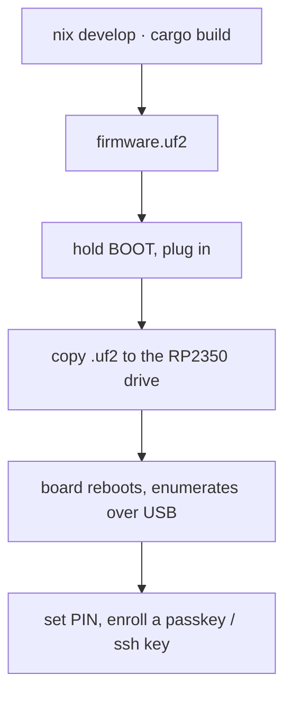

# Quick start

From zero to a working security key in about ten minutes.

> This is experimental firmware with no security audit and no secure element.
> It's fine for trying things out and for credentials you can afford to lose;
> see the [threat model](threat-model.md) before using it for anything real.



## What you need

- An RP2350 board (tested: Waveshare RP2350-One; any RP2350 with USB works)
- A USB cable
- [Nix](https://nixos.org/download/) with flakes enabled (everything —
  toolchain, `picotool`, host tools — comes from the dev shell). Without Nix:
  rustup + `rustup target add thumbv8m.main-none-eabihf` + picotool ≥ 2.0,
  and the Python deps from `flake.nix` for the host tools.

## 1. Build

```sh
nix develop                                  # first run downloads the toolchain
cargo build --release -p firmware
picotool uf2 convert target/thumbv8m.main-none-eabihf/release/firmware -t elf firmware.uf2
```

This is the **touch build**: FIDO operations (registering, logging in) require
a press of the BOOTSEL button — it stands in for the touch sensor on a typical
hardware key. For a no-touch build (needed by the automated test suites, or if
your board is hard to reach) add `--features no-touch`. All build knobs:
[build.md](build.md).

## 2. Flash

1. Hold the **BOOT** button while plugging the board in (or hold BOOT, tap
   RESET). A mass-storage drive named `RP2350` appears.
2. Copy the image: `cp firmware.uf2 /Volumes/RP2350/` (macOS) or to the
   mounted drive on Linux.
3. The board reboots itself and enumerates as `RS-Key Security Key`. (The
   default build uses the project's own USB identity, VID:PID
   `0x1209:0x0001` from pid.codes; the PC/SC reader name contains "RS-Key".
   For a build that presents the YubiKey USB identity so `ykman`/Yubico
   Authenticator auto-recognize it, build the opt-in `VIDPID=Yubikey5`
   flavor — see [build.md](build.md).)

Check it:

```sh
rsk status        # FIDO getInfo + secure-boot + backup state, over USB
ykman info        # needs the opt-in VIDPID=Yubikey5 build: YubiKey 5A, firmware 5.7.4, 6 apps
```

On Linux, the CCID half (OpenPGP/PIV/OATH) needs `pcscd` + a polkit rule
first — see [linux.md](linux.md). FIDO works as soon as the udev rules are in
place.

## 3. Set a PIN (recommended)

```sh
rsk fido set-pin
```

Browsers and `ssh-keygen` will prompt for it when enrolling. 8 wrong attempts
lock the PIN until a reset — standard security-key behaviour.

## 4. Enroll something

**A passkey** — go to any WebAuthn site (or https://webauthn.io to try),
register a security key, touch the button when the LED asks.

**An SSH key:**

```sh
ssh-keygen -t ed25519-sk -f ~/.ssh/id_ed25519_sk    # touch twice, enter PIN
ssh-copy-id -i ~/.ssh/id_ed25519_sk you@server
ssh -i ~/.ssh/id_ed25519_sk you@server              # one touch to log in
```

The `id_ed25519_sk` file is a *handle*, not a key — it is useless without the
board. Copy it to other machines you ssh from.

> macOS note: Apple's `/usr/bin/ssh` has no FIDO support. Use Homebrew
> OpenSSH (`brew install openssh`, then the absolute path
> `/opt/homebrew/opt/openssh/bin/ssh` or put it first in `PATH`).
> Details: [guides/ssh.md](guides/ssh.md).

## 5. Back up your identity (optional but wise)

```sh
rsk backup export --scheme bip39          # 24 words, write them down
rsk backup finalize                       # seals the export window
```

The words recover your deterministic FIDO identity (ssh-sk logins, 2FA
registrations) onto a fresh board with `rsk backup restore`. Anyone who has the
words can recreate that identity on their own board, so store them like cash.
They do **not** cover resident passkeys, OpenPGP or PIV keys — see
[guides/seed-backup.md](guides/seed-backup.md).

## Where next

- [Feature guides](guides/fido2.md) — OpenPGP with gpg, PIV, OATH codes, OTP
  slots, soft-lock, LED colors
- [production.md](production.md) — fuse the master key into OTP + enable
  secure boot (irreversible, read first)
- [threat-model.md](threat-model.md) — what this device actually protects
  against
