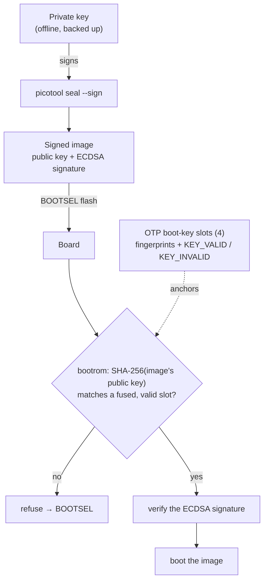

<!-- SPDX-License-Identifier: AGPL-3.0-only -->
<!-- Copyright (C) 2026 RS-Key contributors -->

# Signing keys (secure boot)

Once [secure boot](production.md) is enabled, a single key you hold is the root
of trust for the board's whole life: it signs every image the board will run.
This page is the full key lifecycle — what the key is, how it relates to the
other on-chip keys, and the correct flow to generate, back up, provision, use,
rotate, and (if it comes to it) recover it.

> ⚠️ **This key is the most important secret in the production path.** Lose it
> after `enable` and you can never flash new firmware to that board again. Read
> the backup section before you generate anything.

## The keys on an RS-Key, and which one this is

Three different key concepts live on a provisioned board. Don't conflate them:

| Key | Where it lives | Who holds it | This page? |
|---|---|---|---|
| **Secure-boot signing key** | private key **on your host**; only its fingerprint is fused in OTP | **you** | **yes** |
| **MKEK / DEVK** (master sealing / device attestation) | OTP page 58, generated on-device and **forgotten** | nobody — the fuses *are* the keys | no ([production.md](production.md) stage 1) |
| Per-applet secrets (FIDO seed, PIV/OpenPGP keys) | sealed in flash under the MKEK | the device | no ([threat-model.md](threat-model.md)) |

The signing key is the only one **you** generate, hold, and must keep. The
MKEK/DEVK are random and unrecoverable by design; the signing key is the
opposite — you keep it, and keeping it is the whole job here.

## Architecture — the trust chain

You sign images with the **private** key. The board never sees it; OTP holds
only a **fingerprint** (`SHA-256` of the matching public key). The signed image
carries its public key plus an ECDSA signature, and the bootrom checks both at
every boot:



Two consequences fall out of this shape and explain everything below:

- The board only ever holds the **public** fingerprint, so a stolen board can't
  yield your signing key — but the board also can't help you recover it.
- The bootrom matches against any **valid** slot and ignores *which* key signed,
  beyond the fingerprint. That is what makes key **revocation** a downgrade
  defense (see [anti-rollback.md](anti-rollback.md)).

## 1. Generate (one fresh key per board, off-repo, ideally offline)

The RP2350 bootrom verifies **secp256k1 + SHA-256**, so the key must be
secp256k1. Protect it with a passphrase — that is the difference between a
stolen backup being your signing key and being ciphertext:

```sh
mkdir -p ~/.rs-key-secrets && cd ~/.rs-key-secrets
# generate, then encrypt at rest with a passphrase (openssl prompts you to set one):
openssl ecparam -genkey -name secp256k1 -noout \
  | openssl ec -aes256 -out secure_boot_key.pem
# derive the public key (prompts for the passphrase to read the private key):
openssl ec -in secure_boot_key.pem -pubout -out secure_boot_pub.pem
chmod 600 secure_boot_key.pem
```

Use a long, unique passphrase and back **it** up separately — losing the
passphrase loses the key as surely as losing the file. If you would rather not
use one, drop the `| openssl ec -aes256 …` pipe and write the key straight out
(`-out secure_boot_key.pem`): simpler, but then any copy of the file *is* the
key. Either way, generate it on a machine you trust — ideally offline/air-gapped
— and never commit it. The hermetic `nix build` path deliberately keeps the key
**out** of the build sandbox ([build.md](build.md#nix-build-hermetic-no-dev-shell));
signing is always a separate, local step.

> **One key per board, one board per key.** Generate a brand-new key for every
> chip you provision and trust **only** it on that board. A **new device is
> signed with a new key** — never carry an old board's key onto a new one. That
> rule is also what keeps a replacement board's rollback floor safe: the old
> images are signed by the old key, which the new board does not trust
> ([anti-rollback.md](anti-rollback.md#moving-to-a-new-board)).

## 2. Back it up — before you fuse anything

This is the step people skip and regret. After `enable`, the fused fingerprint
is permanent and only this key can sign images the board will boot. So:

- **Make at least two durable copies**, on media that survive this machine
  (and each other) — e.g. an encrypted USB stick kept offline, plus a printout
  of the PEM in a safe.
- **Encrypt it at rest.** A passphrase-protected copy, or a copy held on a
  separate hardware token, is worth the friction.
- **Keep it off networked machines.** The host that signs only needs the key for
  the few seconds of `picotool seal`.
- **There is no recovery from the device.** It holds only the public
  fingerprint. If every copy of the private key is gone, the board's current
  signed image keeps booting but you can never flash it again.

If you reserve a slot for [rotation](#5-rotate-a-key) you get one escape hatch
later; even so, treat the key as un-loseable.

## 3. Provision — fuse the fingerprint (slot 0)

`picotool seal` writes the fingerprint into the `otp_secureboot.json` it
produces; `rsk secure-boot load-key` fuses it into **boot-key slot 0** without
enabling enforcement yet:

```sh
# seal once to produce the otp.json (also see production.md, stage 2b):
picotool seal --sign --hash firmware.uf2 firmware-signed.uf2 \
    ~/.rs-key-secrets/secure_boot_key.pem ~/.rs-key-secrets/otp_secureboot.json \
    --major 1 --minor 0
rsk secure-boot status                          # bootkey present: False
rsk secure-boot load-key ~/.rs-key-secrets/otp_secureboot.json   # fuses slot 0
```

`load-key` is non-enforcing — unsigned images still boot until `enable`. It
refuses if a key is already present, so it is a one-shot for slot 0. (If your key
is passphrase-protected, decrypt it to a temp file for this `seal` too, exactly as
in [step 4](#4-daily-use--sign-every-flash).) The rest of the staged ritual
(`harden` → `enable` → `lock`) is in [production.md](production.md#2c-burn-staged).

## 4. Daily use — sign every flash

After `enable`, every image must be sealed with this key. `picotool` reads only
an **unencrypted** PEM — it has no passphrase prompt — so a passphrase-protected
key (recommended) is decrypted to a temporary file just for the seal and removed
straight after:

```sh
# decrypt for the seal only — best on a RAM-backed dir so the plaintext never
# touches disk; openssl prompts for the passphrase:
( umask 077; openssl ec -in ~/.rs-key-secrets/secure_boot_key.pem -out /tmp/sk.pem )
picotool seal --sign --hash firmware.uf2 firmware-signed.uf2 \
    /tmp/sk.pem ~/.rs-key-secrets/otp_secureboot.json --major 1 --minor 0
rm -P /tmp/sk.pem        # overwrite + delete (Linux: shred -u /tmp/sk.pem)
# BOOTSEL, then:
picotool load -v firmware-signed.uf2 && picotool reboot   # or drag it onto the RP2350 drive
```

If your key has **no** passphrase, pass `~/.rs-key-secrets/secure_boot_key.pem`
straight in as the `<key>` argument and skip the decrypt / `rm` lines.

The `rsk-wipe` recovery image must be sealed with a **currently valid** key too,
or it won't boot on a secure-boot board — and after a [rotation](#5-rotate-a-key)
it must be re-signed with the new key. The full flag meaning is in
[production.md](production.md#2b-sign-and-prove-a-signed-image-boots-before-any-fuse);
if anti-rollback is on, add `--rollback` ([anti-rollback.md](anti-rollback.md)).

## Key slots and validity

The RP2350 has **four** boot-key slots, each holding one fingerprint, plus
`KEY_VALID` / `KEY_INVALID` masks that say which slots the bootrom trusts:

- The bootrom accepts an image whose public key matches **any valid,
  non-revoked** slot.
- The `lock` stage ([production.md](production.md#2c-burn-staged)) sets
  `KEY_INVALID` on the three unused slots — maximum hardening, but it also
  removes any room to add a key later.
- **Reserving a slot vs. full lock-down is a decision you make at provisioning
  time.** It is the same trade-off as the anti-rollback escape valve, laid out
  in [anti-rollback.md](anti-rollback.md#a-decision-you-must-make-before-the-ceiling).
  Most users should take the full lock; reserve a slot only if you specifically
  want a future rotation path.

## 5. Rotate a key

You rotate when you want a *new* signing key to take over and the old one to
stop being trusted — the two real reasons being a **suspected key compromise**
or the **anti-rollback budget ceiling** (a new key revokes the old, killing old
signed images by signature; see
[anti-rollback.md](anti-rollback.md#key-revocation--downgrade-defense-without-the-thermometer)).

The flow, in order — never revoke the old key until the new one is proven:

1. Generate a new key `K2` (section 1) and **back it up** (section 2).
2. Provision `K2`'s fingerprint into a **free, un-revoked** slot:
   `rsk secure-boot load-key --slot <free> K2-otp.json`.
3. Re-sign the current firmware with `K2`, flash it, and **confirm it boots**
   (the board now validates it via `K2`).
4. Revoke the old key `K1`: `rsk secure-boot revoke <K1-slot>`. Old images signed
   only by `K1` now fail secure boot.

`rsk secure-boot rotate K2-otp.json` runs steps 2–4 as a guided flow: it
provisions the next free slot, then stops and tells you to flash and prove `K2`
before you revoke `K1` — it never revokes for you while only one key is proven.

> **Tooling.** Rotation is driven by `rsk secure-boot`, not hand-rolled
> `picotool otp` writes: `load-key --slot N` provisions any of the four slots,
> `revoke <slot>` retires one (refusing to revoke your last valid key), and
> `rotate <new.json>` walks the whole flow — provision a free slot, then it tells
> you to flash and **prove** the new key before revoking the old one. It only
> works if you **reserved a slot** (didn't run the full `lock`, which leaves the
> key pages bootloader-writable); on a fully-locked board the commands refuse,
> and a fresh board is the only path. With four slots you can rotate roughly
> three times before they're spent.

## Loss and recovery — the cases

| Situation | Outcome |
|---|---|
| Lost the key **before** `load-key` | No harm — regenerate. Nothing is fused yet. |
| Lost it **after** `load-key`, **before** `enable` | Enforcement is still off, so the board boots unsigned images and keeps working — but slot 0 is now fused to a key you don't have. Provision a *different* slot for a new key, or treat the board as not worth securing. |
| Lost it **after** `enable` | The key itself is unrecoverable, and the current signed image **keeps booting forever**. After a full `lock`, the unused slots are revoked and the key pages are locked, so you can **never flash new firmware** — a new board. If instead you **reserved a free slot**, you can still provision a *new* key into it and flash again (the bootrom never asks for the old key): `rsk secure-boot load-key --slot <free>` does it, no hand-rolled `picotool` needed. |
| Key **compromised** (someone else has it) | [Rotate](#5-rotate-a-key) to a new key and revoke the old (needs a reserved slot), or move to a new board. The old key can sign images your board still trusts until it is revoked. |
| Replacing the board | Provision the new chip with a **new** key; restore your FIDO identity with `rsk backup restore`. See [anti-rollback.md](anti-rollback.md#moving-to-a-new-board). |

## Best practices, in one place

- secp256k1, generated offline, passphrase-protected at rest, never in the repo
  or a build sandbox.
- ≥2 durable, encrypted, offline backups — *before* you fuse anything.
- One fresh key per board for its life — a **new board gets a new key**, never
  the old one; rotate only on compromise or the rollback ceiling, and only if
  you reserved a slot.
- Sign `rsk-wipe` with the same key as your firmware (keep the recovery hatch bootable).
- Decide lock-down vs. a reserved rotation slot up front — it can't be changed
  after `lock`.
