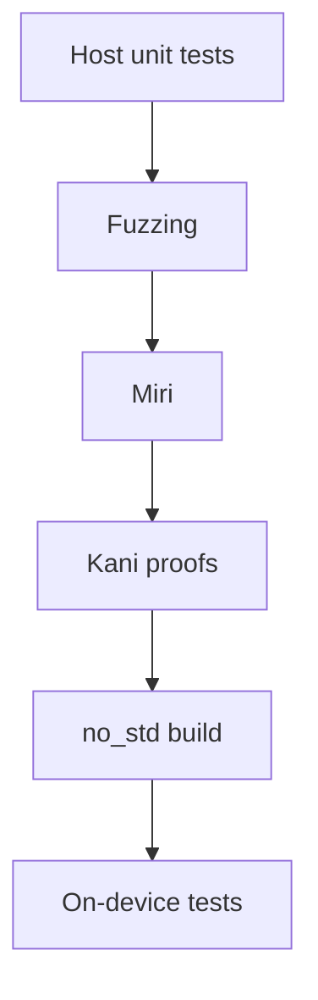
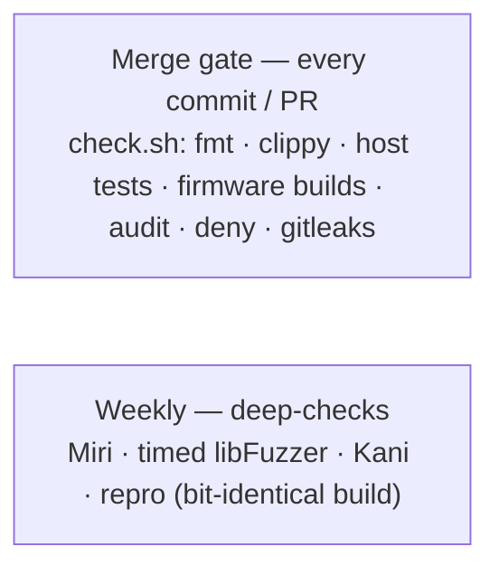

# Testing

Several layers, fastest first. The protocol and applet crates are
hardware-agnostic on purpose — only `firmware` touches the HAL — so
everything except board bring-up is tested and fuzzed on the host, with the
device reserved for end-to-end integration.

| Layer | What it checks | Where |
|---|---|---|
| Host unit tests | parsers, state machines, applets, crypto (~350 tests) | `#[cfg(test)]` in each crate |
| Fuzzing | the same logic under adversarial bytes | `fuzz/` |
| Miri | the fuzz targets' logic under the UB checker | `fuzz/tests/miri.rs` |
| Kani proofs | bounded model checking — every input, not a sample | `#[cfg(kani)]` in the crates |
| `no_std` build | the crates still link for the device | default `thumbv8m` target |
| On-device tests | real USB + flash on the board | `tests/*.py` |



Top to bottom: fast and host-only, tapering to slow and needs-a-board.

## The one command

```sh
nix develop -c ./scripts/check.sh
```

runs fmt, clippy (embedded **and** host targets, `-D warnings`), all host
tests, both firmware builds (touch + no-touch), the rsk-wipe build,
`cargo-audit`, `cargo-deny` and `gitleaks`. Green check.sh is the bar for
every commit.

## Host tests

`cargo test` must target the host explicitly (the workspace defaults to
`thumbv8m`):

```sh
nix develop -c cargo test -p rsk-sdk -p rsk-fs -p rsk-usb -p rsk-crypto \
    -p rsk-fido -p rsk-openpgp -p rsk-rsa-asm -p rsk-mgmt -p rsk-oath \
    -p rsk-otp -p rsk-piv -p rsk-rescue --target aarch64-apple-darwin
```

(`HOST_TARGET` env overrides the triple in `check.sh`.) Crypto tests pin
NIST/RFC vectors; applet tests drive full protocol flows (register → assert,
PIN lockout ladders, OpenPGP import → sign → verify against `RustCrypto`,
PIV generate → attest → parse with `x509-parser`).

## Fuzzing

Every parser **and every applet's full dispatch** has a `cargo-fuzz` target —
30+ of them: APDU, BER-TLV, CTAPHID reassembly (+ round-trip property), CCID
framing, all the FIDO command surfaces (CBOR dispatch, credentials,
credMgmt, U2F, extensions, large blobs, the vendor backup/lock commands —
half that corpus runs soft-locked), OpenPGP dispatch + the EC/RSA crypto
parsers, OATH/OTP/PIV/management/rescue dispatch, the keyboard frame codec,
the phy TLV codec (parse∘serialize round-trip is an asserted invariant), the
PIN protocols, AEADs, the DRBG, ML-DSA/ML-KEM decoding, and the seed-blob
format/migration state machine.

Most targets drive one applet from a fresh state. Four are **stateful** —
they replay an attacker-chosen *sequence* against persistent state, hunting
the multi-step seams a fresh-state target can't reach (both real bugs of this
class — the largeBlobs overflow and the mgmt write→read mismatch — were
multi-step):

- `cross_applet` wires the real `Dispatcher` to the OpenPGP / Management /
  OATH / OTP / PIV set over a single shared `Fs`: SELECT switches, command
  chaining and the file system persist across APDUs — state leaking between
  applets, a SELECT mid-chain, FID collisions. (GENERATE is skipped, as on
  device the RSA prime search is fast-pathed off the dispatcher.)
- `fido_session` replays a CTAPHID_CBOR message sequence against one
  `FidoState` + `Fs` with an all-permissions token armed and a resident
  credential provisioned: PIN/token state, the credential store, large blobs
  and the journal persist across commands, `now_ms` advances over the
  token-timeout edges, a mid-sequence reset wipes the store under the
  session's feet — and getInfo must still succeed after anything.
- `fs_ops` drives put / read / delete / meta ops / reboot
  (`into_storage`→`scan`) over one image against a `HashMap` shadow model:
  every read checks the full-length-returned / copy-clamped contract (the
  mgmt bug was a caller missing it), `meta_add` is checked against the exact
  `META_MAX` boundary, and the live key set must equal the model's after any
  prefix of operations.
- `power_cut` is the torture extension of `fs_ops`: the same op-sequence
  shadow model, but over the *real* on-device storage stack — a scaled-down
  mirror of `firmware/src/flash_storage.rs` (the two `sequential-storage`
  partitions, counter-FID routing, the caches) on a mock NOR flash whose
  power can be cut after any byte of any write or erase. Once a cut fires, a
  dead-latch fails every further mutation (a dead device cannot keep
  writing), the stack is rebuilt with fresh caches over the surviving bytes,
  and the model checks atomicity (the torn op reads as old or new, never
  garbage; a torn `delete` never leaves the value gone but its metadata
  alive), durability (every committed file reads back exactly — a spurious
  "absent" is the on-device "seed lost" disaster), and the key set. Cuts
  landing inside the next mount's own repair are survived by dying again.

```sh
nix develop .#fuzz -c cargo fuzz list
nix develop .#fuzz -c cargo fuzz run <target> -- -max_total_time=60
```

The fuzz workspace is separate (nightly + libfuzzer) and is **not** built by
check.sh — after changing a shared type, `nix develop .#fuzz -c cargo fuzz
build` to catch drift. House rule: new attacker-facing parser or dispatch
surface ⇒ new fuzz target in the same change.

**Miri** runs every target's logic once more as plain tests under the UB
checker — undefined behavior instead of panics (`fuzz/tests/miri.rs`; the
`MIRIFLAGS` policy is set by the `.#fuzz` shell):

```sh
nix develop .#fuzz -c cargo miri test --manifest-path fuzz/Cargo.toml
```

Neither suite gates a commit. CI runs both weekly — the `deep-checks`
workflow: the Miri suite, plus a timed libFuzzer pass over every target with
the corpus carried between runs, crash artifacts uploaded.

## Kani proofs

Where a fuzzer samples inputs, [Kani](https://model-checking.github.io/kani/)
(a bounded model checker over CBMC) checks **every** input up to a stated
bound — no panic, no overflow, no out-of-bounds access, and the asserted
invariants hold. The harnesses live next to the unit tests as
`#[cfg(kani)] mod proofs` and cover the small, total, attacker- or
crypto-critical helpers, where a proof genuinely beats a sample:

- `rsk-sdk` — BER-TLV walk over arbitrary bytes; `format_len` round-trip for
  every `u16`; APDU case-1..4 parsing over every buffer up to the bound.
- `rsk-fs` — the `EF_META` record-walk (`rebuild_meta`) over arbitrary
  (corrupt) blobs.
- `rsk-rsa-asm` — `mod_small` proven *functionally* (`== v % m`, every
  dividend up to 2 bytes and every modulus) and panic-free / `< m` for every
  input up to 8 bytes; the `IncrementalSieve` residue invariant
  (`res[i] == cand mod p_i` after a step, verdict identical to the flat
  sieve) for every seed.
- `rsk-crypto` — the `base64url` length helpers (`encoded_len` / `decoded_len`)
  panic-free (no overflow/underflow) and mutually inverse for every length up
  to 64 KiB; `encode∘decode == id` for every input up to 9 bytes (every
  `len % 3` tail, with and without preceding full chunks); `decode` panic-free
  over every byte string up to 8 chars.
- `rsk-rescue` — the `phy` device-configuration record: `parse` total over
  every byte string up to 12 bytes (and always materializes an interface
  mask); `serialize∘parse == id` for every `PhyData` — every field-presence
  combination and value, product strings up to 4 bytes — modulo the documented
  missing-ENABLED_USB_ITF→ALL normalization, with `PHY_MAX_SIZE` sufficiency
  proven en route.

Kani is **not** in nixpkgs and its setup downloads a prebuilt CBMC bundle, so
this is the one deliberately non-nix tool (install once, outside the dev
shell):

```sh
cargo install --locked kani-verifier && cargo kani setup
cargo kani -p rsk-sdk -p rsk-fs -p rsk-rsa-asm -p rsk-crypto -p rsk-rescue -p rsk-openpgp
```

The proofs are bounded, and the bound is the honest fine print. A 16–20-byte
symbolic buffer reaches every branch of the TLV/APDU parsers; bigger inputs
are the fuzzers' job. Big loops (a full modexp, Baillie–PSW) are out of CBMC's
reach by design and stay covered by the differential tests and on-device KATs.

The sharpest bound is on *functional division* specs. Proving
`mod_small == v % m` makes the solver equate two division circuits —
`mod_small`'s byte-wise Horner reduction against one wide `%` — which is the
shape resolution-based SAT handles worst: it discharges in ~100 s at a 2-byte
dividend, but the cost climbs steeply per added byte and a full `u32` dividend
(4 bytes) does not converge (it ran ~30 min without a verdict; the early
`SATISFIABLE` lines are Kani's reachability covers, not the property). So
`mod_small`'s exact value is pinned exhaustively at 2 bytes
(`mod_small_matches_value`), its panic-freedom and range over the full 8
(`mod_small_in_range`), and the full-width semantics by the 32-byte BigUint
differential test plus the division-free `IncrementalSieve` proof. The earlier
instinct — "never spec a division functionally" — was half right: avoid it at
*wide* dividends; at a narrow width it is the strongest evidence there is.
House rule: a small total helper in a parsing or arithmetic hot path gets a
proof harness sized to what CBMC can swallow — functional where it converges,
structural (`< m`, panic-free) where it doesn't, or relational against a
division-free reformulation; anything bigger gets a fuzz target.

CI: the weekly `deep-checks` workflow has a `kani` job (rustup-based, version
pinned, `~/.kani` cached) running the same `cargo kani` line.

## On-device tests

Numbered, self-contained scripts under `tests/`, run from the dev shell
against a flashed board:

```sh
nix develop -c python tests/10_fido_getinfo.py
nix develop -c python tests/80_piv.py
nix develop -c python tests/75_seed_backup.py --pin <your PIN>
```

- Most need the **no-touch build** (`--no-default-features`) — they cannot
  press the button. If the board runs secure boot, sign the test build too.
- Numbering: `0x` transport smoke, `1x` FIDO basics, `2x` FIDO full,
  `3x/4x/5x` OpenPGP, `6x` PQC, `7x` management/OATH/OTP/backup/lock,
  `8x` PIV/rescue, `9x` OTP-fuse migration.
- Tests that reboot the device do it hands-free over CCID and wait for
  re-enumeration; tests are idempotent where the applet allows it and say so
  in their docstring when they are destructive (resets).
- The FIDO PIN is never guessed: destructive PIN tests take `--pin`
  explicitly.

Two external suites were run against the implementation: Yubico's python-fido2
test corpus and the Gnuk/OpenPGP card suite (see
[third_party/](https://github.com/TheMaxMur/RS-Key/tree/main/third_party) if
vendored, or run them from their upstream checkouts). Running an upstream
corpus shows conformance on the cases it covers; it is not a security audit.

## Real-world interop

Protocol conformance is necessary but not sufficient: a response can be
spec-arguable yet still trip a strict third-party parser. The layer above
drives the *real* consumer software — `gpg`, `ssh`, libfido2, `ykman`,
OpenSC, browsers — and records whether the device works end to end. The
`ykman` and Yubico Authenticator cells gate on the "Yubico YubiKey" reader
name, so they run against the opt-in `VIDPID=Yubikey5` interop flavor (never
distributed); the default RS-Key build (0x1209:0x0001) does not expose itself
to them. The sweep `tests/interop/run.py` automates the read-only CLI cells;
the full matrix (including the GUI/ceremony cells) lives in
[interop.md](interop.md). It is how the `ykman openpgp info` GET DATA `6E`
wrapper bug was caught — every protocol test passed, only the real ykman
parser rejected the reply.

## CI parity

`check.sh` is plain bash over the Nix dev shell — a CI job is
`nix develop -c ./scripts/check.sh` plus, on a runner with the board
attached, the `tests/` scripts. The scheduled `deep-checks` workflow is the
Miri, fuzz and Kani commands from this page, weekly, plus a `repro` job
that builds the hermetic firmware twice and requires bit-identical outputs
([build.md](build.md#nix-build-hermetic-no-dev-shell)). No hidden state.


