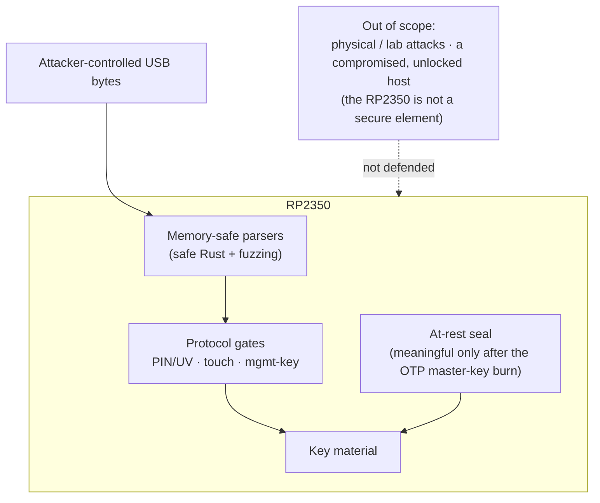
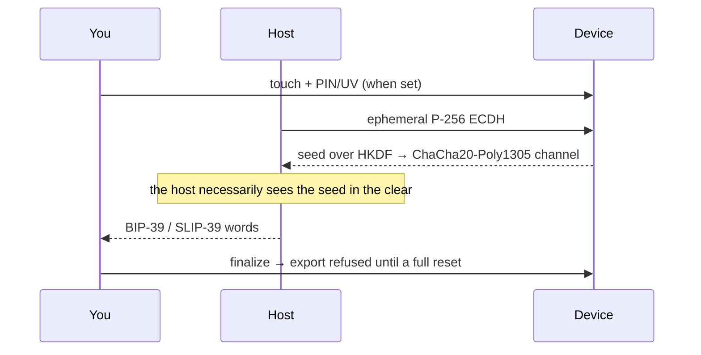

# Threat model

What RS-Key defends against, what it deliberately does not, and the honest
residuals in between. The defenses compose in tiers — each one assumes the
ones before it.

## Assets

The FIDO master seed (every non-resident credential derives from it),
resident passkeys, OpenPGP private keys and their DEK chain, PIV private
keys, OATH secrets, OTP slot secrets, PINs.

## Attackers, strongest defense first

### 1. A hostile host (malware on the computer)

Everything arriving over USB is attacker-controlled: CTAPHID frames, the CCID
bulk stream, ISO-7816 APDUs, CTAP2 CBOR. Defenses:

- **Memory safety.** `no_std` Rust end to end; the parsers and applet
  dispatch are safe code. The handful of `unsafe` sites are enumerated and
  justified in [unsafe.md](unsafe.md).
- **Fuzzing.** Every parser and every applet's full dispatch path has a
  `cargo-fuzz` target (30+); see [testing.md](testing.md).
- **Protocol gates.** PINs/UV with retry counters and lockout, physical-touch
  requirements on FIDO operations and OpenPGP UIF, OATH access codes, PIV
  management-key auth.
- What a hostile host **can** do: drive any operation you have authorized
  while the device is plugged in and unlocked (sign, decrypt, assert). A
  security key authenticates *presence and possession*, not the intent of
  every byte the host sends. Touch requirements bound the rate.

### 2. A thief with the powered-off device (at-rest)

- All key material is sealed in flash: FIDO seed and PIV keys under
  AES-256-CBC/GCM keyed by a device key (`kbase` = HKDF of the chip serial
  and the OTP master key once provisioned), OpenPGP keys under the
  PIN-wrapped DEK chain.
- **OTP master key** ([production.md](production.md) stage 1): with the MKEK
  fused and page-58 hard-locked, a flash dump — even with BOOTSEL access and
  the chip id — does not reproduce the sealing key. Without the burn, the
  sealing key derives from on-chip state an attacker with full flash + chip
  access could reconstruct; the burn is what makes at-rest real.
- **Soft-lock** ([guides/soft-lock.md](guides/soft-lock.md)): optionally, the
  seed at rest is additionally wrapped with ChaCha20-Poly1305 under a 32-byte
  key only you hold (BIP-39/SLIP-39 words). A stolen device — even running
  genuine firmware — refuses every FIDO operation until that key is presented
  over an encrypted channel at power-up. Device + words, two factors.
- Caveat: the flash log keeps a superseded plain-seed record until natural
  compaction overwrites it, so soft-lock's at-rest guarantee hardens over
  time rather than at the instant of enabling (the lingering record is still
  kbase-sealed — moot against anything but a fused-key compromise).
- The FIDO seed is **never PIN-wrapped at rest** (a deliberate design
  decision): UP-only operations — `ssh ed25519-sk`, U2F, no-PIN assertions —
  must work from a cold boot with no PIN presented, so a PIN-keyed at-rest
  copy adds no protection an attacker couldn't bypass via the always-loadable
  copy, while breaking those flows. At-rest strength is the kbase (tier
  above), not the PIN.

### 3. An attacker who can flash their own firmware

- **Secure boot** ([production.md](production.md) stage 2): the bootrom
  refuses unsigned images, so no foreign code ever runs to read the OTP key
  in secure mode. Glitch detectors are fused on along the way.
- **Anti-rollback** ([anti-rollback.md](anti-rollback.md), optional): with
  `ROLLBACK_REQUIRED` fused, images below your board's rollback floor — or
  carrying no version at all, i.e. anything sealed before the feature — no
  longer boot. A kept copy of an old signed release with a since-fixed bug
  stops being a downgrade path.
- Before secure boot is enabled, this attacker wins against the OTP tier:
  their firmware reads the MKEK exactly like ours does. That is why the
  production page calls the two stages one story.

### 4. Physical / lab attacks — OUT OF SCOPE

Decapping, microprobing, advanced fault injection beyond the RP2350's glitch
detectors, power/EM side channels, and the **XIP TOCTOU** (emulating the QSPI
flash chip to swap the image between signature check and execution). The
RP2350 is not a secure element and RS-Key does not pretend otherwise. If your
threat model includes a funded lab, buy a certified key.

### 5. Network

None. The device speaks USB only; there is no radio and no IP stack.

## Seed backup (the deliberate exception)

A FIDO authenticator's pitch is non-exportable keys; the wallet-style backup
is a conscious trade for recoverability, gated accordingly. Export moves the
seed over an ephemeral encrypted channel (P-256 ECDH → HKDF →
ChaCha20-Poly1305), and requires — all at once — physical touch, the FIDO
PIN/UV token when a PIN is set, and the **one-time setup window**: after an
explicit `finalize`, export is refused until a full reset regenerates a new
seed. Malware cannot exfiltrate the seed silently or later. Restore re-seals
the seed under the *destination* chip's root. The host driving a backup
necessarily sees the seed plaintext — do it on a machine you trust.
Scope: the deterministic identity only (resident passkeys, OpenPGP, PIV are
not covered).

## Zeroization

Key-grade material in RAM is wiped (`zeroize`, volatile writes) when its use
ends: session state and PIN/UV tokens on drop, transient key copies at end of
scope including error paths, and the transport/exchange buffers as soon as a
message completes (requests carry PINs and imported keys). Accepted
residuals: `Copy` temporaries inside RustCrypto curve arithmetic, digest
internals, and heap temporaries inside the `rsa` crate — short-lived,
library-internal, not wipeable without forking the crates.

## Supply chain & process

- `cargo audit` + `cargo deny` (advisories, license allow-list, source
  policy) and `gitleaks` run in `scripts/check.sh` and the pre-commit hook.
- Dependencies are pinned (`Cargo.lock`); the git dependencies are restricted
  to the embassy organization.
- One known-unfixed advisory is accepted deliberately: RUSTSEC-2023-0071
  (Marvin timing side channel in `rsa`) — the OpenPGP RSA backend, mitigated
  by blinding; rationale in `deny.toml`.

## Post-quantum notes

ML-DSA-44 (FIPS 204, `fips204` crate) FIDO2 credentials with hedged signing
(32 fresh DRBG bytes per signature; the hedge and expanded keys are
zeroized). ML-KEM-768 is compiled in as scaffolding but nothing calls it
until a CTAP PQC PIN/UV protocol exists. Neither crate has a third-party
audit yet — the same standing as the rest of the RustCrypto stack, tracked
via cargo-audit/deny.

## Reporting

This is an experimental hobby project. If you find a security issue, please
report it privately to the maintainer rather than opening a public issue.
