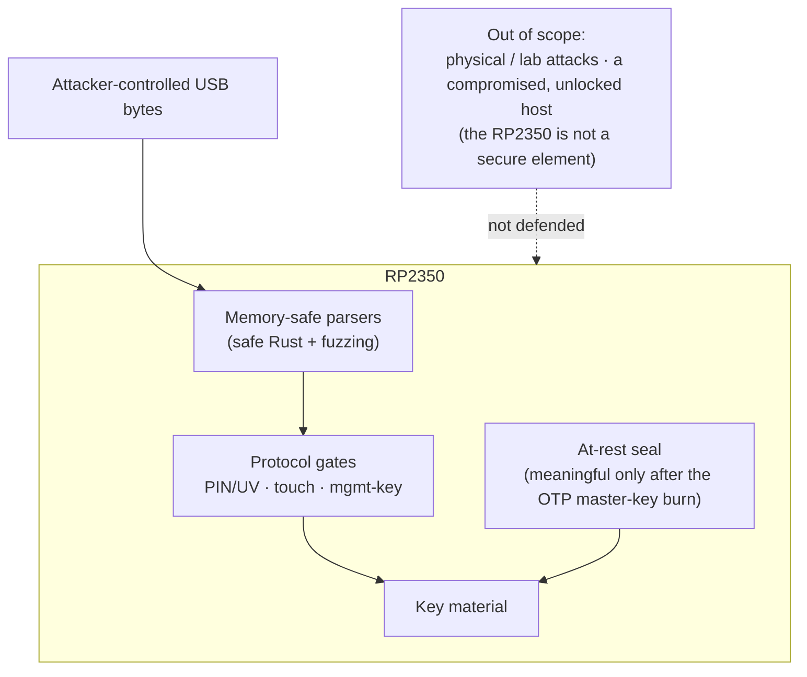
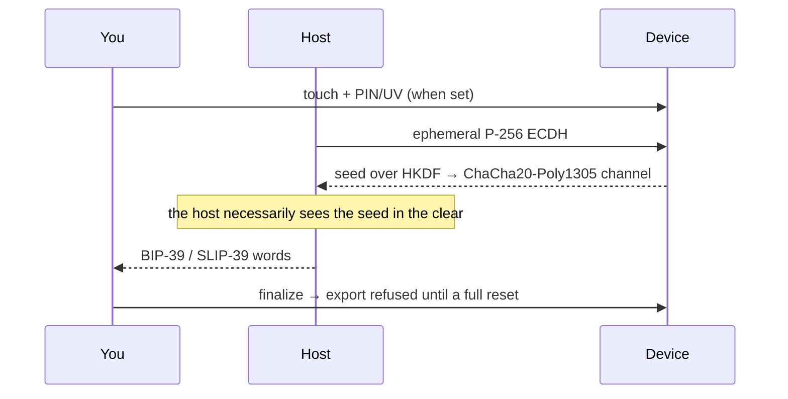

# Threat model

What RS-Key defends against, what it deliberately does not, and the honest
residuals in between. The defenses compose in tiers — each one assumes the
ones before it.

## Assets

The FIDO master seed (every non-resident credential derives from it),
resident passkeys, OpenPGP private keys and their DEK chain, PIV private
keys, OATH secrets, OTP slot secrets, PINs.

## Attackers, strongest defense first

### 1. A hostile host (malware on the computer)

Everything arriving over USB is attacker-controlled: CTAPHID frames, the CCID
bulk stream, ISO-7816 APDUs, CTAP2 CBOR. Defenses:

- **Memory safety.** `no_std` Rust end to end; the parsers and applet
  dispatch are safe code. The handful of `unsafe` sites are enumerated and
  justified in [unsafe.md](unsafe.md).
- **Fuzzing.** Every parser and every applet's full dispatch path has a
  `cargo-fuzz` target (30+); see [testing.md](testing.md).
- **Protocol gates.** PINs/UV with retry counters and lockout, physical-touch
  requirements on FIDO operations and OpenPGP UIF, OATH access codes, PIV
  management-key auth.
- What a hostile host **can** do: drive any operation you have authorized
  while the device is plugged in and unlocked (sign, decrypt, assert). A
  security key authenticates *presence and possession*, not the intent of
  every byte the host sends. Touch requirements bound the rate.

### 2. A thief with the powered-off device (at-rest)

- All key material is sealed in flash: FIDO seed and PIV keys under
  AES-256-CBC/GCM keyed by a device key (`kbase` = HKDF of the chip serial
  and the OTP master key once provisioned), OpenPGP keys under the
  PIN-wrapped DEK chain.
- **OTP master key** ([production.md](production.md) stage 1): with the MKEK
  fused and page-58 hard-locked, a flash dump — even with BOOTSEL access and
  the chip id — does not reproduce the sealing key. Without the burn, the
  sealing key derives from on-chip state an attacker with full flash + chip
  access could reconstruct; the burn is what makes at-rest real.
- **Soft-lock** ([guides/soft-lock.md](guides/soft-lock.md)): optionally, the
  seed at rest is additionally wrapped with ChaCha20-Poly1305 under a 32-byte
  key only you hold (BIP-39/SLIP-39 words). A stolen device — even running
  genuine firmware — refuses every FIDO operation until that key is presented
  over an encrypted channel at power-up. Device + words, two factors.
- Caveat — superseded records linger: the flash log is append-only, so
  re-sealing or deleting a secret leaves the old copy on flash until its page
  is reclaimed. Two cases differ in how much that matters:
  - The **OTP-burn migration** supersedes the *pre-OTP* seed, which was sealed
    under the chip-serial-only root (no fuse secret). Left alone, a flash dump
    plus the chip id would recover it — bypassing the burn. So it is **not**
    left to lazy healing: the first boot after provisioning runs a one-shot
    compaction (`Fs::compact`, gated by the `EF_HARDENED` marker, crash-safe)
    that drives a full GC lap over the credential partition and physically
    erases every superseded pre-OTP record before the device re-attaches to USB.
  - The **soft-lock** transition leaves the same kind of lingering record, but
    on a provisioned device it is already sealed under the fused root — moot
    against anything short of a fused-key compromise — so soft-lock's at-rest
    guarantee simply hardens over time as natural compaction overwrites it.
- The FIDO seed is **never PIN-wrapped at rest** (a deliberate design
  decision): UP-only operations — `ssh ed25519-sk`, U2F, no-PIN assertions —
  must work from a cold boot with no PIN presented, so a PIN-keyed at-rest
  copy adds no protection an attacker couldn't bypass via the always-loadable
  copy, while breaking those flows. At-rest strength is the kbase (tier
  above), not the PIN.

### 3. An attacker who can flash their own firmware

- **Secure boot** ([production.md](production.md) stage 2): the bootrom
  refuses unsigned images, so no foreign code ever runs to read the OTP key
  in secure mode. Glitch detectors are fused on along the way.
- **Anti-rollback** ([anti-rollback.md](anti-rollback.md), optional): with
  `ROLLBACK_REQUIRED` fused, images below your board's rollback floor — or
  carrying no version at all, i.e. anything sealed before the feature — no
  longer boot. A kept copy of an old signed release with a since-fixed bug
  stops being a downgrade path.
- Before secure boot is enabled, this attacker wins against the OTP tier:
  their firmware reads the MKEK exactly like ours does. That is why the
  production page calls the two stages one story.

### 4. Physical / lab attacks — OUT OF SCOPE

Decapping, microprobing, advanced fault injection beyond the RP2350's glitch
detectors, power/EM side channels, and the **XIP TOCTOU** — interposing on the
QSPI bus to serve the genuine image to secure boot's verifier and a tampered one
to the CPU, since nothing binds checked bytes to executed bytes and the image is
too large to verify-in-place from SRAM. An in-package-flash part (RP2354) leaves
no discrete flash chip to tap, raising a reliable swap to decap-class effort. The
RP2350 is not a secure element and RS-Key does not pretend otherwise. If your
threat model includes a funded lab, buy a certified key.

### 5. Network

None. The device speaks USB only; there is no radio and no IP stack.

## Platform silicon: the RP2350 security challenges

Raspberry Pi has publicly stress-tested the RP2350 die, and the results bound
RS-Key's physical-attack posture.

**Challenge 1 broke the A2 stepping** ([results][c1]). The task was to extract an
OTP secret from a board running secure boot. The winning attacks:

- **Aedan Cullen** — voltage glitch on the `USB_OTP_VDD` rail, reading OTP
  secrets out of the guarded path (erratum E16) ([writeup][cullen], [talk][c38c3]).
- **Marius Muench** — a glitch plus a boot-ROM flaw, bypassing secure boot to run
  unsigned code.
- **Kévin Courdesses** — laser fault injection corrupting the boot-time signature
  check (erratum E24) ([writeup][courk]).
- **IOActive** — focused-ion-beam (FIB) plus passive voltage contrast (PVC),
  reading the antifuse array directly: the bitwise OR of two physically paired
  bitcell rows ([writeup][ioactive]).

The first three are comparatively cheap fault / boot-ROM attacks; the IOActive
readout needs FIB-class lab equipment (a tool worth hundreds of thousands of
dollars, one to two days per target) and applies to *every* device built on the
Synopsys `dwc_nvm_ts40*` antifuse IP on TSMC's 40 nm node — an antifuse property,
not an RP2350-specific defect.

**The A4 stepping fixes the fault and boot-ROM attacks in silicon — but not the
antifuse readout** ([announcement][a4]). A4 closes the boot-ROM errata
(E20/E21/E24, including the laser signature bypass) in a new boot ROM, the OTP
power-glitch (E16) through changes to the wrapper circuitry around the OTP macro,
and the GPIO errata (E9, E3). The antifuse-array PVC readout is explicitly **not**
fixed in A4; Raspberry Pi's guidance is to mitigate it by how secrets are stored
in OTP — the chaffing RS-Key applies (see [otp-fuses.md](otp-fuses.md)). A third
challenge — power side-channel analysis of the secure-boot AES — is open with no
break reported ([challenge 2][c2]).

**What this means for RS-Key.** Our development boards are **A2** — the broken
stepping, kept as the conservative worst case. The firmware is **A4-compatible**,
and A4 is recommended for the fault / boot-ROM attacks above. Against the antifuse
readout — which no stepping fixes — RS-Key applies the chaffing mitigation
directly ([otp-fuses.md](otp-fuses.md)). What remains out of scope is unchanged: a
funded lab with FIB/PVC, laser fault injection, or power/EM analysis against a
device in hand. No software or provisioning choice on a general-purpose die closes
those — that is what a dedicated secure element is for ([limitations.md](limitations.md)).

[c1]: https://www.raspberrypi.com/news/security-through-transparency-rp2350-hacking-challenge-results-are-in/
[a4]: https://www.raspberrypi.com/news/rp2350-a4-rp2354-and-a-new-hacking-challenge/
[c2]: https://www.raspberrypi.com/news/rp2350-hacking-challenge-2-less-randomisation-more-correlation/
[cullen]: https://github.com/aedancullen/hacking-the-rp2350
[c38c3]: https://media.ccc.de/v/38c3-hacking-the-rp2350
[courk]: https://courk.cc/rp2350-challenge-laser
[ioactive]: https://www.ioactive.com/raspberry-pi-2350-hacking-challenge/

## Seed backup (the deliberate exception)

A FIDO authenticator's pitch is non-exportable keys; the wallet-style backup
is a conscious trade for recoverability, gated accordingly. Export moves the
seed over an ephemeral encrypted channel (P-256 ECDH → HKDF →
ChaCha20-Poly1305), and requires — all at once — physical touch, the FIDO
PIN/UV token when a PIN is set, and the **one-time setup window**: after an
explicit `finalize`, export is refused until a full reset regenerates a new
seed. Malware cannot exfiltrate the seed silently or later. Restore re-seals
the seed under the *destination* chip's root. The host driving a backup
necessarily sees the seed plaintext — do it on a machine you trust.
Scope: the deterministic identity only (resident passkeys, OpenPGP, PIV are
not covered).

On the **trusted-display flavor** the host need not be in that trust path: the
device can render its BIP-39 recovery phrase **on its own screen** (the seed is
turned into words on-device and never crosses USB), so a backup can be taken
without trusting any host. That trades the host-observation surface for a
physical/visual one — the words are briefly on the panel (shoulder-surf, camera).
It is gated to keep that surface small: it requires a **device PIN** set and
re-entered, a deliberate hold past an explicit "no one watching" warning, runs
only inside the same one-time window (and seal closes it), is disabled on the
`fips-profile` (non-exportable) build, zeroizes the seed/words from RAM on exit,
and auto-clears the panel after a short idle.

## Zeroization

Key-grade material in RAM is wiped (`zeroize`, volatile writes) when its use
ends: session state and PIN/UV tokens on drop, transient key copies at end of
scope including error paths, and the transport/exchange buffers as soon as a
message completes (requests carry PINs and imported keys). Accepted
residuals: `Copy` temporaries inside RustCrypto curve arithmetic, digest
internals, and heap temporaries inside the `rsa` crate — short-lived,
library-internal, not wipeable without forking the crates.

## Supply chain & process

- `cargo audit` + `cargo deny` (advisories, license allow-list, source
  policy) and `gitleaks` run in `scripts/check.sh` and the pre-commit hook.
- Dependencies are pinned (`Cargo.lock`); the git dependencies are restricted
  to the embassy organization.
- One known-unfixed advisory is accepted deliberately: RUSTSEC-2023-0071
  (Marvin timing side channel in `rsa`) — the OpenPGP RSA backend, mitigated
  by per-operation base blinding on **every** private-key path (PKCS#1 v1.5
  sign, decipher, and the raw fallback `rsa_raw`); rationale in `deny.toml`.
  The [constant-time audit](ct-audit.md) verified that this blinding leaves no
  unblinded private-exponent path.

## Post-quantum notes

ML-DSA-44 (FIPS 204, `fips204` crate) FIDO2 credentials with hedged signing
(32 fresh DRBG bytes per signature; the hedge and expanded keys are
zeroized). ML-KEM-768 is compiled in as scaffolding but nothing calls it
until a CTAP PQC PIN/UV protocol exists. Neither crate has a third-party
audit yet — the same standing as the rest of the RustCrypto stack, tracked
via cargo-audit/deny.

## Reporting

This is an experimental hobby project. If you find a security issue, please
report it privately to the maintainer rather than opening a public issue.
