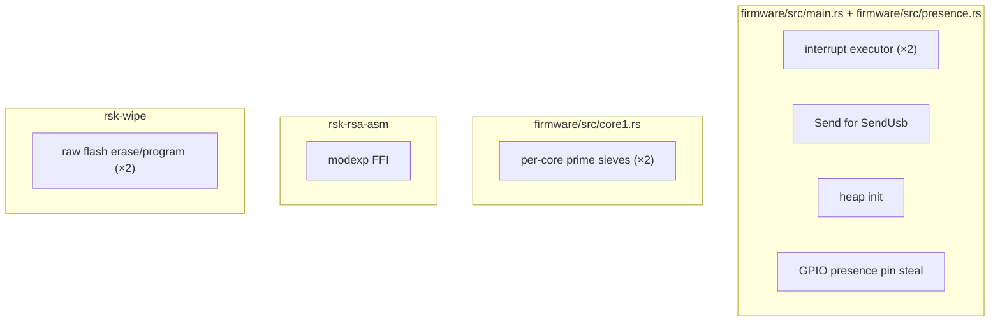

# `unsafe` audit

The firmware is `no_std` Rust. Safety of the parsers and applet logic is the
core defensive property, so every `unsafe` is enumerated here: its
justification, why a safe alternative does not work, and how the risk is
contained. Adding a new `unsafe` requires updating this page. (Safe Rust rules
out memory-corruption bugs in this code. It is not a security audit; see the
[threat model](threat-model.md).)

**Runtime sites: 10.** Four concerns in the firmware proper (the interrupt
handler pair counted honestly as two), two for the per-core prime sieves, one
in the RSA assembly FFI, two in the standalone flash-wipe tool.



The `unsafe` lives only in plumbing. None of it is in a parser, applet, crypto
wrapper, or the filesystem.

## Firmware (`firmware/src/main.rs`, `firmware/src/presence.rs`)

### 1–2. The high-priority interrupt executor

```rust
#[interrupt]
unsafe fn SWI_IRQ_1() {
    unsafe { EXECUTOR_HIGH.on_interrupt() }
}
```

USB and the transports run on an embassy `InterruptExecutor` so they preempt
long synchronous work (RSA keygen, flash GC) and keep the bus alive. The
handler itself is `unsafe fn` (hardware interrupt ABI). The `on_interrupt()`
contract (call only from the interrupt the executor was started on) is upheld
by construction: `EXECUTOR_HIGH.start(SWI_IRQ_1)` is the only starter and this
is the only caller.
*Safe alternative:* none; this is embassy's documented pattern for a second
executor.
*Containment:* two lines, no data touched.

### 3. `unsafe impl Send for SendUsb`

`embassy_usb::UsbDevice` is `!Send` only because it holds a list of
`&mut dyn Handler` control-request handlers. Our only stateful handler is a
zero-sized type whose state is `Sync` (critical-section-guarded statics). The
device is moved into exactly one task on the interrupt executor and never
touched from anywhere else: exclusive ownership after the move.
*Safe alternative:* none while the USB device must live on the interrupt
executor and embassy keeps the trait object `!Send`.
*Containment:* the wrapper is private, constructed once, and the invariant
(single task, single executor) is structural.

### 4. Heap initialization

```rust
unsafe { HEAP.init(core::ptr::addr_of_mut!(HEAP_MEM) as usize, HEAP_SIZE) }
```

A 64 KiB heap exists solely for the `rsa` crate's big integers (the only
allocating dependency). `init`'s contract (call once, with exclusive access
to the region) is met: it runs once at the top of `main`, on a dedicated
static buffer used by nothing else.
*Safe alternative:* none; every embedded allocator initializes this way.
*Containment:* one call, before any allocation can happen.

### 5. GPIO presence pin type-erasure

```rust
let any = unsafe { AnyPin::steal(pin) };
```

The optional `PRESENCE_PIN=<gpio>` path chooses the presence button at runtime
(instead of a concrete `PIN_n` type at compile time), so the code must convert a
numeric pin to embassy's type-erased `AnyPin`. `AnyPin::steal` is `unsafe`
because the caller must guarantee unique ownership of that hardware pin.
*Safe alternative:* none for a runtime-selected GPIO; the safe constructors
require a statically known pin type.
*Containment:* one call site in `ButtonPresence::new_gpio`, gated by pin-range
validation and the single-owner invariant from `main` (the chosen presence pin
is never handed to the LED/backends; an LED/presence conflict panics at boot).

## Firmware dual-core keygen (`firmware/src/core1.rs`)

### 6–7. The per-core prime sieves

```rust
static mut CORE0_SIEVE: IncrementalSieve = IncrementalSieve::new();
static mut CORE1_SIEVE: IncrementalSieve = IncrementalSieve::new();
// …
let sieve = unsafe { &mut *core::ptr::addr_of_mut!(CORE1_SIEVE) }; // core1
let sieve = unsafe { &mut *core::ptr::addr_of_mut!(CORE0_SIEVE) }; // core0
```

The dual-core keygen runs one running small-prime sieve per core (each ~5 KiB
of residues, too large to live on core1's stack beside the Baillie-PSW
bignum frames, so they are `static`). Each is **single-core-exclusive**:
`CORE0_SIEVE` is taken `&mut` only inside `run_rsa_search` (core0),
`CORE1_SIEVE` only inside `search` (core1), and the two cores never touch the
same sieve. So the `&mut` never aliases and there is no cross-core race.
Each keygen calls `scrub()` through the reference before use, forcing a fresh
window and wiping any prime left from the previous job.
*Safe alternative:* none that is free. A `Mutex`/`critical-section` cell would
add a lock on a provably-uncontended access, and the sieve is reused across
jobs so it cannot be a stack local. (Edition-2024 forbids implicit `&mut` to a
`static mut`, hence the explicit `addr_of_mut!`.)
*Containment:* two call sites, one per core; the partition (which core touches
which sieve) is structural, and the data is non-secret (small-prime residues of
a candidate, scrubbed at the top of every keygen). A wrong residue can only let
a composite through to the strong-MR/Lucas test, which still rejects it.

## RSA assembly FFI (`crates/rsk-rsa-asm/src/lib.rs`)

### 8. The modexp call

On-card RSA key generation needs hundreds of modular exponentiations over
1024–2048-bit candidates. The pure-Rust path was ~7× too slow on the
Cortex-M33 (minutes per key, CCID timeouts). The crate wraps one vendored
C+ARM-assembly routine behind a single `unsafe` FFI call with fully owned,
length-checked buffers on both sides.
*Safe alternative:* tried (num-bigint). Functionally correct, unusably slow.
*Containment:* the call is KAT-gated: a power-on known-answer self-test must
pass or key generation refuses to run, so a miscompiled/corrupt routine
fails closed. Inputs/outputs are fixed-size stack buffers zeroized after
use. On the host the crate substitutes a pure-Rust fallback, so all host
tests exercise the same API safely.

## Flash wiper (`rsk-wipe/src/main.rs`)

### 9–10. Raw flash erase/program in a critical section

The wiper's entire job is to erase the flash the firmware lives on, from a
RAM-resident image. It calls the ROM flash-erase/program routines inside
`critical_section::with(|_| unsafe { ... })`: interrupts off, XIP disabled,
nothing else running.
*Safe alternative:* none; erasing the chip out from under yourself is
inherently unsafe and is the tool's purpose.
*Containment:* rsk-wipe is a separate opt-in UF2 you flash deliberately; it
never ships inside the firmware.

## Build-time (not runtime)

- `crates/rsk-rsa-asm/build.rs`: `unsafe { env::set_var(...) }` forces the
  ARM cross-compiler for the vendored C. Build scripts are single-threaded at
  that point (the call is host-side, never in the image).
- Edition-2024 *declarations*: `#[unsafe(link_section = ".start_block")]` on
  the two bootrom image-definition statics and `unsafe extern "C"` on the
  linker-symbol/FFI declaration blocks. These mark declarations the compiler
  cannot check. The symbols are addresses read via `addr_of!`, never
  dereferenced as data.

## What is *not* here

No `unsafe` in any parser, applet, crypto wrapper, or the flash filesystem.
The attacker-facing surface is entirely safe Rust, and `cargo clippy -D
warnings` plus the fuzz targets ([testing.md](testing.md)) keep it that way.
